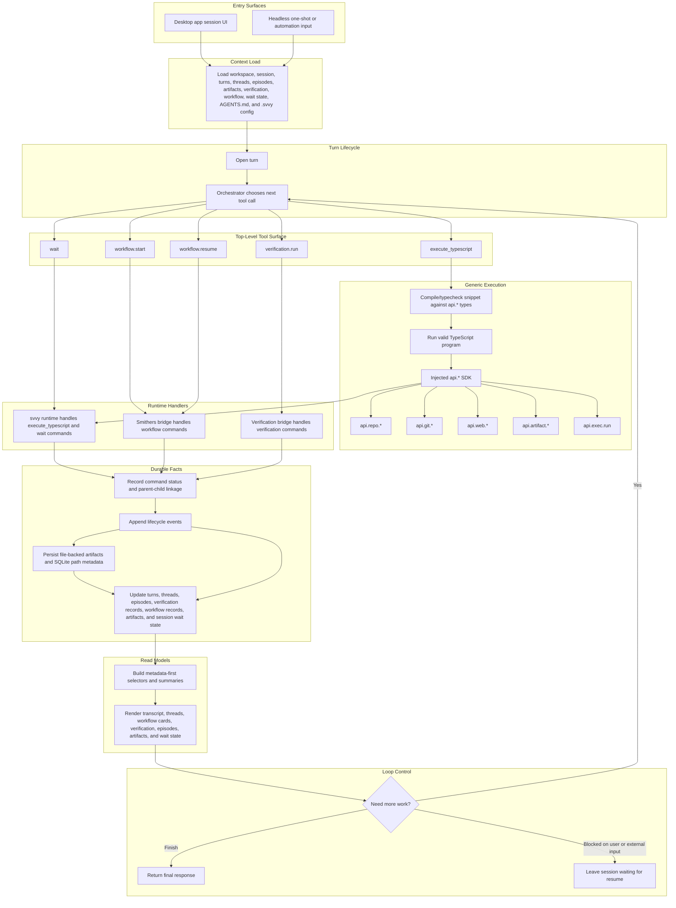

# Execution Model

This document is a companion to the [PRD](./prd.md).

It describes the intended product-level request flow for `svvy`. It is a behavioral model, not a package layout or implementation call graph.

The adopted model is one shared command system:

```text
tool call -> command -> handler -> events -> structured state -> UI
```

The orchestrator chooses the next tool call inside one runtime model. It does not switch between unrelated engines.



Key points:

- `execute_typescript` is the default generic work surface.
- The injected SDK is `api.*`.
- `api.exec.run` is allowed as an explicit bounded execution capability.
- `execute_typescript` snippets are compiled or typechecked before runtime execution, and invalid snippets stop at diagnostics instead of running blindly.
- `workflow.start`, `workflow.resume`, `verification.run`, and `wait` remain separate native control tools because they change product-level control flow.
- Artifacts are file-backed, with SQLite metadata and path indexing so durable records can point back to files.
- Hooks may call `execute_typescript`, but hooks do not flatten the control tools into `api.*`.
- Runtime handlers and bridges write durable facts from real execution; the agent does not mutate product state directly through arbitrary write tools.
- Waiting is a shared status in the model, not a fourth execution engine.
