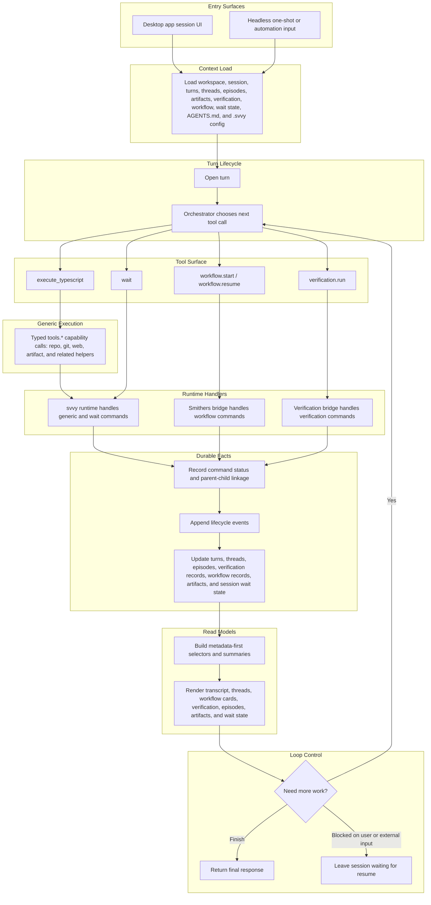

# Execution Model

This document is a companion to the [PRD](./prd.md).

It shows the intended product-level request flow for `svvy`. It is a behavioral model, not a package layout or implementation call graph.

The adopted model is one shared command system:

```text
tool call -> command -> handler -> events -> structured state -> UI
```

The orchestrator does not switch between four unrelated engines. It chooses the next tool call inside one runtime model.



Key points:

- `execute_typescript` is the default generic work surface.
- `workflow.start`, `workflow.resume`, `verification.run`, and `wait` are native control tools, but they are still just tool calls.
- Generic capability access inside `execute_typescript` uses typed `tools.*` namespaces rather than flat `external_*` globals.
- Runtime handlers and bridges write durable facts from real execution; the agent does not mutate product state directly through arbitrary write tools.
- Waiting is a shared status in the model, not a fourth execution engine.
