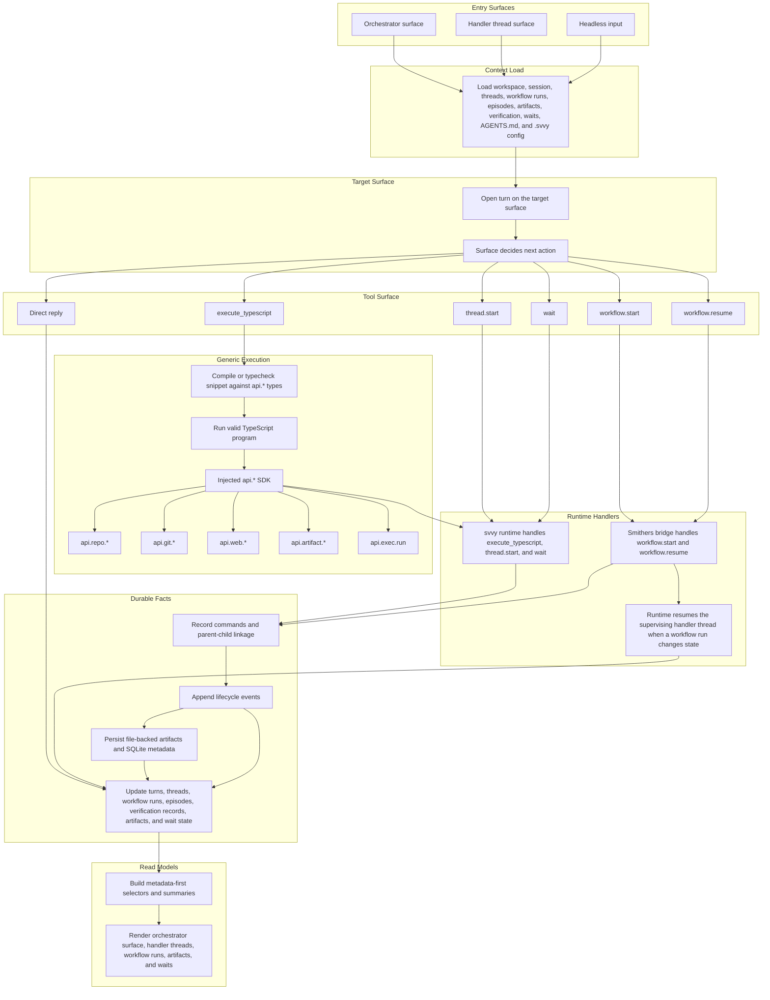

# Execution Model

This document is a companion to the [PRD](./prd.md).

It describes the intended product-level request flow for `svvy`.

It is a behavioral model, not a package layout or implementation call graph.

## Core Shape

The adopted model is one shared command system:

```text
message -> target surface -> turn -> tool call -> command -> handler -> events -> structured state -> UI
```

The target surface may be:

- the main orchestrator surface
- a delegated handler thread surface

The orchestrator remains the strategic brain.

Handler threads own one delegated objective at a time.

Smithers owns workflow execution under those handler threads.

## End-To-End Flow



## Practical Interpretation

### 1. Messages Target A Surface

Every send goes to one interactive surface.

That means:

- a message sent in the orchestrator pane goes to the orchestrator surface
- a message sent in a handler thread pane goes to that handler thread surface

This is shared surface behavior, not special logic for waiting threads only.

### 2. The Orchestrator Delegates Objectives, Not Raw Workflow Runs

The orchestrator typically chooses among:

- direct reply
- `execute_typescript`
- `thread.start`
- `wait`

It normally does **not** supervise every workflow pause, rerun, and repair step itself.

Instead, it opens a handler thread for that delegated objective.

### 3. A Handler Thread Supervises Workflow Execution

Inside a handler thread, the normal choices are:

- `execute_typescript`
- `workflow.start`
- `workflow.resume`
- `wait`
- final reply inside the thread

The handler thread may:

- reuse a workflow template
- fill a preset
- author a custom workflow
- rerun after repair
- resume after clarification
- terminate with a final episode

### 4. Workflow State Returns To The Handler Thread, Not The Orchestrator

When a Smithers run:

- completes
- fails
- pauses

the runtime resumes the supervising handler thread with the structured run result.

After `workflow.start` or `workflow.resume`, the runtime parks that handler thread while Smithers executes.

The handler thread then decides what to do next.

The orchestrator only receives the final terminal outcome of that delegated objective through the thread's episode.

### 5. One Final Episode Per Handler Thread

The supervising handler thread may manage:

- multiple workflow runs
- multiple reruns
- multiple clarification cycles

but it should emit exactly one final terminal episode back to the orchestrator.

That episode is the default reconciliation unit.

### 6. Waiting Is A Lifecycle Status

`wait` is still a native control tool because wait changes product-level state.

But waiting is not a separate execution subsystem.

Any interactive surface may enter wait when it needs:

- user clarification
- an external prerequisite

The difference is where the wait lives:

- orchestrator wait lives in the main orchestrator surface
- delegated clarification usually lives in the handler thread surface

### 7. Verification Is Workflow-Shaped Execution

Verification remains first-class in product behavior and UI, but it is modeled through workflow templates and presets rather than a separate native execution engine.

That means build, test, lint, and related checks can still have structured verification records and specialized UI, while execution stays consistent with the workflow model.

## Key Guarantees

- `execute_typescript` remains the default generic work surface.
- `api.exec.run` remains the explicit bounded process execution capability inside `execute_typescript`.
- `thread.start`, `workflow.start`, `workflow.resume`, and `wait` remain native control tools.
- `workflow.start` and `workflow.resume` are primarily used inside handler threads.
- runtime handlers and bridges write durable facts from real execution; agents do not mutate product state through arbitrary write tools.
- child `api.*` calls remain nested command facts under a parent `execute_typescript` command.
- workflow runs are durable execution records under a handler thread.
- episodes are the main reusable semantic outputs returned to the orchestrator.
