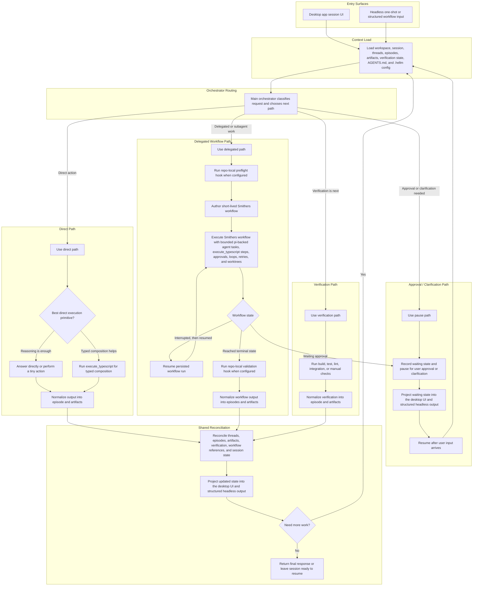

# Execution Model

This document is a companion to the [PRD](./prd.md).

It shows the intended product-level request flow for `hellm`. It is a behavioral model, not a package layout or implementation call graph.

Key points:

- `execute_typescript` is an internal primitive inside the direct path and inside Smithers-backed delegated work. It is not a fifth top-level path.
- Repo-local preflight and validation hooks wrap consequential delegated workflows rather than replacing orchestrator routing.
- All meaningful execution paths normalize into episodes and artifacts before reconciliation, which keeps the product model uniform across desktop and headless use.
