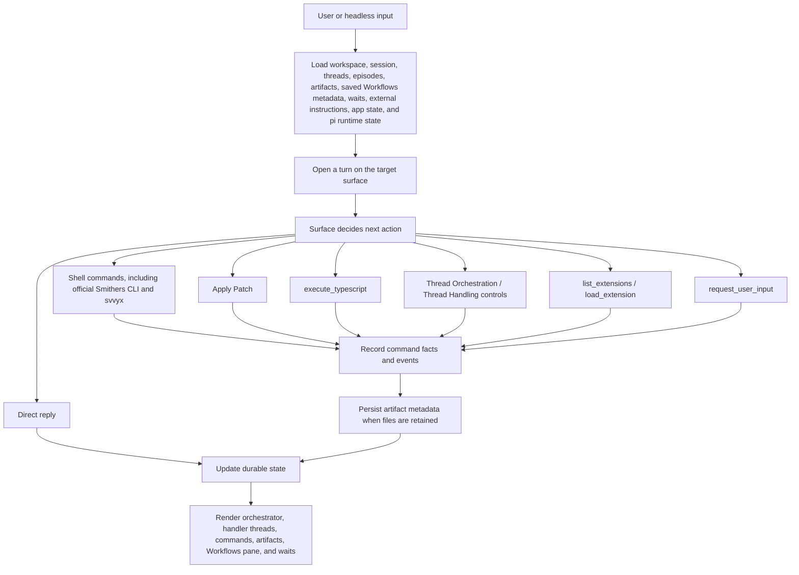

# Execution Model

This document is a companion to the [PRD](./prd.md).

It describes the current product-level request flow for `svvy`.

## Core Shape

The adopted model is one shared command system:

```text
message -> target surface -> turn -> tool call -> command -> handler -> events -> structured state -> UI
```

The target surface may be:

- the main orchestrator surface
- a delegated handler thread surface

The orchestrator remains the strategic brain. Handler threads own delegated objectives.

Smithers is used directly through official Smithers CLI commands from Shell. `svvy` does not expose
Smithers through product workflow wrappers.

## End-To-End Flow


```mermaid
flowchart TD
    Entry["User or headless input"] --> Load["Load workspace, session, threads, episodes, artifacts, saved Workflows metadata, waits, external instructions, app state, and pi runtime state"]
    Load --> Surface["Open a turn on the target surface"]
    Surface --> Decide["Surface decides next action"]
    Decide --> Direct["Direct reply"]
    Decide --> Shell["Shell commands, including official Smithers CLI and svvyx"]
    Decide --> Patch["Apply Patch"]
    Decide --> TS["execute_typescript"]
    Decide --> Threads["Thread Orchestration / Thread Handling controls"]
    Decide --> Extensions["list_extensions / load_extension"]
    Decide --> Input["request_user_input"]
    Shell --> Commands["Record command facts and events"]
    Patch --> Commands
    TS --> Commands
    Threads --> Commands
    Extensions --> Commands
    Input --> Commands
    Direct --> State["Update durable state"]
    Commands --> Artifacts["Persist artifact metadata when files are retained"]
    Artifacts --> State
    State --> UI["Render orchestrator, handler threads, commands, artifacts, Workflows pane, and waits"]
```

## Actor Responsibilities

The orchestrator usually chooses among:

- direct reply
- direct tools through Shell and Apply Patch
- `execute_typescript`
- Thread Orchestration tools: `thread_start`, `thread_followup`, `thread_list`,
  `thread_episodes`, and `thread_request_report`
- `request_user_input`

It normally delegates workflow work to a handler thread.

Inside a handler thread, normal choices include:

- direct reply
- direct tools through Shell and Apply Patch
- official Smithers CLI commands through Shell against workspace `.smithers/`
- `svvyx workflows list`, `save`, `build`, and `models list`
- `execute_typescript`
- `thread_current`, `thread_group`, `thread_report`, and `thread_episodes`
- `list_extensions` and `load_extension`
- `request_user_input`

Workflow task agents are Smithers-authored task agents configured through generated
`@svvy/workflows` parameter exports. Their active run-state and UI projection are not specified in
this document.

## Smithers And Workflows Boundary

Smithers owns workflow authoring concepts and runtime execution.

Workspace Smithers source lives under:

```text
<workspace>/.smithers/
```

Reusable app-global Workflows source lives under:

```text
~/.config/svvy/workflows/
```

`svvyx workflows build` generates:

```text
~/.config/svvy/workflows/generated/package
```

The generated package is imported as:

```ts
import { Agents, Components, Prompts, Workflows } from "@svvy/workflows";
```

Generated package links under `.smithers/node_modules` are read-only plumbing. Agents edit source
and build; they do not edit generated output.

## Episodes

Ordinary replies inside a handler thread do not emit episodes and do not close the delegated
objective.

When the handler wants to give the orchestrator an important update, it calls `thread_report`
without `outcome`.

When the handler wants to hand control back, it calls `thread_report` with `outcome`.

Each `thread_report` emits one ordered episode. Reports with `outcome` also mark the current
objective concluded, while the thread surface itself stays interactive for later follow-up.

## Waiting

There is no shipped model-facing `wait` tool.

Waiting is lifecycle state recorded by request-user-input, execution approval, or another durable
product prerequisite. It is not a separate execution subsystem.

## Key Guarantees

- Direct tools are the default coding-agent work surface.
- Prompt-only CLIs such as cx, Git, GitHub, Web, and Smithers are used through Shell.
- `svvyx ...` command families are ordinary Shell commands and may also expose generated clients
  when the extension supports TypeScript clients.
- Thread Orchestration controls, Thread Handling controls, `load_extension`, `list_extensions`, and
  `request_user_input` remain `svvy`-native control tools.
- `svvyx workflows ...` manages reusable source and generated imports; it does not run Smithers.
- Runtime handlers write durable facts from real execution; agents do not mutate product state
  through arbitrary state writes.
- Tool-run summaries stay on command records and artifacts; ordinary handler replies do not emit
  episodes.
- Episodes are the main reusable semantic outputs returned to the orchestrator.
