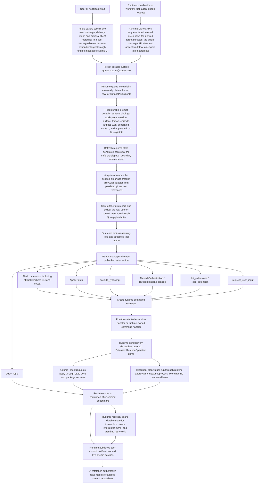

# Execution Model

Status: non-authoritative execution-model note. Current product behavior is defined by `docs/prd.md`, `docs/features.ts`, `docs/progress.md`, and the owning `docs/specs/**` files; promote behavior changes there before implementation.

## Core Shape

The model is one shared command system:

```text
message submit -> durable queue commit -> queue wake/claim -> prompt defaults/binding read -> required generated-context refresh -> turn record commit -> pi stream -> streamed tool intent -> accepted tool call -> runtime command envelope -> extension handler -> ExtensionRuntimeOperation processing -> runtime_effect application / execution_plan execution -> state commit -> runtime notification/live patch -> UI refetch or stream rebaseline -> recovery scan
```

The target surface may be:

- the main orchestrator surface
- a delegated handler thread surface
- a workflow task-agent attempt surface created by the Smithers task-agent bridge

The orchestrator remains the strategic brain. Handler threads own delegated objectives. Workflow
task-agent attempts own one Smithers task-agent attempt and are driven by accepted bridge requests
plus runtime-owned recovery or coordinator work for that attempt surface.

Smithers is used directly through official Smithers CLI commands from Shell. `svvy` does not expose
Smithers through product workflow wrappers.

## End-To-End Flow


```mermaid
flowchart TD
    EntryUser["User or headless input"] --> SubmitUser["Public callers submit one user message, delivery intent, and optional client metadata to a user-messageable orchestrator or handler target through runtime.messages.submit(...)"]
    EntryInternal["Runtime coordinator or workflow task-agent bridge request"] --> SubmitInternal["Runtime-owned APIs enqueue typed internal queue rows for allowed target surfaces; the public message API does not accept workflow task-agent attempt targets"]
    SubmitUser --> Queue["Persist durable surface queue row in @svvy/state"]
    SubmitInternal --> Queue
    Queue --> Claim["Runtime queue wake/claim atomically claims the next row for surfacePiSessionId"]
    Claim --> Load["Read durable prompt defaults, surface bindings, workspace, session, surface, thread, episode, artifact, wait, generated-context, and app state from @svvy/state"]
    Load --> Refresh["Refresh required stale generated context at the safe pre-dispatch boundary when enabled"]
    Refresh --> Surface["Acquire or reopen the scoped pi surface through @svvy/pi-adapter from persisted pi session references"]
    Surface --> Turn["Commit the turn record and deliver the real user or control message through @svvy/pi-adapter"]
    Turn --> Stream["Pi stream emits reasoning, text, and streamed tool intents"]
    Stream --> Decide["Runtime accepts the next pi-backed actor action"]
    Decide --> Direct["Direct reply"]
    Decide --> Shell["Shell commands, including official Smithers CLI and svvyx"]
    Decide --> Patch["Apply Patch"]
    Decide --> TS["execute_typescript"]
    Decide --> Threads["Thread Orchestration / Thread Handling controls"]
    Decide --> Extensions["list_extensions / load_extension"]
    Decide --> Input["request_user_input"]
    Shell --> Commands["Create runtime command envelope"]
    Patch --> Commands
    TS --> Commands
    Threads --> Commands
    Extensions --> Commands
    Input --> Commands
    Commands --> Handler["Run the selected extension handler or runtime-owned command handler"]
    Handler --> Effects["Runtime exhaustively dispatches ordered ExtensionRuntimeOperation items"]
    Direct --> State["Commit reply/turn facts through @svvy/state ports"]
    Effects --> RuntimeEffect["runtime_effect requests apply through state ports and package services"]
    Effects --> Plan["execution_plan values run through runtime approval/sandbox/subprocess/file/stdin/child-command lanes"]
    RuntimeEffect --> State["Runtime collects committed after-commit descriptors"]
    Plan --> State
    State --> Notify["Runtime publishes post-commit notifications and live stream patches"]
    Notify --> UI["UI refetches authoritative read models or applies stream rebaselines"]
    State --> Recovery["Runtime recovery scans durable state for incomplete claims, interrupted turns, and pending retry work"]
    Recovery --> Notify
```

## Actor Responsibilities

The orchestrator usually chooses among:

- direct reply
- direct tools through Shell and Apply Patch
- `execute_typescript`
- Thread Orchestration tools: `thread_start`, `thread_followup`, `thread_list`,
  `thread_episodes`, and `thread_request_report`
- `request_user_input`

It normally delegates workflow work to a handler thread.

Inside a handler thread, normal choices include:

- direct reply
- direct tools through Shell and Apply Patch
- official Smithers CLI commands through Shell against workspace `.smithers/`
- `svvyx workflows list`, `save`, `build`, and `models list`
- `execute_typescript`
- `thread_current`, `thread_group`, `thread_report`, and `thread_episodes`
- `list_extensions` and `load_extension`
- `request_user_input`

Workflow task agents are Smithers-authored task agents configured through generated
`@svvyx/workflows` parameter exports. Each active workflow task-agent attempt is a pi-backed surface
coordinated by `@svvy/runtime` and persisted/projected by `@svvy/state`. Smithers remains the owner
of workflow graph, run, node, iteration, retry, and resume state except for observed product facts
needed by `svvy` read models.

## Smithers And Workflows Boundary

Smithers owns workflow authoring concepts and workflow graph, run, node, iteration, retry, and
resume semantics. `svvy` owns Shell command tracking, app approval/sandbox execution, pi-backed
workflow task-agent attempt surfaces, durable observed Smithers facts, and the narrow runtime-owned
`runTaskAgent` bridge. Agents use official Smithers CLI commands through Shell, such as
`bunx smthrs ...`, according to Smithers documentation and the active
sandbox/approval policy. `svvy` does not expose `workflow.*`, `svvyx smithers`, or loopback
Smithers runtime-control tools as product surfaces.

Workspace Smithers source lives under:

```text
<workspace>/.smithers/
```

Reusable app-global Workflows source lives under:

```text
~/.config/svvy/workflows/
```

`svvyx workflows build` requests runtime-owned refresh of the canonical generated packages.
Generated package roots are app-owned output roots resolved through `GeneratedPackageRootPort`, not
children of the editable Workflows source tree.

`@svvyx/workflows` is the reusable Workflows import surface for saved prompt, component, workflow,
and workflow-agent source. `@svvyx/extensions` is generated extension-reference plumbing for
workflow-agent source and is not the Workflows import surface.

The reusable Workflows generated package is imported as:

```ts
import { Agents, Components, Prompts, Workflows } from "@svvyx/workflows";
```

Generated package links under `.smithers/node_modules` are read-only plumbing. Agents edit source
and build; they do not edit generated output.

`@svvy/extensions` owns Workflows source interpretation, generated package file production, build
evidence, and immutable workspace-link plan construction for the canonical generated packages
`@svvyx/workflows` and `@svvyx/extensions`. `@svvy/runtime` owns generated-package refresh
scheduling and ordered refresh application, commits generated-package facts through `@svvy/state`,
schedules workspace-link repair after those facts commit, and applies link plans for acquired
workspace runtime scopes. Repo-root `workflows/`, generated authoring databases, and
source-checkout-relative Smithers paths are authoring inputs for maintaining `svvy` itself, not
shipped product runtime boundaries.

The only Smithers task-agent bridge is the narrow runtime-owned generated `runTaskAgent` path used
inside a command-scoped workflow task attempt. It accepts task-agent parameters and Smithers
attempt identity, returns text/usage/output, and exposes no arbitrary app RPC, Shell, settings,
or orchestrator controls.

## Episodes

Ordinary replies inside a handler thread do not emit episodes and do not close the delegated
objective.

When the handler wants to give the orchestrator an important update, it calls `thread_report`
without `outcome`.

When the handler wants to hand control back, it calls `thread_report` with `outcome`.

Each `thread_report` emits one ordered episode. Reports with `outcome` also mark the current
objective concluded, while the thread surface itself stays interactive for later follow-up.

## Waiting

There is no shipped model-facing `wait` tool.

Waiting is lifecycle state recorded by request-user-input, execution approval, or another durable
product prerequisite. It is not a separate execution subsystem.

## Key Guarantees

- Direct tools are the default coding-agent work surface.
- Prompt-only CLIs such as cx, Git, GitHub, Web, and Smithers are used through Shell.
- `svvyx ...` command families are ordinary Shell commands and may also expose injected
  `execute_typescript` generated TypeScript facades plus generated declaration blocks when the
  extension supports
  TypeScript facades. Those facades are not generated `@svvyx/workflows` or
  `@svvyx/extensions` package imports.
- Thread Orchestration controls, Thread Handling controls, `load_extension`, `list_extensions`, and
  `request_user_input` remain `svvy`-native control tools.
- `svvyx workflows ...` manages reusable source and generated imports; it does not run Smithers.
- Runtime owns durable command/fact envelopes, invokes extension handlers for accepted tool calls,
  and applies returned ordered `ExtensionRuntimeOperation` items inside runtime-owned lanes. Runtime
  applies wrapped `RuntimeEffectRequest` items through core-owned state ports implemented by
  `@svvy/state` and the relevant package services, and executes wrapped immutable extension plans
  when approval, sandbox, subprocess, file-effect, stdin/stdout/stderr, child-command, or
  cancellation behavior is required. Extension handlers return model-facing results, typed command
  facts, and ordered operation items rather than writing product state directly.
- Tool-run summaries stay on command records and artifacts; ordinary handler replies do not emit
  episodes.
- Episodes are the main reusable semantic outputs returned to the orchestrator.
