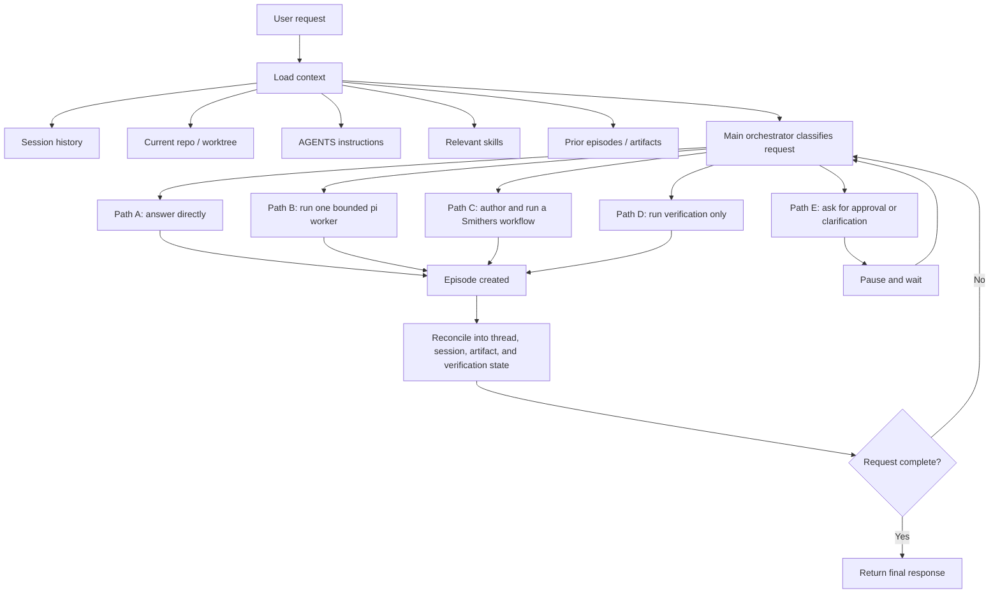
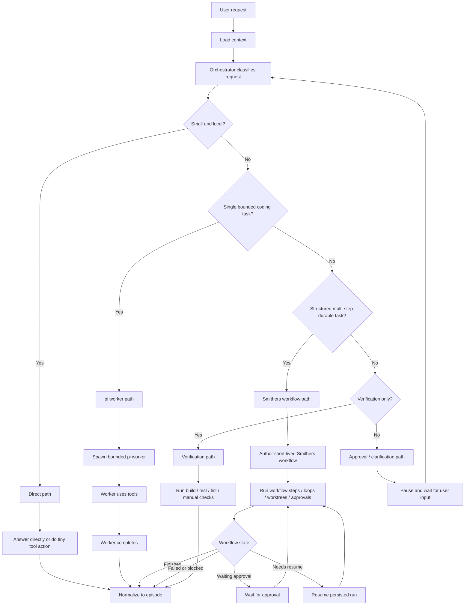

# Product Requirements Document

## Title

Build a pi-derived coding agent and TUI that reproduces Slate's public architectural strengths, using Smithers internally for complex durable workflows.

## Status

- Date: 2026-04-08
- Status: Architecture direction clarified and initial Bun monorepo scaffold created
- Repository purpose: Bun monorepo scaffold for `hellm`, a pi-first, Slate-like coding agent

## Document Purpose

This document is the source of truth for what this repository is trying to build.

It is intentionally explicit about:

- what the product is
- what it is not
- which claims are grounded in public Slate material
- which facts come from the vendored `pi` and `smithers` references
- which choices are our design decisions
- which features are in scope now, later, or not at all

When reference docs and reference code disagree, reference code wins.

## Executive Decision

We are adopting a pi-first hybrid architecture.

- `pi` is the substrate and user-facing shell:
  - core agent runtime
  - tool loop
  - sessions
  - TUI foundation
  - SDK / RPC / headless integration
  - skills, prompt templates, AGENTS loading, extensions
- our product layer sits above pi:
  - main orchestrator
  - thread model
  - episode model
  - reconciliation loop
  - routing decisions
  - orchestration-aware UI projection
- `smithers` is used selectively under the orchestrator as an internal executor for complex jobs:
  - short-lived authored workflows for complex requests
  - durable multi-step workflows
  - approvals
  - loops
  - worktrees
  - resumable structured jobs

The orchestrator is the only strategic source of truth.

Smithers is not the top-level product shell.
Smithers is not the main TUI foundation.
Pi is not enough on its own.
The product is the combination:

- pi substrate and interactive shell
- our orchestrator and data model
- Smithers-backed complex workflow execution paths when needed

## Simple Product Picture

The simplest correct mental model is:

- `pi` is the terminal app, session system, and base agent runtime
- the orchestrator is the boss that decides what happens next
- `Smithers` is a specialist workflow engine the orchestrator can call for complex jobs

In practice that means:

- we keep the `pi` TUI and extend it
- we do not build a separate top-level Smithers UI
- for simple work, the orchestrator answers directly or runs one bounded `pi` worker
- for complex work, the orchestrator can write a short-lived Smithers workflow, run it, show its progress in the `pi`-based TUI, then take control back when it finishes

## Simple Build Order

The build order should be easy to explain:

1. Start from `pi` as-is, including its TUI, runtime, sessions, skills, and prompts.
2. Add one orchestrator above `pi` so requests stop behaving like one long transcript-only chat loop.
3. Add threads, episodes, artifacts, and reconciliation as structured product state stored through `pi` sessions.
4. Add verification as a first-class path so builds, tests, and lint results shape the next decision.
5. Add the Smithers bridge early for the complex path so the orchestrator can author and run short-lived workflows instead of reinventing durable workflow machinery.
6. Upgrade the `pi` TUI to show orchestrator state, including active Smithers-backed workflow progress, instead of only raw chat and tool output.

## Mission

Build a coding agent and TUI that feels much closer to Slate than to stock pi by adding:

- one visible orchestrator
- bounded workers instead of persistent role agents
- reusable structured outputs
- explicit reconciliation
- visible thread state
- first-class verification
- strong session and worktree alignment
- strong headless and automation surfaces

## Product Definition

The product should feel like one coherent agent system with these properties:

- the user can see what workstreams exist and what each one produced
- the system can choose between direct action, bounded pi workers, Smithers workflows, and verification-only runs
- for complex work, the system can author a short-lived Smithers workflow instead of hand-rolling custom orchestration logic each time
- every meaningful unit of work produces a reusable structured episode
- long tasks can resume safely
- worktree context and session context stay aligned
- verification results are not buried in chat
- the system remains adaptive rather than rigid

## Non-Goals

This project is not trying to:

- visually clone Slate
- claim private knowledge of Slate internals
- turn the repo into a generic multi-agent playground
- make Smithers the top-level chat or TUI runtime
- replace pi's session and UI substrate with Smithers storage
- force all tasks through predeclared workflows
- build a planner / implementer / reviewer bureaucracy
- treat transcripts as the only durable state
- optimize for benchmark theater over developer experience

## Reference Basis

This PRD is grounded in three different kinds of source material.

### 1. Public Slate Facts

From Slate's public docs and architecture writing, the following are fair to treat as public product behavior:

- one central orchestrator owns strategy and integration
- bounded worker threads are the main delegation unit
- worker outputs are compressed durable artifacts called episodes
- episodes can be reused as inputs to later work
- synchronization is frequent rather than deferred
- rigid task trees and stale markdown plans are not the primary architecture
- headless / structured / server-oriented control surfaces matter
- worktree and session support matter
- multiple model slots matter

### 2. Slate Inferences

These are reasonable design inferences, not public implementation facts:

- Slate quality likely comes from orchestration discipline, not UI polish alone
- structured intermediate artifacts likely matter more than prose summaries
- task-type-based routing likely matters in practice
- flexibility plus bounded synchronization is the core tradeoff

We must keep this distinction explicit.

### 3. Local Reference Facts

We have two vendored local references under `docs/references/`:

- `docs/references/pi-mono`
- `docs/references/smithers`

These are the implementation references for what we can reuse, depend on, or adapt.

## Reference Facts: pi

The vendored `pi` reference provides the following relevant capabilities.

### Runtime and SDK

`@mariozechner/pi-agent-core` provides:

- a stateful tool-calling agent runtime
- streaming events
- configurable tool execution
- hooks before and after tool calls
- explicit agent state access

Relevant references:

- `docs/references/pi-mono/packages/agent/README.md`
- `docs/references/pi-mono/packages/coding-agent/docs/sdk.md`

### Sessions

`pi` sessions are:

- JSONL files
- tree-shaped via `id` / `parentId`
- branchable in-place
- forkable into new session files
- resumable
- navigable via `/tree`

Relevant references:

- `docs/references/pi-mono/packages/coding-agent/docs/session.md`
- `docs/references/pi-mono/packages/coding-agent/docs/tree.md`

### Session Runtime Replacement

`AgentSessionRuntime` can replace the active session across:

- new session
- resume
- fork
- import

This matters because our product needs session-aware and worktree-aware runtime switching without rebuilding everything manually.

Relevant references:

- `docs/references/pi-mono/packages/coding-agent/docs/sdk.md`
- `docs/references/pi-mono/packages/coding-agent/src/core/agent-session-runtime.ts`

### Extensibility

`pi` supports:

- custom tools
- custom commands
- event interception
- custom UI surfaces
- state persistence through session entries
- custom message rendering
- skills
- prompt templates
- AGENTS loading
- themes

Relevant references:

- `docs/references/pi-mono/packages/coding-agent/docs/extensions.md`
- `docs/references/pi-mono/packages/coding-agent/examples/extensions/README.md`
- `docs/references/pi-mono/packages/coding-agent/src/core/extensions/types.ts`

### TUI

`pi` already has:

- a coding-agent TUI shell
- tool and message rendering
- footer and status surfaces
- custom widgets and overlays
- tree navigation
- session selectors

This is the right substrate for our UI, but it is not yet orchestration-aware.

## Reference Facts: Smithers

The vendored `smithers` reference provides the following relevant capabilities.

### Workflow Engine

Smithers executes a render-extract-schedule-execute-persist loop:

1. render workflow tree
2. extract task descriptors
3. schedule runnable work
4. execute work
5. persist outputs and events
6. rerender until terminal

Relevant references:

- `docs/references/smithers/README.md`
- `docs/references/smithers/docs/concepts/execution-model.mdx`
- `docs/references/smithers/src/engine/index.ts`

### Persistence and Resume

Smithers persists completed task outputs durably and resumes from the first incomplete mounted work.

Important constraints:

- completed work is not rerun on resume
- task identity depends on stable task IDs
- resume validates workflow hash and VCS state
- stale in-progress work is cleaned up on resume

Relevant references:

- `docs/references/smithers/docs/concepts/suspend-and-resume.mdx`
- `docs/references/smithers/src/RunOptions.ts`
- `docs/references/smithers/src/RunResult.ts`
- `docs/references/smithers/src/engine/index.ts`

### Workflow Primitives

Smithers provides:

- `Workflow`
- `Task`
- `Sequence`
- `Parallel`
- `Branch`
- `Ralph` / `Loop`
- `Approval`
- `Worktree`
- `Sandbox`
- `Timer`

Relevant references:

- `docs/references/smithers/src/components/index.ts`
- `docs/references/smithers/docs/jsx/overview.mdx`

### Approvals

Smithers supports two approval modes:

- `needsApproval` for task gates
- `<Approval>` as an explicit decision-producing node

Relevant references:

- `docs/references/smithers/docs/concepts/human-in-the-loop.mdx`
- `docs/references/smithers/src/engine/approvals.ts`

### Worktrees

Smithers has a first-class `Worktree` primitive and engine support for worktree creation and sync.

Important accuracy note:

- the component docs emphasize JJ
- the engine implementation supports both `git` and `jj`

Relevant references:

- `docs/references/smithers/docs/components/worktree.mdx`
- `docs/references/smithers/src/components/Worktree.ts`
- `docs/references/smithers/src/engine/index.ts`

### Agent Adapters

Smithers can run tasks using different agent adapters, including:

- `PiAgent`
- `CodexAgent`
- `ClaudeCodeAgent`
- API-backed agents

Relevant references:

- `docs/references/smithers/src/agents/PiAgent.ts`
- `docs/references/smithers/src/agents/index.ts`

### Server and CLI Surfaces

Smithers provides:

- CLI run/resume/approve/deny/list functionality
- server surfaces
- a separate serve app

Relevant references:

- `docs/references/smithers/src/cli/index.ts`
- `docs/references/smithers/src/server/index.ts`
- `docs/references/smithers/src/server/serve.ts`

### Important Constraint

Smithers currently assumes Bun as its runtime in package metadata and implementation patterns.

Relevant reference:

- `docs/references/smithers/package.json`

This strongly affects how tightly we should couple it to the main product runtime.

## Product Architecture Decision

We are not choosing between pi and Smithers.
We are assigning them different jobs.

### Decision Summary

- pi owns the interactive coding-agent substrate and TUI foundation
- our orchestrator owns strategy and product behavior
- Smithers owns selective internal workflow execution for complex jobs under the orchestrator

### Why This Split

Pi is strongest at:

- interactive coding-agent runtime behavior
- TUI and session ergonomics
- extensibility
- SDK / RPC integration

Smithers is strongest at:

- typed durable multi-step execution
- explicit workflow graphs
- approval handling
- resumable loops and branches
- worktree-isolated structured jobs

Trying to make pi do all durable workflow orchestration inside ad hoc extensions would create extension spaghetti.

Trying to make Smithers the top-level chat, session, and TUI runtime would discard the strongest parts of pi and create two competing user models.

### Complex Workflow Policy

We should be explicit about how complex jobs work.

- normal work should use direct execution or one bounded `pi` worker
- complex work should use Smithers as soon as the orchestrator can describe that work as a short-lived workflow with real value from durability, approvals, loops, or worktrees
- the orchestrator may author that workflow dynamically from the current request and state
- while the workflow runs, the user should see workflow state through the product TUI
- when the workflow finishes, fails, or pauses, control returns to the orchestrator for reconciliation and next-step decisions

## Core Product Principles

### 1. One Strategic Brain

The main orchestrator owns:

- request interpretation
- path selection
- worker spawning
- reconciliation
- next-step decisions
- final user-facing decisions

No worker becomes the source of truth for overall strategy.

### 2. Bounded Work Over Persistent Roles

Workers are:

- short-lived
- scoped
- task-specific
- terminated at explicit completion boundaries

Workers are not:

- permanent planner agents
- permanent reviewer agents
- long-running side conversations

### 3. Episodes Are the Synchronization Unit

Every path returns a structured episode.

Episodes capture durable value, not transcript noise:

- conclusions
- changed files
- artifacts
- verification results
- unresolved issues
- follow-up suggestions
- provenance

### 4. Frequent Re-entry

The orchestrator should re-enter cheaply after every meaningful unit of work.

The system should prefer:

- short worker runs
- fast reconciliation
- reevaluation after each durable outcome

### 5. Explicit Verification

Verification is part of the main loop, not a cosmetic last step.

### 6. Visible Orchestration

The user must be able to understand:

- what is active
- what finished
- what is blocked
- what was verified
- what still needs attention

without reconstructing state from raw logs.

### 7. Pi Sessions Stay the User-Facing Session Substrate

For the first implementation, the top-level product session remains pi's session system.

We extend it with structured entries. We do not replace it.

## End-to-End Request Lifecycle

This is the intended lifecycle of a single request.



## Request Routing Paths

This graph expands the decision points.



## Path Selection Table

| Path | Use when | Executor | Typical output |
| --- | --- | --- | --- |
| Direct | explanation, tiny reads, tiny tool actions, simple synthesis | orchestrator itself | small episode |
| pi worker | one bounded coding task with normal coding-agent behavior | pi runtime under bounded context | coding episode |
| Smithers workflow | structured, resumable, multi-step, approval-heavy, loop-heavy, or worktree-heavy job | Smithers workflow engine via an orchestrator-authored workflow | workflow episode or set of episodes |
| Verification | build / test / lint / integration / manual checks are the main next step | verification subsystem | verification episode |
| Approval / clarification | ambiguity or risk is too high to guess | orchestrator wait state | waiting episode or paused thread |

## Runtime Architecture

### Entry Surfaces

The product should have three request entry surfaces:

- interactive TUI built on pi's shell
- headless CLI / JSONL / workflow input
- later server surface

These are different entry points to the same orchestrator, not different products.

### Main Orchestrator

The main orchestrator is responsible for:

- loading current context
- deciding execution path
- authoring short-lived Smithers workflows when warranted
- spawning bounded work
- reconciling outputs
- deciding whether to continue
- producing the final response

The orchestrator must always reason over compact structured state first:

- current thread states
- existing episodes
- current worktree binding
- current verification state

It must not depend on replaying the full transcript for every decision.

### Direct Path

The direct path exists for work that does not justify a worker run.

Examples:

- explain architecture
- answer a small question about local code
- perform a tiny read-only inspection
- carry out a tiny single-step action

The direct path still emits an episode so the orchestrator loop stays uniform.

### Native pi Worker Path

This is the default path for most bounded coding tasks.

The worker is a bounded pi-based session or runtime invocation with:

- a precise objective
- scoped context
- relevant files
- relevant skills
- allowed tools
- a completion condition
- expected outputs

Preferred implementation order:

1. in-process pi SDK / runtime usage
2. optional out-of-process pi CLI / RPC worker mode for stronger isolation later

Important:

- the worker is not a user-facing second TUI
- the worker is not a long-running subordinate agent
- the worker returns a bounded result that is converted into an episode

### Smithers Workflow Path

This path is the specialized path for complex jobs when durable structured execution is worth the extra machinery.

Use Smithers when the task needs one or more of:

- explicit multi-step workflow structure
- durable resume across crashes or pauses
- human approvals
- looped review / validate / retry behavior
- worktree-isolated execution
- explicit typed outputs

Do not use Smithers for:

- every normal coding request
- trivial explanations
- tiny local actions
- ordinary single-pass bug fixes unless resume / approvals / worktrees matter

Typical lifecycle:

1. the orchestrator decides the task is complex enough to justify workflow execution
2. the orchestrator authors a short-lived Smithers workflow from the current request, constraints, and prior episodes
3. Smithers runs that workflow and persists its internal state
4. the TUI shows workflow progress as part of the thread state, not as a separate top-level app
5. when the workflow finishes, blocks, or pauses, the result is normalized into episodes
6. the orchestrator resumes control and decides the next step

Smithers runs are invoked programmatically and translated back into our product's episode model.

Smithers run state is internal workflow state, not the top-level user session model.

### Verification Path

Verification is a first-class execution path.

It should normalize:

- build runs
- test runs
- lint runs
- manual verification checkpoints
- integration test runs

into structured verification records with artifacts.

### Approval / Clarification Path

The orchestrator should pause instead of guessing when:

- the user must make a product choice
- a destructive operation should be gated
- the next step is ambiguous
- a Smithers approval node is waiting

This path should be explicit in both state and UI.

### Episode Normalizer

All execution paths must end by producing the same product-level episode model.

That means we normalize:

- direct actions
- pi worker results
- Smithers workflow outcomes
- verification runs

into the same structure before reconciliation.

### Reconciler

The reconciler updates:

- threads
- episodes
- artifacts
- verification state
- session entries
- worktree associations

It then decides whether the orchestrator has enough information to finish or must dispatch new work.

### UI Projection

The TUI should project orchestrator state, not raw internal mechanics.

Minimum required user-visible surfaces:

- active threads
- latest episodes
- blocked / waiting work
- verification status
- current session and worktree context
- active workflow status when a thread is currently backed by Smithers

## Data Model

### Session Persistence Strategy

### Product Decision

Initial top-level persistence should extend pi sessions, not replace them.

That means:

- pi JSONL session remains the user-facing session of record
- orchestrator state is added as structured custom entries
- episode and thread records are stored in or referenced from those entries
- artifacts live on disk and are referenced from episodes
- Smithers keeps its own SQLite run state for Smithers workflows only

This gives us:

- continuity with pi sessions, forks, and tree navigation
- no second top-level session system in phase 1
- clear boundaries between product session state and Smithers workflow state

### Why Not Make Smithers the Main Store

Because that would:

- replace pi's established user-facing session model
- create two competing interaction models
- overcouple the whole product to Smithers and Bun too early

### Why Not Use Transcript-Only Storage

Because the core product requires structured orchestration state:

- threads
- episodes
- artifacts
- verification
- waiting and blocked status

### Thread Model

A thread is a bounded product-level workstream.

Recommended shape:

```ts
type ThreadKind =
  | "direct"
  | "pi-worker"
  | "smithers-workflow"
  | "verification"
  | "approval";

type ThreadStatus =
  | "pending"
  | "running"
  | "waiting_input"
  | "waiting_approval"
  | "blocked"
  | "completed"
  | "failed"
  | "cancelled";

interface ThreadRef {
  id: string;
  kind: ThreadKind;
  status: ThreadStatus;
  objective: string;
  parentThreadId?: string;
  inputEpisodeIds: string[];
  worktreePath?: string;
  smithersRunId?: string;
  createdAt: string;
  updatedAt: string;
}
```

### Episode Model

Episodes are the primary synchronization unit.

Recommended shape:

```ts
type EpisodeSource =
  | "orchestrator"
  | "pi-worker"
  | "smithers"
  | "verification";

type EpisodeStatus =
  | "completed"
  | "completed_with_issues"
  | "waiting_input"
  | "waiting_approval"
  | "blocked"
  | "failed"
  | "cancelled";

interface EpisodeArtifactRef {
  id: string;
  kind:
    | "file"
    | "diff"
    | "log"
    | "test-report"
    | "screenshot"
    | "workflow-run"
    | "note";
  path?: string;
  description: string;
}

interface EpisodeVerification {
  kind: "build" | "test" | "lint" | "manual" | "integration";
  status: "passed" | "failed" | "skipped" | "unknown";
  summary: string;
  artifactIds: string[];
}

interface Episode {
  id: string;
  threadId: string;
  source: EpisodeSource;
  objective: string;
  status: EpisodeStatus;
  conclusions: string[];
  changedFiles: string[];
  artifacts: EpisodeArtifactRef[];
  verification: EpisodeVerification[];
  unresolvedIssues: string[];
  followUpSuggestions: string[];
  smithersRunId?: string;
  worktreePath?: string;
  startedAt: string;
  completedAt?: string;
  inputEpisodeIds: string[];
}
```

### Artifact Model

Artifacts should be file-addressable and referenceable from episodes.

Examples:

- full logs
- test reports
- screenshots
- diffs
- exported verification output
- Smithers run identifiers

### Verification State

Verification should exist both:

- locally inside each episode
- globally as current request / thread state

This allows:

- thread-specific verification summaries
- whole-request "what is the latest verification state?" logic

### Worktree Binding

The product needs first-class worktree awareness at the thread level.

At minimum:

- a thread may be bound to a worktree path
- an episode may reference a worktree path
- the orchestrator must know whether the active session and filesystem view are aligned

## How We Will Use pi

| pi capability | Decision | Notes |
| --- | --- | --- |
| `pi-agent-core` runtime | keep and build on | core tool loop substrate |
| coding-agent SDK | keep and use directly | preferred path for bounded worker execution |
| `AgentSessionRuntime` | keep and use directly | required for session replacement and worktree-aware runtime transitions |
| JSONL sessions and tree model | keep as top-level session substrate | we extend with structured entries |
| `/tree` and branching semantics | keep | useful for user-facing branch navigation |
| extensions | keep | useful for UI surfaces, hooks, custom tools, safety, integration |
| skills / prompts / AGENTS | keep | inherited context system |
| TUI primitives | keep | base for orchestration-aware UI |
| compaction | keep but demote | not the main memory strategy once episodes exist |

## How We Will Use Smithers

| Smithers capability | Decision | Notes |
| --- | --- | --- |
| `runWorkflow()` engine | use selectively but early for the complex path | durable structured workflow execution path once the orchestrator and episode model exist |
| JSX workflow primitives | use selectively | used to author short-lived workflows for complex jobs when explicit workflow structure is justified |
| approval support | use | strong fit for gated workflows |
| worktree support | use | strong fit for isolated multi-branch work |
| loop / parallel primitives | use selectively inside Smithers workflows | valuable for complex jobs, but not the default path for all work |
| `PiAgent` adapter | may use inside Smithers workflows | useful when a workflow task needs pi-driven coding behavior |
| CLI and server surfaces | use as integration references, not as top-level product shell | our product orchestrator remains primary |
| web app / voice / RAG / scorers / devtools | out of scope | not core to the product we are building |

## Important Boundary Decisions

### Smithers Is Not the Top-Level Session Model

Smithers SQLite state is workflow-internal state.

Product session truth remains:

- pi session
- our thread / episode / artifact entries

### Smithers Is Not the Default Path

The default path for normal coding work is:

- direct orchestrator action, or
- one bounded pi worker

Smithers is chosen when its durability and explicit graph model are actually needed.

This does not mean Smithers is a late afterthought.

It means:

- Smithers is an early specialized executor for complex paths
- Smithers should be used instead of reinventing workflow machinery when the task clearly benefits from it
- Smithers should not become the top-level shell for every request

### pi Extensions Are Not the Product Architecture

Pi extensions are useful integration points, but the core orchestrator must be a first-class product layer, not a pile of extensions pretending to be a runtime.

## TUI Requirements

The TUI should become orchestration-aware without throwing away pi's foundation.

Minimum required views:

- chat pane
- threads pane
- episode inspector
- verification panel
- current session / worktree indicator
- workflow activity view for active Smithers-backed threads

Important:

- raw logs may exist, but they are not the main comprehension surface
- the user should understand active vs blocked vs completed work at a glance

## Headless and Automation Requirements

The product must remain scriptable.

Initial required surfaces:

- headless one-shot execution
- structured workflow input file
- JSONL or structured event output
- reuse of pi SDK / RPC where appropriate

Deferred:

- first-class long-lived server mode for the whole product

## Workflow Input

We still want a structured workflow input format, but it should be a seed for the orchestrator, not a rigid task tree.

Recommended initial shape:

```json
{
  "prompt": "Implement X safely in this repository.",
  "todos": [
    { "id": "docs", "description": "Read relevant docs", "status": "pending" },
    { "id": "tests", "description": "Run the relevant tests", "status": "pending" }
  ],
  "constraints": [
    "Do not modify deployment configuration",
    "Prefer local verification over inference"
  ],
  "successCriteria": [
    "Tests pass",
    "Implementation matches acceptance criteria"
  ]
}
```

## Scope Decisions

### Keep Now

- pi substrate: runtime, sessions, TUI base, SDK / RPC, extensions, skills
- main orchestrator
- direct execution path
- bounded native pi worker path
- episode model
- thread model
- verification subsystem
- orchestration-aware TUI basics
- workflow input and headless execution

### Build Early Right After the Core Loop and Session Model

- Smithers bridge for durable workflow execution
- Smithers-to-episode normalization
- short-lived orchestrator-authored workflow generation for complex paths
- worktree-aware threads and session bindings

### Defer

- parallel independent workers as a default execution mode
- broad multi-slot model routing beyond simple `main` and `worker`
- rich slash-command surface such as `/threads` or `/reconcile`
- full server mode for the whole product
- advanced worktree switching UX
- separate artifact database or sidecar store
- Smithers hot reload integration into the main product
- voice, RAG, scorers, observability dashboards

### Explicitly Reject

- persistent planner / implementer / reviewer stacks
- rigid upfront task trees as the default operating model
- transcript-only state
- long-lived side-conversation workers
- making Smithers the whole product shell
- making compaction the main memory strategy

## Implementation Plan

### Phase 0: Design Lock

Deliverables:

- this PRD
- exact thread / episode / artifact schema draft
- decision to extend pi sessions with structured entries
- decision to keep Smithers behind a bridge boundary

Success condition:

- no ambiguity remains about which subsystem owns strategy, session truth, and durable workflows

### Phase 1: Orchestrator Skeleton on Top of pi

Deliverables:

- request classification
- direct path
- bounded pi worker path
- episode normalization
- reconciliation loop

Success condition:

- the system no longer behaves like a single transcript-only chat loop

### Phase 2: Session-Backed Thread and Episode Persistence

Deliverables:

- structured thread entries
- structured episode entries
- artifact references
- resume reconstruction from pi session state

Success condition:

- restart and resume reconstruct orchestrator-visible state without inventing it from chat text

### Phase 3: Verification as a First-Class Path

Deliverables:

- normalized verification records
- verification artifacts
- verification-aware reconciliation

Success condition:

- tests and builds shape next-step decisions programmatically

### Phase 4: Smithers Bridge For Complex Paths

Deliverables:

- programmatic Smithers run adapter
- short-lived workflow authoring from orchestrator state
- Smithers workflow result translation into episodes
- approval and waiting-state integration
- worktree-aware workflow execution path

Success condition:

- the orchestrator can offload complex durable jobs to Smithers without giving up strategic control

### Phase 5: Minimal Orchestration-Aware TUI

Deliverables:

- thread view
- episode inspection
- verification state display
- session / worktree context display
- active Smithers workflow visualization inside the pi-based TUI

Success condition:

- the user can understand what the system is doing, including active workflows, without reading raw logs

### Phase 6: Headless Workflow Input

Deliverables:

- structured workflow input
- structured headless output
- automation-friendly execution path

Success condition:

- the orchestrator is useful outside the interactive TUI

### Phase 7: Advanced Parallel and Worktree Flows

Deliverables:

- safe parallel independent work
- stale result handling
- explicit write-scope rules
- richer worktree UX

Success condition:

- the system can safely exploit independent parallelism without becoming brittle

### Deferred After Phase 7

- whole-product server mode
- advanced model routing
- secondary storage backends
- richer remote attachment patterns

## Package Layout

Recommended implementation layout:

```text
docs/
  prd.md
packages/
  pi-bridge/          # pi SDK/runtime wrappers and substrate integration
  orchestrator/       # routing, thread lifecycle, episode normalization, reconciliation
  session-model/      # custom session entry schemas, reconstruction, artifact refs
  verification/       # normalized verification runners and artifact capture
  smithers-bridge/    # Smithers workflow adapter and translation layer
  tui/                # orchestration-aware UI on top of pi primitives
  cli/                # headless entry points and workflow input handling
```

Important:

- orchestrator logic must not be buried in UI code
- Smithers integration must stay isolated behind a bridge package
- session modeling must stay explicit rather than leaking through ad hoc message details

## Constraints and Caveats

### Bun Boundary

Smithers currently carries Bun assumptions.

Therefore:

- the whole product should not require Bun from day one
- Smithers integration should remain isolated and optional at the boundary
- dependency choice and packaging need to respect that constraint

### Stable IDs Matter

Smithers durability depends on stable task IDs.

Therefore:

- any workflow we author must treat IDs as durable keys
- dynamic workflows must derive IDs from stable data, not array position or randomness

### Two Durable Systems Will Exist

Once Smithers is integrated, two durable systems will exist:

- pi session state as top-level product session truth
- Smithers SQLite state for workflow runs

That is acceptable only if we keep the ownership boundary explicit:

- product state lives in pi session plus our structured entries
- Smithers state lives behind workflow-run references

## Acceptance Criteria

The project is on the right track when all of the following are true:

- it no longer feels like a single chat transcript with tools
- the user can see active workstreams clearly
- every meaningful work unit produces a reusable episode
- direct action, pi workers, Smithers workflows, and verification all normalize into the same product model
- when a task is complex, the orchestrator can author a short-lived Smithers workflow, show its progress, and resume normal orchestration when it ends
- session and worktree state stay aligned
- verification is structured and visible
- the product remains adaptive rather than becoming a rigid workflow engine
- Smithers can be used without becoming the top-level product shell
- pi remains the substrate rather than being discarded

## Open Questions

These are the remaining real design questions, after the architecture decision above.

- Should `pi` be consumed as a dependency first or vendored first?
- Should the Smithers bridge run in-process, out-of-process, or support both?
- How much structured state should be stored inline in pi custom entries versus external artifact files?
- What is the minimum useful episode inspector UI before a larger TUI overhaul?
- At what phase should independent parallel workers be introduced without compromising correctness?

## Final Guidance For Future Work

Do not reinterpret this repository as "build some agent system."

The mission is specific:

- keep pi as the substrate
- add a first-class orchestrator above it
- use episodes and reconciliation as the durable product model
- use Smithers selectively for durable structured jobs
- keep orchestration visible
- keep verification first-class
- avoid rigid role-agent bureaucracy
