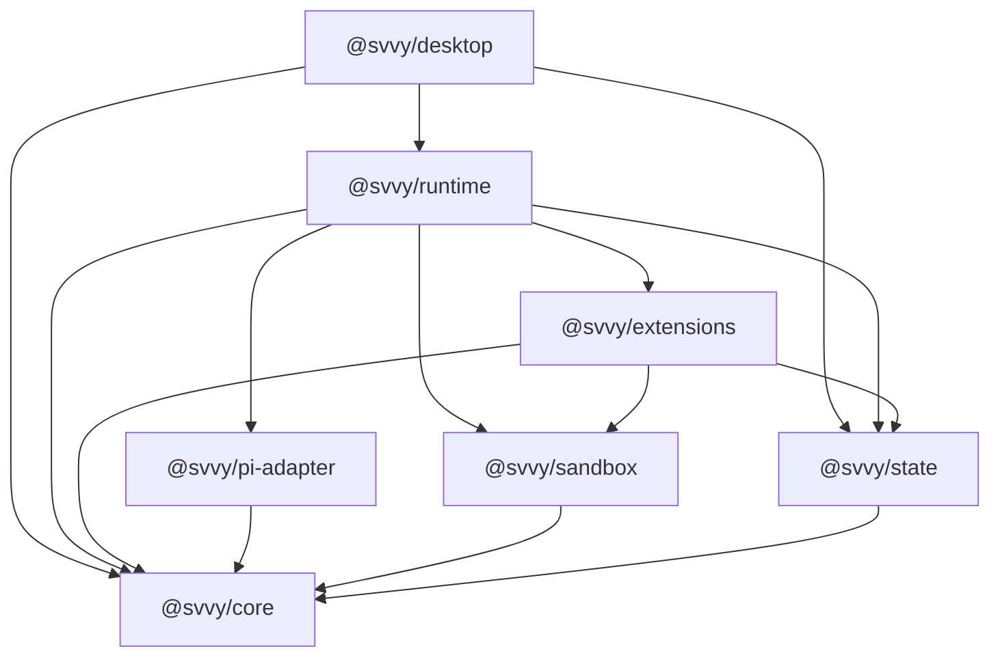

# Package Architecture Spec Todo

## Status

- Date: 2026-06-11
- Status: future architecture todo
- Scope: package-oriented architecture for making `svvy` a reusable runtime plus desktop UI

This spec defines the target package split for the future architecture refactor.

It is a `.todo` spec because the current authoritative product specs still describe the shipped
single-app implementation and current generated package names. When this future is accepted, the
affected PRD sections and feature inventory must be rewritten to this target design.

## Goal

`svvy` should be a vertically integrated desktop app on top of a small set of reusable packages.
Another app should be able to reuse the runtime, state model, sandbox, pi adapter, and extension
system with a different UI.

The package split must stay intuitive:

- public `@svvy/*` packages are for app developers building with `svvy`
- generated `@svvyx/*` packages are for agents and Smithers workflow source
- builtin capabilities that agents experience as tools, prompt guidance, or commands live under the
  extension system
- implementation areas that are not independently useful outside extensions remain source folders,
  not public packages
- prompts and instructions are extension source assets, not a separate prompt package
- the runtime API accepts new user-message inputs and emits typed events; consumers refetch durable
  read models instead of receiving renderer-shaped snapshots as the core API

## Public Package Set

The target public packages are exactly:

| Package | Spec | Purpose |
| --- | --- | --- |
| `@svvy/core` | `core.spec.todo.md` | Shared stable `svvy` domain contracts, ids, schemas, event/read-model types, and tiny pure helpers. |
| `@svvy/state` | `state.spec.todo.md` | Durable product state, projections, settings, logs, and persistence. |
| `@svvy/sandbox` | `sandbox.spec.todo.md` | Filesystem/network policy and sandbox helper integration. |
| `@svvy/pi-adapter` | `pi-adapter.spec.todo.md` | Thin pi adapter for sessions, system prompts, turns, and model metadata. |
| `@svvy/extensions` | `extensions.spec.todo.md` | Extension system plus builtin capability catalog. |
| `@svvy/runtime` | `runtime.spec.todo.md` | Shared orchestration kernel for sessions, surfaces, turns, queues, and extension routing. |
| `@svvy/desktop` | `desktop.spec.todo.md` | Electrobun/Svelte desktop UI over runtime and state. |

Do not create public packages for the following in this refactor:

- `@svvy/tools`
- `@svvy/request-input`
- `@svvy/threading`
- `@svvy/workflows`
- `@svvy/workflow-library`
- `@svvy/artifacts`
- `@svvy/snippets`
- `@svvy/logs`
- `@svvy/observability`
- `@svvy/settings`
- `@svvy/workspaces`
- `@svvy/prompts`
- `@svvy/agent-context`
- `@svvy/extension-library`
- `@svvy/smithers`

Those are source folders, generated local packages, or subdomains inside the public packages listed
above.

## Generated Package Set

The generated agent/workflow-author packages are:

| Generated package | Spec | Purpose |
| --- | --- | --- |
| `@svvyx/workflows` | `generated-packages.spec.todo.md` | Generated reusable workflow assets for Smithers source. |
| `@svvyx/extensions` | `generated-packages.spec.todo.md` | Generated extension references for workflow task-agent parameter records. |

`@svvyx/*` packages are local generated packages, not published reusable SDKs.

This target design intentionally renames the current generated `@svvy/workflows` and
`@svvy/extensions` packages to `@svvyx/workflows` and `@svvyx/extensions`. The public `@svvy/*`
namespace stays available for reusable developer packages.

## Dependency Graph

Arrows mean "imports or depends on".



`@svvy/core` is the only bottom public package. It must not import any implementation package.

## Source Folder Map

The public package list is intentionally small. The following product domains still need strong
internal module boundaries, but they are not public packages in this target design:

```text
@svvy/extensions/src/
  builtin/
    base-common/
    base-orchestrator/
    base-handler/
    base-workflow-task/
    shell/
    apply-patch/
    execute-typescript/
    extension-loading/
    extension-managing/
    request-input/
    thread-orchestration/
    thread-handling/
    artifacts/
    workflows/
    smithers/
    web/
    cx/
    git/
    github/
    external-instructions/
    generated-clients/
    svvyx/

@svvy/runtime/src/
  workspaces/
  worktrees/
  sessions/
  surfaces/
  queues/
  turns/
  prompt-refresh/
  recovery/
  title-jobs/

@svvy/state/src/
  settings/
  providers/
  sessions/
  workspaces/
  worktrees/
  commands/
  threads/
  artifacts/
  artifact-files/
  snippets/
  request-input/
  runtime-approvals/
  logs/
  generated-packages/
  read-models/
  migrations/
```

These folders can later become packages only after there is a real non-extension or non-runtime
consumer. Until then, splitting them would make the architecture less intuitive.

## Composition Model

The desktop app and other consumers compose the runtime explicitly:

```ts
import { createExtensions } from "@svvy/extensions";
import { createPiAdapter } from "@svvy/pi-adapter";
import { createRuntime } from "@svvy/runtime";
import { createSandbox } from "@svvy/sandbox";
import { createStateStore } from "@svvy/state";

const state = createStateStore({ databasePath, secretStore });
const sandbox = createSandbox({ policySource: state.sandboxPolicyPort() });
const pi = createPiAdapter({ providers, auth: state.providerAuthPort() });
const extensions = createExtensions({
  state: state.extensionStatePort(),
  artifactStore: state.artifactFileStorePort(),
  sandbox,
});

const runtime = createRuntime({
  state: state.runtimeStatePort(),
  sandbox,
  pi,
  extensions,
});
```

The exact factory names are illustrative. The architectural requirement is that packages compose
through explicit inputs and ports, not hidden globals, renderer singletons, ambient pi state, source
checkout paths, or implicit global package resolution.

## Bottom-Up Runtime Flow

The future package architecture must preserve this responsibility chain:

1. pi runs the raw agent session: transcript, model turn, streamed assistant output, streamed tool
   calls, and tool execution callbacks.
2. `@svvy/pi-adapter` translates between pi sessions/events and `@svvy/core` event contracts.
3. `@svvy/core` supplies the stable shared language: ids, target shapes, submission inputs, runtime
   events, read-model types, command fact envelopes, and policy port types.
4. `@svvy/state` persists durable product facts and projects read models. It does not execute work.
5. `@svvy/sandbox` turns immutable policy snapshots into filesystem/network launch constraints. It
   does not approve work.
6. `@svvy/extensions` resolves actor capability bindings, composes extension-owned instruction
   source, declares tools, validates tool calls, runs extension-local semantics, and returns command
   facts or runtime effects.
7. `@svvy/runtime` owns message submission, queue claiming, turn execution, prompt refresh,
   handler-thread lifecycle, request-input answer delivery, recovery, and runtime event publishing.
8. `@svvy/desktop` is one consumer. It sends runtime requests, subscribes to runtime events, refetches
   read models from state, and renders the result.

The desktop UI must not be required for programmatic runtime use. Headless tests and alternate apps
must be able to submit messages, subscribe to events, and fetch read models through the same lower
packages.

## Extension Principle

If agents experience a capability as a model-callable tool, prompt-only guidance, `svvyx` command
family, generated `execute_typescript` client, or loaded instruction block, it belongs in
`@svvy/extensions`.

That includes:

- Shell
- Apply Patch
- Execute TypeScript
- Extension Loading
- Extension Managing
- Request User Input
- Thread Orchestration
- Thread Handling
- Artifacts
- Workflows
- Smithers
- Web
- cx
- Git
- GitHub
- External Instructions
- Base actor prompts

The package architecture refactor must not create separate public packages for those builtin
extension domains unless an independent non-extension consumer is proven later.

## Prompt And Instruction Source Ownership

There is no public `@svvy/prompts` package in this target architecture.

All default agent-facing prompts and instructions live in `@svvy/extensions` as builtin extension
source assets because prompt material is part of extension binding, extension ordering, loaded /
available / off state, token estimation, source invalidation, reset behavior, generated context
preview, and actor capability slicing.

This includes:

- base common prompt
- base orchestrator prompt
- base handler prompt
- base workflow-task prompt
- native tool guidance
- prompt-only CLI guidance such as Smithers, Git, GitHub, Web, and cx
- Extension Loading and Extension Managing guidance
- Workflows and Artifacts guidance

Default instruction contributors should be Markdown or MDX files unless a generator is required.
The preferred source shape is:

```text
@svvy/extensions/src/builtin/
  base-common/
    instructions.mdx
  base-orchestrator/
    instructions.mdx
  base-handler/
    instructions.mdx
  base-workflow-task/
    instructions.mdx
  shell/
    instructions.mdx
    native-tool.schema.ts
  apply-patch/
    instructions.mdx
    native-tool.schema.ts
  smithers/
    instructions.generated.mdx
    generator.ts
  workflows/
    instructions.mdx
    svvyx-command-source.ts
```

Editable/default prompt source is `.md` or `.mdx`. Generated prompt output, such as
Smithers-docs-derived guidance, is produced from an editable generator/source pair and is not an
independent top-level source type. Runtime prompt bindings store composed generated context in
product state; they do not make prompt source part of `@svvy/runtime`.

## Smithers And Workflows Boundary

Smithers and Workflows remain separate extensions.

The Smithers extension is the existing generated Smithers instruction extension surface. This
architecture refactor does not redesign, expand, or reinterpret Smithers instruction content. If a
future change needs different Smithers guidance, that change belongs in the existing Smithers
extension spec and generation pipeline, not in the package architecture spec.

The Workflows extension is the reusable asset/source-library extension. It owns guidance and command
surface for saving, listing, building, and reusing app-global workflow assets. It is separate from
the Smithers extension and must not rely on Smithers guidance to teach Workflows-specific imports or
commands.

The Workflows extension remains a source-library capability. It does not run, resume, approve,
inspect, or debug active Smithers workflows.

If current Smithers guidance contains reusable Workflows import guidance, the package architecture
implementation must narrowly remove that Workflows-owned guidance from Smithers and relocate it to
the Workflows extension. That is the only Smithers instruction-content change in scope here; it must
not introduce new Smithers guidance or redesign generated Smithers instructions.

Smithers workflow execution remains official Smithers CLI usage through Shell in handler threads.
`svvy` must not expose Smithers as native tools, `svvyx smithers`, generated Smithers TypeScript
clients, broad Smithers runtime bridge tools, or product `workflow.*` APIs.

## Generated Package Naming

Agents and workflow source should import generated assets from `@svvyx/*` packages:

```ts
import { Agents, Components, Prompts, Workflows } from "@svvyx/workflows";
import { Extensions } from "@svvyx/extensions";
```

Inside `execute_typescript`, loaded extension clients remain an actor-scoped runtime object:

```ts
extensions.artifacts.run("inspect", { args: { artifactId } });
extensions.workflows.run("list", { options: { json: true } });
```

That `extensions` object is not a package import and is not the same thing as generated
`@svvyx/extensions`.

The `Prompts` namespace inside `@svvyx/workflows` contains reusable Smithers prompt assets saved in
the Workflows source library. It is not a public `@svvy/prompts` package and is not where default
actor prompts or extension instructions live.

## Non-Goals

- Do not create a public `@svvy/workflows` package in this refactor.
- Do not create a public `@svvy/artifacts` package in this refactor.
- Do not create a public `@svvy/tools` package in this refactor.
- Do not create a public `@svvy/request-input` package in this refactor.
- Do not create a public `@svvy/threading` package in this refactor.
- Do not create a public `@svvy/prompts` package in this refactor.
- Do not create a public Smithers package in this refactor.
- Do not introduce a standalone custom shell, readline loop, or alternate TUI stack outside pi.
- Do not use repo-root `workflows/` as shipped product runtime architecture.
- Do not keep compatibility aliases for the old generated package names when this future design
  lands.
- Do not make pi the root of the package graph by putting shared `svvy` contracts inside
  `@svvy/pi-adapter`.

## Migration Requirements

When this future design is implemented:

- rename package/spec references from `@svvy/contracts` to `@svvy/core`
- rename package/spec references from `@svvy/pi-host` to `@svvy/pi-adapter`
- move runtime-facing public contracts into `@svvy/core` without leaking pi or SQLite internals
- rewrite package imports in generated workflow source from `@svvy/workflows` to `@svvyx/workflows`
- rewrite generated workflow-agent extension references from `@svvy/extensions` to
  `@svvyx/extensions`
- update Workflows extension guidance to teach `@svvyx/workflows` and `@svvyx/extensions`
- move any existing Workflows import/source-library guidance out of Smithers specs or generators and
  into Workflows extension guidance
- keep new Smithers extension guidance out of the Workflows import story
- update `execute_typescript` import allowlists for generated packages
- update workspace `.smithers/node_modules` link creation and repair
- delete or invalidate stale workspace `.smithers/node_modules/@svvy/workflows` and generated
  `.smithers/node_modules/@svvy/extensions` links so old imports cannot keep working accidentally
- update generated package read models and Workflows pane labels
- update docs, tests, and generated declaration fixtures together
- remove old generated package names rather than preserving aliases

This migration list applies when the future package architecture is promoted from `.todo` to the
authoritative product specs. Until then, the current PRD and feature inventory may still describe
the shipped generated names.

## Acceptance Criteria

- The public package set is limited to seven packages: `@svvy/core`, `@svvy/state`,
  `@svvy/sandbox`, `@svvy/pi-adapter`, `@svvy/extensions`, `@svvy/runtime`, and `@svvy/desktop`.
- A non-desktop app can use `@svvy/runtime` with its own UI.
- A UI can render authoritative read models and command facts without owning product lifecycle rules.
- Runtime prompt submission accepts only new user-message inputs and delivery intent, not full
  renderer/pi message arrays or system prompts.
- Runtime publishes typed app/workspace events and consumers refetch read models instead of treating
  runtime events as durable state snapshots.
- All model-callable capabilities are extension records in `@svvy/extensions`.
- All default prompts and instructions are extension source assets in `@svvy/extensions`; no public
  `@svvy/prompts` package exists.
- `@svvy/extensions` hosts the builtin extension catalog without splitting builtin domains into
  premature public packages.
- Generated agent/workflow packages use the `@svvyx/*` namespace.
- Smithers extension instruction content remains governed by the existing Smithers extension specs.
- Workflows extension guidance is separate from Smithers guidance.
- Smithers workflow execution remains official CLI usage through Shell in handler threads.
- `execute_typescript` keeps actor-scoped loaded-extension clients only for loaded callable
  TypeScript clients.
- Package boundaries avoid cycles and avoid hidden singleton coupling.
- `@svvy/core` imports no implementation package.
- `@svvy/pi-adapter` imports `@svvy/core` but shared `svvy` contracts do not live inside
  `@svvy/pi-adapter`.
- Old generated package links are removed, not retained as compatibility aliases.
