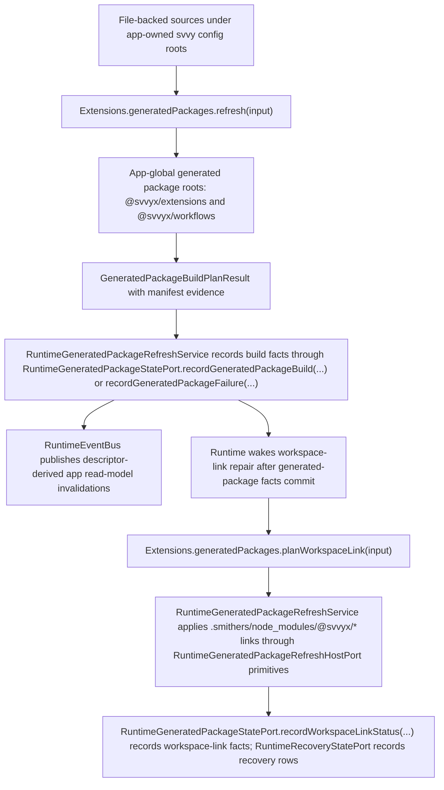

# Generated Packages Architecture Spec

## Status

- Status: active architecture spec; implementation progress is tracked in `docs/progress.md`
- Scope: generated local packages emitted from app-global Workflows source-library inputs and
  consumed by workspace Smithers workflow authoring source

## Purpose

Generated packages provide stable, intuitive imports for workspace Smithers workflow source.
Same-package generated-package reuse uses relative imports only. Generated package files may use
only the explicit external package imports allowed by this spec, such as Smithers authoring imports,
`@svvyx/extensions` extension references, and the narrow type-only `@svvy/core` task-agent bridge
contracts. Persistent Workflows source-library files are inputs to generation, not consumers of
`@svvyx/workflows`.

They are generated local packages, not public reusable SDK packages.

Generated packages are not Effect service packages. They are generated TypeScript source artifacts
for workflow/source-authoring contexts, not runtime facades for agent-authored `execute_typescript`
snippets.

## Package Names

The generated package names are:

```text
@svvyx/workflows
@svvyx/extensions
```

`@svvyx/*` means "svvy-generated extension/workflow context available inside generated `@svvyx/*`
package output and workspace Smithers workflow authoring contexts." Persistent app-global
Workflows source under `~/.config/svvy/workflows/**` is source input used to generate
`@svvyx/workflows`; it is not itself a consumer of the generated `@svvyx/workflows` package.

## Import Policy By Source Root

| Source root or context                                                                                                  | `@svvyx/workflows`                                                                                                                                                                                                 | `@svvyx/extensions`                                                                                                                 |
| ----------------------------------------------------------------------------------------------------------------------- | ------------------------------------------------------------------------------------------------------------------------------------------------------------------------------------------------------------------ | ----------------------------------------------------------------------------------------------------------------------------------- |
| `<workspace>/.smithers/workflows/**` and `<workspace>/.smithers/components/**` Smithers TypeScript/TSX authoring source | Allowed.                                                                                                                                                                                                           | Allowed for workflow task-agent extension references.                                                                               |
| Other `<workspace>/.smithers/**` files such as prompts, agents, config, executions, and generated Smithers state        | Forbidden.                                                                                                                                                                                                         | Forbidden.                                                                                                                          |
| Source passed to `svvyx workflows save --from ...`                                                                      | Allowed only while parsing external authoring input for `svvyx workflows save --from ...`; saved persistent source is either extracted as reusable source with no self-import or rejected with a typed diagnostic. | Allowed only while parsing external authoring input; before save, destination source policy decides whether the import may persist. |
| `~/.config/svvy/workflows/agents/*.agent.json`                                                                          | Not applicable; JSON records have no imports.                                                                                                                                                                      | Not applicable; JSON records store validated extension ids.                                                                         |
| `~/.config/svvy/workflows/prompts/**` persistent prompt source                                                          | Forbidden; prompt source contributors are managed by `@svvy/extensions` and emitted into generated `@svvyx/workflows` prompt string outputs, not generated-package consumers.                                      | Forbidden; reusable prompt source does not import generated package APIs.                                                           |
| `~/.config/svvy/workflows/components/**` and `~/.config/svvy/workflows/workflows/**` persistent source                  | Forbidden; it would self-import the package generated from this source tree.                                                                                                                                       | Allowed when extension reference values are needed.                                                                                 |
| Generated `@svvyx/workflows` package files                                                                              | Forbidden; same-package reuse uses relative internal imports.                                                                                                                                                      | Allowed.                                                                                                                            |
| Generated `@svvyx/extensions` package files                                                                             | Forbidden.                                                                                                                                                                                                         | Forbidden; no bare self-imports.                                                                                                    |
| Product implementation source under public `@svvy/*`, app/bootstrap implementation source, renderer/desktop source      | Forbidden.                                                                                                                                                                                                         | Forbidden.                                                                                                                          |
| `execute_typescript` snippets                                                                                           | Forbidden.                                                                                                                                                                                                         | Forbidden.                                                                                                                          |

`~/.config/svvy/workflows/prompts/*.mdx` files are editable reusable workflow prompt MDX source
contributors owned and validated by `@svvy/extensions`. They are source inputs to generated
`@svvyx/workflows` raw prompt string exports only; generation preserves the prompt source text as
the exported value after path/export-name validation. They must not import `@svvyx/workflows`,
`@svvyx/extensions`, Smithers packages, product packages, or runtime facades. Generated `Prompts.*`
exports are never an editable prompt source location.

## `@svvyx/workflows`

`@svvyx/workflows` is generated by the `@svvy/extensions` generated-package service from Workflows
source-library inputs.

It exports reusable workflow assets:

```ts
import { Agents, Components, Prompts, Workflows } from "@svvyx/workflows";
```

The root public shape is:

```ts
export * as Agents from "./agents";
export * as Components from "./components";
export * as Prompts from "./prompts";
export * as Workflows from "./workflows";
```

The generated `Prompts` namespace contract is:

```ts
// @svvyx/workflows index.ts
export * as Prompts from "./prompts";

// @svvyx/workflows prompts/index.ts
export const reviewPrompt: string;
```

`Prompts.reviewPrompt` is representative: it is read-only validated prompt string output generated
from editable reusable workflow prompt source such as
`~/.config/svvy/workflows/prompts/reviewPrompt.mdx`. The MDX file is the source. The generated
validated string export is output. The `Prompts` namespace is the read-only generated output for
reusable workflow prompt MDX source. It is not the editable source location and is not used for
default actor prompts or extension instructions. Generated package files are never edited to
customize prompt text.

The generated `Agents` namespace contract is:

```ts
import type { ExtensionId as GeneratedExtensionId } from "@svvyx/extensions";
import type { AgentLike } from "smthrs";

// @svvyx/workflows index.ts
export * as Agents from "./agents";

// @svvyx/workflows agents/index.ts
export type TaskAgentExtensionOverrides = {
  readonly [extensionId in GeneratedExtensionId]?: "loaded" | "available" | "unavailable";
};

export type TaskAgentParametersSource = {
  id: string;
  label: string;
  provider: string;
  model: string;
  reasoning: {
    effort: "off" | "minimal" | "low" | "medium" | "high" | "xhigh";
  };
  instructions: string;
  overrides?: TaskAgentExtensionOverrides;
};

export const defaultAgent: TaskAgentParametersSource;
export const explorerAgent: TaskAgentParametersSource;
export const implementerAgent: TaskAgentParametersSource;
export const reviewerAgent: TaskAgentParametersSource;

export function defineTaskAgent(parametersOrExport: TaskAgentParametersSource): AgentLike;
```

`Agents.*` exports are generated structured `TaskAgentParametersSource` records from file-backed
Workflows source under `~/.config/svvy/workflows/agents/*.agent.json`. `defaultAgent` is generated
from the app-owned default `.agent.json` source file after packaged defaults have been scaffolded or
reset into that source root. It is not generated from an agent-profile DB row. `id`, `label`,
`provider`, `model`, `reasoning`, and `instructions` are
required. `reasoning` is the generated-package source representation of the exact core
`ReasoningSelection` encoding, including `"off"` for models without reasoning support. Runtime
decodes it through `ReasoningSelectionSchema`, validates it against pi model metadata, and rejects
unsupported values without clamping before it can affect a surface, queue row, generated-context
binding, command fact, or model request. `TaskAgentExtensionOverrides` is emitted as a sparse
`Partial<Record<TaskAgentExtensionId, TaskAgentExtensionOverrideState>>`-equivalent map from
generated `@svvyx/extensions` extension id to usage state for values that differ from the resolved
workflow task-agent defaults.

`TaskAgentParametersSource` is an authoring and generated-package input type. It deliberately uses
plain generated package ids and must not expose `@svvy/core` branded domain ids as authoring inputs.
`TaskAgentParametersSource.instructions` is the workflow task-agent row's individual inline
instruction text. It is not a default actor prompt, extension instruction source, generated-context
contributor, or prompt ownership surface. Default prompts, loaded extension instructions, scripted
prompt contributors, generated-context assembly policy, and editable prompt/instruction MDX files
belong to `@svvy/extensions`; generated `@svvyx/workflows` packages only carry the already-authored
per-agent instruction field needed by Smithers `<Task agent={...}>` execution.
`@svvyx/workflows` may use type-only imports from `@svvy/core` only for the exact unbranded bridge
contracts named in this spec: `RunTaskAgentSourceInput`, `RunTaskAgentResult`,
`RunTaskAgentPromptSource`, and `RunTaskAgentError`. It must not import branded ids, runtime service
types, state port types, runtime facade types, schema values, decoders, validators, or broad
task-agent/core contracts.
The generated package manifest must record `@svvy/core` type availability whenever generated
`@svvyx/workflows` source contains an `import type` from `@svvy/core`. That evidence is app-owned
contract/typecheck metadata only. The active mechanism is a generated package-manager
`devDependencies` entry for `@svvy/core` plus generated-package evidence with
`manifestDependency: "dev-type-dependency"`. The `devDependencies["@svvy/core"]` value is a
relative `file:` specifier from `workflowsPackageRoot` to `coreTypeContractPackageRoot`, computed
from the two named roots supplied through `GeneratedPackageRootPort`. It is not a bare version, a
workspace protocol, a registry dependency, or a repo-local source checkout path. That mechanism must
make the generated package typecheck outside the monorepo without making emitted runtime JavaScript
require `@svvy/core`. It must not add value exports, runtime imports, a package-root SDK surface, or
`execute_typescript` facade declarations. Generated source must use `import type` only for the named
bridge contracts.
The packaged-app-safe resolution source for that type-only `@svvy/core` dependency is the app-owned
generated contract/type package materialized beside the generated package roots by app/bootstrap
from the shipped core declaration bundle. It is not resolved from the source checkout, desktop app
bundle internals, repo-root `packages/core`, repo-root `workflows/`, or a global package cache. The
generated-package evidence manifest records that resolution authority as
`"app-owned-type-contract"`; runtime JavaScript emitted by `@svvyx/workflows` contains no
`@svvy/core` require/import.

Runtime validates `TaskAgentParametersSource` into an internal runtime-owned
`ValidatedTaskAgentParameters` shape with branded provider, model, reasoning, and extension ids
before any queue row, generated-context binding, profile override, or command fact is persisted.
That validated shape is defined by runtime/core contracts and is not emitted by
`@svvyx/workflows`.

Runtime rejects generated task-agent requests whose source override keys do not resolve to current
extension records for the workflow-task actor. Generated package code never brands extension ids and
never persists `TaskAgentParametersSource` directly.

`Agents.defineTaskAgent(...)` returns a Smithers-compatible `AgentLike` for `<Task agent={...}>`.
That `AgentLike` calls svvy through exactly one authenticated bridge operation named `runTaskAgent`.
The generated bridge request carries the `TaskAgentParametersSource`, Smithers
run/node/iteration/attempt identity, optional observed Smithers context `{ run, node, rootDir }`,
exactly one `promptSource` value (`{ kind: "prompt" }` or `{ kind: "messages" }`),
`workspaceSessionId`, and `sourceCommandId`. It has no top-level `rootDir`. The bridge result shape
is the `RunTaskAgentResult` contract exported by `@svvy/core`: `text: string` plus optional
JSON-safe `usage` and `output`.

Generated package code may import that contract type-only for authoring types. Runtime schema
validation happens in the app/runtime bridge on both request and response. Generated package code
owns local structural guards and generated-client response byte-limit rejection before returning to
Smithers code; it does not own authoritative bridge response validation, pi session lifecycle,
queue claiming, app settings, arbitrary app RPC, Shell access, or orchestrator controls.
Local structural guards are intentionally shallow generated-client checks: required bridge URL/token
env variables are present, the source prompt shape is one of the generated client variants, the HTTP
status/body is parseable JSON, and the response byte limit is respected before returning control to
Smithers. They must not brand ids, duplicate core schemas, reinterpret runtime error variants,
validate command lineage, validate extension usage, or accept a response the runtime bridge rejected.
The runtime bridge remains the only authoritative validator for request and response contracts.
The generated bridge request does not carry `threadId`. Runtime resolves the owning handler thread
from the validated `workspaceSessionId` plus `sourceCommandId` command fact lineage and rejects the
request when the source command is not owned by a handler-thread surface.
The bridge is only the generated Smithers task-agent `runTaskAgent` operation for
`<Task agent={...}>`; it is not a generated Smithers workflow-control API and does not run, resume,
approve, inspect, or debug Smithers workflow executions.
Generated package code must not open, read, write, migrate, mirror, or summarize Smithers
persistence such as `smithers.db`, execution directories, run stores, approval stores, or graph
state as product state. Generated `@svvyx/*` code may pass Smithers-provided run/node/attempt
identity and optional observed context into `runTaskAgent`; Smithers remains the sole owner of
workflow graph execution and workflow/run state. `@svvy/state` may persist only svvy
command/task-attempt/recovery/read-model facts and CLI-observed Smithers facts recorded by
runtime-owned command handling.

Generated client code may perform exactly one transport operation: a direct POST to the
command-scoped `runTaskAgent` bridge URL injected into the Smithers command environment. This
generated `@svvyx/workflows` client is not product package/runtime code and is the only
generated-package location allowed to read bridge env variables or call raw `fetch`:

```ts
const bridgeUrl = readRequiredBridgeEnv("SVVY_WORKFLOW_AGENT_BRIDGE_URL");
const bridgeToken = readRequiredBridgeEnv("SVVY_WORKFLOW_AGENT_BRIDGE_TOKEN");

await fetch(bridgeUrl, {
  method: "POST",
  headers: { authorization: `Bearer ${bridgeToken}` },
  body: JSON.stringify(request satisfies RunTaskAgentSourceInput),
});
```

No product package, extension handler, runtime service, state service, renderer module,
app/bootstrap helper, or `execute_typescript` facade may copy this raw `fetch` / ambient env pattern.

The generated `@svvyx/workflows` task-agent bridge client may read exactly these variables, and only
while running inside a Smithers workflow command environment launched by runtime-owned Shell command
execution for an eligible handler-thread command:

- `SVVY_WORKFLOW_AGENT_BRIDGE_URL`
- `SVVY_WORKFLOW_AGENT_BRIDGE_TOKEN`
- `SVVY_WORKFLOW_AGENT_WORKSPACE_SESSION_ID`
- `SVVY_WORKFLOW_AGENT_SOURCE_COMMAND_ID`
- `SVVY_WORKFLOW_AGENT_BRIDGE_TIMEOUT_MS`
- `SVVY_WORKFLOW_AGENT_BRIDGE_MAX_RESPONSE_BYTES`

App/bootstrap injects those values only for the command-scoped Smithers child process selected by
`@svvy/runtime`. Generated code must treat a missing, empty, malformed, or non-command-scoped value
as a local bridge setup failure and must not fall back to global process env names, config files,
localhost probing, renderer state, or runtime facades.

The exact server-side bridge transport, command-scoped environment variable injection, auth token
validation, rejection conditions, accepted-request behavior, and runtime idempotency key are defined by
`docs/specs/package-architecture/runtime.spec.md` using DTOs owned by
`docs/specs/package-architecture/core.spec.md`. Workflow-library docs may mirror the product
semantics for workflow authors, but they do not define a second bridge transport, environment, or
idempotency contract. The runtime idempotency key is derived from `workspaceSessionId`,
`sourceCommandId`, Smithers run/node/iteration/attempt identity, and `agent.id`.
The generated package does not define a second transport or idempotency contract. Accepted bridge
calls are normalized by `@svvy/runtime` into `workflow_task_agent_start` durable queue rows
persisted by `@svvy/state`; runtime owns idempotency, scheduling, and delivery.

Rules:

- It is generated from app-global reusable workflow source.
- It is plain generated TypeScript by default.
- It is read-only to ordinary agent edits.
- It is generated from persistent app-global Workflows source-library inputs and then linked into
  workspace `.smithers/node_modules` only as workspace package-resolution plumbing for Smithers
  authoring source.
- It is visible through the Workflows generated-surface pane.
- It is taught by Workflows extension guidance, not by Smithers extension guidance.
- It may import Smithers workflow-authoring dependencies required by the generated workflow source.
- It may import `@svvyx/extensions` when generated task-agent source needs extension reference
  values.
- It may use type-only imports from `@svvy/core` only for the exact bridge contracts named in this
  spec: `RunTaskAgentSourceInput`, `RunTaskAgentResult`, `RunTaskAgentPromptSource`, and
  `RunTaskAgentError`. It must not import branded ids, runtime service types, schema values,
  decoders, validators, or broad task-agent/core contracts, and must
  not expose Effect services, layers, managed runtimes, process helpers, state ports, or runtime
  facades.
  Manifest dependency evidence for `@svvy/core` is type-only app-owned contract evidence for
  generated/typecheck tooling, not a runtime package dependency for emitted JavaScript.
- It must not import itself by bare specifier or generated package path; same-package reuse uses
  relative internal imports.
- `svvyx workflows save --from ...` may accept external Smithers authoring input that imports
  `@svvyx/workflows` only as a transient source being copied or extracted. Before writing
  persistent app-global source under
  `~/.config/svvy/workflows/{agents,prompts,components,workflows}/**`, the save operation must
  either extract a reusable source unit with no generated-package self-import or reject the save
  with a typed `generated-self-import` diagnostic. It does not perform heuristic import rewriting
  and must not preserve a self-import in source that generates `@svvyx/workflows`.
  Generated package roots resolved through `GeneratedPackageRootPort` are never persistent source
  destinations for `save`.
- It must not import public `@svvy/extensions`.
- Its `Prompts` namespace exposes generated exports for reusable workflow prompt outputs whose
  MDX/source contributors are owned, validated, and built by `@svvy/extensions`. It is not the
  source location for default actor prompts, extension instructions, or reusable workflow prompt
  contributors.
- It must not import `effect`, any `effect/*` subpath, or any `@effect/*` package. Generated
  `@svvyx/*` outputs never import, export, wrap, or expose Effect services, layers, runtimes,
  observability APIs, or runtime lifecycle helpers. A reusable Workflows asset that requires Effect
  code is not eligible for app-global `~/.config/svvy/workflows/**` source-library generation into
  `@svvyx/*`; it stays workspace-local Smithers authoring source under `.smithers/**` and is not
  eligible for generated `@svvyx/*` output unless a product spec names the exact generated
  dependency, generated import allowlist, package manifest output, typecheck/runtime behavior, and
  boundary tests. Generated packages never
  expose `Context`, `Context.Service`, `Layer`, `ManagedRuntime`, `effect/Runtime`, `Metric`,
  `Logger`, `Tracer`, observability/exporter APIs, service APIs, runtime lifecycle APIs, or
  app/bootstrap helpers as root exports, namespace members, workflow task-agent bridge parameters,
  or reusable generated prompt outputs.
- Generated package validation rejects any generated root export or generated source import that
  exposes `Context.Service`, `Layer`, `ManagedRuntime`, `Runtime`, broad `@svvy/state` store or
  repository implementation services, `Sandbox`, `PiAdapter`, `ChildProcessHandle`, public
  `@svvy/extensions` service/package surfaces, or state/runtime/extension/sandbox/pi-adapter
  service ports. It also rejects any public import from `@svvy/runtime`, `@svvy/state`,
  `@svvy/sandbox`, `@svvy/pi-adapter`, `@svvy/desktop`, or public `@svvy/extensions`. This
  restriction does not reject the generated `@svvyx/extensions`
  `Extensions` reference namespace. Type-only `@svvy/core` imports are allowed only for the exact
  bridge contracts named in this spec: `RunTaskAgentSourceInput`, `RunTaskAgentResult`,
  `RunTaskAgentPromptSource`, and `RunTaskAgentError`.
  Runtime callable facades for `execute_typescript` are never generated package imports.

## `@svvyx/extensions`

`@svvyx/extensions` is generated by the `@svvy/extensions` generated-package service from the
workflow-task-safe extension reference set: builtin extension ids valid for workflow task-agent
overrides plus file/build-eligible user `svvyx` extensions that opt into workflow task-agent
reference export generation, have approved dependencies, and have successful current source/build
evidence. DB-backed readiness rows index and observe those facts for product state and read models;
they are not the source input to generated-package eligibility. Deleted, instruction-only,
dependency-blocked, and build-failed extensions are excluded.

User extension opt-in is explicit. `ExtensionManifestV1.workflowTaskAgentReferenceExportEnabled`
defaults to `false`; only user `svvyx` extensions with that field set to `true` may enter
`@svvyx/extensions`. Builtin workflow-task-safe extension ids are selected by builtin extension records,
not by this user manifest field.

The generated reference set means "ids that workflow task-agent source may mention," not "every id
can be changed to every usage state." Build validation still validates each override value against
workflow-task actor binding rules. Fixed always-loaded ids may be emitted as reference ids for
type-safe source, but an override that would change a fixed state is rejected instead of being
silently ignored.

`@svvy/extensions` owns the eligibility rules for that reference set. App/bootstrap and
package-owned services may provide host file services and state-backed ports, but they must not
duplicate the eligibility predicate. The builtin portion is derived from builtin extension records
whose default workflow-task usage state is not `"unavailable"`. Builtins with a hard actor boundary
are excluded. Build validation still rejects usage changes that violate fixed always-loaded or
hard-forbidden actor rules. Network access policy never changes the static workflow-task-safe
`@svvyx/extensions` reference set; runtime validates actual loaded/available state and network
policy per task-agent attempt from the prompt-bound snapshot. The `@svvy/extensions`
generated-package Effect service receives file-backed and approval facts through named Effect
services and ports. Its host-backed app/test adapter is a separate package-owned adapter surface
that accepts the exact `GeneratedExtensionExportDiscoveryHost` operations named below and delegates
to the same selector logic:

```ts
type GeneratedExtensionDependencyDeclaration = {
  readonly kind: "dependency" | "trusted_dependency";
  readonly name: string;
  readonly version: string;
};

type ExtensionDependencyApprovalIdentity = {
  readonly kind: "dependency" | "trusted_dependency";
  readonly packageManager: "bun";
  readonly source: "npm";
  readonly name: string;
  readonly version: string;
  readonly integrity: string | null;
  readonly resolution: string | null;
};

type GeneratedExtensionExportIdsInput = {
  extensionsRoot: AbsolutePath;
  builtinExtensionIds?: readonly string[];
};

type GeneratedExtensionExportDiscoveryServices =
  | FileSystem.FileSystem
  | Path.Path
  | ExtensionStatePort;

type GeneratedExtensionsPackageContents = {
  extensionIds: readonly GeneratedExtensionId[];
  sourceFingerprintParts: readonly string[];
  dependencies: readonly GeneratedExtensionsPackageDependencyEvidence[];
  evidence: GeneratedExtensionsPackageEvidence;
  files: readonly GeneratedExtensionsPackageFile[];
};

type GeneratedExtensionExportDiscoveryHost = {
  join(...segments: readonly string[]): string;
  readDirectory(path: string): readonly string[];
  readFileString(path: string): string | null;
  sourceFingerprint(sourceRoot: string): string | null;
  isDependencyApproved(dependency: ExtensionDependencyApprovalIdentity): boolean;
  statType(path: string): "Directory" | "File" | "Other" | null;
};

declare function generatedExtensionExportIds(
  input: GeneratedExtensionExportIdsInput,
): Effect.Effect<Set<string>, ExtensionError, GeneratedExtensionExportDiscoveryServices>;

declare function generatedExtensionsPackageContents(
  input: GeneratedExtensionExportIdsInput,
): Effect.Effect<
  GeneratedExtensionsPackageContents,
  ExtensionError,
  GeneratedExtensionExportDiscoveryServices
>;

declare function generatedExtensionExportIdsFromHost(
  input: GeneratedExtensionExportIdsInput,
  host: GeneratedExtensionExportDiscoveryHost,
): Set<string>;

declare function generatedExtensionsPackageContentsFromHost(
  input: GeneratedExtensionExportIdsInput,
  host: GeneratedExtensionExportDiscoveryHost,
): GeneratedExtensionsPackageContents;
```

Those inputs and functions are `@svvy/extensions` package contracts, not `@svvyx/extensions`
exports. The Effect service path is the package-to-package surface for generated-extension export
discovery: callers use `generatedExtensionExportIds(...)`,
`generatedExtensionsPackageContents(...)`, or the higher-level `Extensions.generatedPackages`
service through declared Effect services and layers. The host-backed functions are only app-edge and
test adapters for callers that already own an explicit filesystem/state host object; they do not
become generated-package runtime facades and must not add operations beyond the named host contract.
The pure file-render helpers remain package-owned implementation/test seams. App/runtime
generated-package refresh paths use `Extensions.generatedPackages.refresh(...)`; Bun app-edge
modules do not import those renderers or own generated-package file writes. The render helpers
return generated file contents only; they do not become generated `@svvyx/*` output.

Any new app-edge or test adapter must first be named by this spec with its exact export,
input/output types, allowed host operations, owning tests, and boundary allowlist. Such an adapter
may only delegate to the same package eligibility logic; it must not duplicate eligibility policy,
write product state, publish runtime/read-model events, own runtime scheduling, apply
generated-package link repair, expose runtime facades, or become generated `@svvyx/extensions`
output. The selector result is derived package logic. State-backed extension inventory,
generated-package facts, diagnostics, and read-model invalidations remain in `@svvy/state`; they are
not embedded in `@svvyx/extensions` and are not copied into this selector result.

`extensionsRoot` is a branded absolute path because this is a file-backed package boundary. Only
app/bootstrap, `@svvy/extensions` layer construction, and package-owned tests may canonicalize and
brand the app-owned Extensions source root before invoking the Effect service. Arbitrary package
consumers do not construct `GeneratedExtensionExportIdsInput.extensionsRoot`; they consume the
higher-level `Extensions.generatedPackages` service through the composed layer.
`builtinExtensionIds` remains unbranded generated/reference ids at this implementation boundary;
runtime/state validates branded extension ids only when values cross back into product state.

Eligibility fact ownership:

- Source manifest, current build manifest, generated type file path, and installed dependency
  package artifacts are file-backed under the app-owned Extensions root.
- Builtin extension records are package-code/source-library facts owned by `@svvy/extensions` and
  installed into the app-owned Extensions root during bootstrap/source reconciliation. They are not
  SQLite rows, generated-context payloads, renderer state, or generated `@svvyx/extensions` output.
  SQLite readiness rows may observe builtin readiness for product state, but they do not define the
  builtin reference set.
- `@svvy/runtime` source invalidation computes source fingerprints from file-backed source and
  commits the observation through core-owned state ports implemented by `@svvy/state`.
  `@svvy/extensions` may read committed fingerprint/readiness rows through
  `ExtensionStatePort.records.readSourceFingerprint(...)` only as previous observation and
  comparison evidence. The same refresh batch must reread the file-backed source manifest, current
  build manifest, generated type file path, and installed dependency package artifacts before
  emitting `@svvyx/extensions`; DB rows are not freshness authority and are never sufficient source
  input for generated-package eligibility.
- Committed dependency approval facts are DB/product-state-backed and read through
  `ExtensionStatePort.dependencies.isApproved(...)` with the exact normalized dependency identity.
  A `GeneratedExtensionDependencyDeclaration` maps to
  `{ kind, packageManager: "bun", source: "npm", name, version, integrity: null, resolution: null }`
  before crossing the state port.
  The generated-package refresh batch reads dependency approval facts through that state port in the
  same Effect operation that rereads file-backed source evidence. The batch observes one consistent
  state snapshot for dependency approvals and one current filesystem read set for source/build
  evidence; stale DB fingerprint rows alone never satisfy either freshness requirement.
- Extension inventory, generated-package facts, diagnostics, workspace-link rows, and read-model
  invalidations are SQLite-backed `@svvy/state` facts.

A user extension enters the reference set only when all of these facts are true:

- the source manifest exists at `sources/user/<extensionId>/manifest.json`
- the source manifest has `schemaVersion: 1`, `id` equal to the directory name,
  `interface: "svvyx"`, `typescriptApiEnabled: true`, and
  `workflowTaskAgentReferenceExportEnabled: true`
- the current build manifest exists at `builds/extensions/<extensionId>/current/manifest.json`
- the current build manifest has `schemaVersion: 1`, matching `extensionId`,
  `interface: "svvyx"`, a string `module`, a valid `incur.v1` command manifest, an array
  `dependencies`, and `typescriptTypes` equal to
  `<extensionsRoot>/generated/extensions/<extensionId>/types.d.ts`
- the current build manifest `sourceFingerprint` equals the current source root fingerprint computed
  from file-backed source in the same generated-package refresh batch
- every dependency declaration is normalized to its exact approval identity, approved by
  `ExtensionStatePort.dependencies.isApproved({ dependency: identity })`, and has an exact installed
  package artifact at
  `<extensionsRoot>/package/node_modules/<dependency.name>/package.json` with matching `name` and
  `version`

The generated-package evidence `sourceFingerprint` includes the sorted exported extension ids and
the validated source fingerprint part for each exported extension. Builtin extension references use
package-owned builtin source identity parts. User extension references use the same current source
root fingerprint that matched the current build manifest during eligibility validation. Dependency
declarations are eligibility evidence for user extension references; because `@svvyx/extensions`
emits only plain extension reference values and no imports of user extension dependency types or
runtime modules, those user-extension dependency declarations are not emitted as
`GeneratedPackageDependencyEvidence` entries unless generated source starts emitting matching
non-relative imports.

It exposes extension reference values for workflow task-agent parameter records:

```ts
import { Extensions } from "@svvyx/extensions";
```

The root public shape is:

```ts
export type ExtensionReference<Id extends string = string> = {
  readonly id: Id;
};

export declare const Extensions: {
  readonly "apply-patch": ExtensionReference<"apply-patch">;
  readonly artifacts: ExtensionReference<"artifacts">;
  readonly "base-common": ExtensionReference<"base-common">;
  readonly "base-workflow-task": ExtensionReference<"base-workflow-task">;
  readonly cx: ExtensionReference<"cx">;
  readonly "execute-typescript": ExtensionReference<"execute-typescript">;
  readonly "extension-loading": ExtensionReference<"extension-loading">;
  readonly git: ExtensionReference<"git">;
  readonly github: ExtensionReference<"github">;
  readonly shell: ExtensionReference<"shell">;
  readonly web: ExtensionReference<"web">;
  // plus eligible user svvyx extension ids
};

export type ExtensionId = (typeof Extensions)[keyof typeof Extensions]["id"];
```

`Extensions` is keyed by the generated workflow-task-safe builtin extension reference set. The
builtin workflow-task reference set is exactly:

| id                   | emitted | override allowed |
| -------------------- | ------- | ---------------- |
| `apply-patch`        | yes     | no               |
| `artifacts`          | yes     | no               |
| `base-common`        | yes     | no               |
| `base-workflow-task` | yes     | no               |
| `cx`                 | yes     | no               |
| `execute-typescript` | yes     | no               |
| `extension-loading`  | yes     | no               |
| `git`                | yes     | no               |
| `github`             | yes     | no               |
| `shell`              | yes     | no               |
| `web`                | yes     | no               |

Eligible user svvyx extension ids are appended only through the eligibility rules below. Generation
does not emit alias properties such as `Extensions.applyPatch`. Task-agent parameter records may use
generated reference ids such as `Extensions.git.id` for identifier-safe ids or
`Extensions["apply-patch"].id` for non-identifier ids. Build validation accepts extension id strings
read from generated references; it rejects passing an entire `ExtensionReference` object such as
`Extensions.git`, generated alias properties such as `Extensions.applyPatch`, and arbitrary strings
that are not in the generated reference set.

The generated `ExtensionId` alias is an authoring-time string union over the generated reference
set. It is not the decoded branded `@svvy/core` `ExtensionId` type, and generated package code must
not import, emulate, or cast to the core brand. Runtime and extension services validate generated
reference strings against `@svvy/core` schemas when those strings cross back into product state or
runtime request boundaries.

Rules:

- It is generated output.
- It is plain generated TypeScript data by default.
- It is read-only to ordinary agent edits.
- It is eligible for runtime-owned workspace-link repair whenever current generated-package facts
  exist for an acquired or recoverable workspace; runtime must not decide `@svvyx/extensions` link
  creation by scanning workflow imports.
- It is not the same thing as the public `@svvy/extensions` package.
- It is not the same thing as the actor-scoped `extensions` object inside `execute_typescript`.
- It is self-contained plain reference data. The `@svvyx/extensions` contract has no allowed
  `@svvy/core` import of any kind.
- It must not import public `@svvy/extensions`.
- It must not import, type-import, emulate, or cast to `@svvy/core` branded ids, bridge DTOs,
  runtime service types, or broad task-agent/core contracts. It must not expose Effect services,
  layers, managed runtimes, process helpers, state ports, or runtime facades.
- It must not emit extension inventory metadata such as display names, descriptions, tags,
  categories, builtin/user kind, readiness state, default usage state, token estimates, generated
  context fingerprints, source paths, package paths, or build diagnostics. Those facts belong to
  `@svvy/state` read models and `@svvy/extensions` inspection APIs, not generated workflow
  authoring imports.
- Generated package validation rejects any generated root export that exposes Effect
  `Context.Service`, `Layer`, `ManagedRuntime`, public `@svvy/runtime` `Runtime` service, broad
  `@svvy/state` store or repository implementation services, `Sandbox`, `PiAdapter`, the public
  `@svvy/extensions` service/package, the runtime-injected `execute_typescript` `extensions`
  object, `ChildProcessHandle`, state/runtime/extension service ports, any public service import
  from `@svvy/runtime`, `@svvy/state`, or `@svvy/extensions`. The generated `@svvyx/extensions`
  `Extensions` namespace is allowed because it is plain generated reference data, not the public
  extension service. Runtime callable facades for `execute_typescript` are never generated package
  imports.

## `execute_typescript` Runtime Object

Inside `execute_typescript`, loaded extension facades remain an injected runtime object:

```ts
await extensions.artifacts.run("inspect", { options: { id: artifactId } });
await extensions.workflows.run("list", { options: { kind: "workflow" } });
```

That object:

- contains only loaded callable TypeScript facades for the current actor
- is not imported from a package
- is governed by `@svvy/extensions`
- creates child command facts under the parent `execute_typescript` command
- exposes Promise-returning methods to agent-authored snippets because the snippet authoring surface
  is ordinary async TypeScript
- is backed by Effect handlers inside `@svvy/extensions` and `@svvy/runtime`
- is not `@svvyx/extensions` and does not grant access to generated extension reference data

`execute_typescript` import allowlists must reject `@svvyx/workflows` and `@svvyx/extensions`.
Runtime callable extensions are exposed only through the injected actor-scoped `extensions` object.

## Generated Package Name Invariants

Generated package manifests, generated source imports, workspace `.smithers/node_modules` links,
Workflows extension instructions, generated declarations for workflow/source-authoring contexts,
Workflows pane labels, read models, tests, and fixtures use only:

```text
@svvyx/workflows
@svvyx/extensions
```

Smithers guidance does not teach reusable Workflows imports or Workflows source-library commands.
That guidance belongs to the Workflows extension.

Only the canonical generated package names `@svvyx/workflows` and `@svvyx/extensions` are emitted.

## Lifecycle Ownership

`@svvy/extensions` exposes generated-package refresh through the canonical
`Extensions.generatedPackages.refresh(...)` service method. Any `GeneratedPackageService` module used
inside `@svvy/extensions` is package-private implementation detail; it is not exported from the
package root, has no public primary layer, and is not imported by runtime, state, desktop,
pi-adapter, sandbox code, or app-owned `src/bun/*` implementation files. Runtime invokes the public
`Extensions.generatedPackages.refresh(...)` service through app-bootstrap-composed host/layer
bindings; desktop, renderer, browser-tool, headless, and non-runtime app code do not call
generated-package refresh directly. App code does not reach into package-private generated-package
renderers, compose `@svvy/extensions` internals, create a `ManagedRuntime`, or duplicate
generated-extension eligibility rules in app code. Package-private refresh implementation returns
`Effect.Effect<GeneratedPackageBuildPlanResult, ExtensionError, FileSystem.FileSystem | Path.Path | ExtensionStatePort | ExtensionSourceRootsPort | GeneratedPackageRootPort>`.
The public `Extensions.generatedPackages.refresh(...)` service method hides every implementation
requirement by closing over the `Extensions.layer` dependencies and by acquiring the operation scope
inside the service method or running the package-private implementation inside the caller's method
scope. The closed implementation requirements include `ExtensionSourceRootsPort` for app-global
Extensions and Workflows source-library roots and `GeneratedPackageRootPort` for output roots.
Public package consumers do not provide an ad hoc `Scope.Scope`, filesystem service, path service,
source-root port, generated-root port, or extension-state port to make generated-package refresh
work; the dependency owner, scope owner, and finalizer path are part of the
`@svvy/extensions` generated-package service implementation.
`@svvy/runtime` schedules refresh work, invokes the extensions refresh service, commits
generated-package build/failure facts through `RuntimeGeneratedPackageStatePort`, records
command/recovery facts, and publishes descriptor-derived notifications after commit;
`@svvy/extensions` owns source validation, generated file writes, atomic replacement, diagnostics,
and declarative workspace-link repair-plan construction when runtime asks for one workspace/package
pair.

`Extensions.generatedPackages.refresh(...)` accepts `GeneratedPackageBuildInput.packages`
containing either or both canonical generated package names: `@svvyx/extensions` and
`@svvyx/workflows`. Refreshing `@svvyx/workflows` first refreshes `@svvyx/extensions` reference
output inside the same app-global build batch, then validates Workflows source against that
reference set. The service is complete only when it supports both
canonical generated packages.

Every explicit app-global generated-package refresh rereads the relevant file-backed source before
it validates or emits files. Recorded DB fingerprint rows are previous observations and comparison
inputs only. They are not sufficient freshness proof for a user-triggered build, startup reconcile,
or runtime source-invalidation batch. If a same-batch source reread fails,
`Extensions.generatedPackages.refresh(...)` fails with a typed `ExtensionError`; runtime records
diagnostics through state from that failure and keeps the last ready generated output active when
one exists.

`GeneratedPackageBuildPlanResult` contains only
`packages: GeneratedPackageBuildStatus[]`. Each status may contain manifest/output fingerprints,
generated file evidence, dependency evidence, and optional string diagnostics. It never contains
workspace-link repair plans, applied workspace-link statuses, `StateInvalidationDescriptor` values,
runtime command ids, or recovery work ids. Workspace-link repair planning is a separate
`GeneratedPackageWorkspaceLinkRepairInput -> GeneratedPackageWorkspaceLinkRepairPlan` extension
service operation, because link paths require the target `workspaceId` and workspace Smithers root.
`Runtime.sourceInvalidation.refreshGeneratedPackages(...)` is the only runtime operation that
returns `GeneratedPackagesRefreshResult`; `scope: "app-global"` fills `packages` and
`recoveryWorkIds` only, while `scope: "workspace-link-repair"` fills `workspaceLinks` and
`recoveryWorkIds` only after it requests a link plan, applies it, and records state/recovery facts.
Runtime publishes public read-model notifications from committed after-commit descriptors; it does
not return raw `StateInvalidationDescriptor` values in the public refresh result.

`@svvy/core` exports schemas and codecs for the shared generated-package contracts:
`GeneratedPackageBuildInput`, `GeneratedPackageBuildPlanResult`,
`RefreshGeneratedPackagesRequest`, `GeneratedPackageBuildStatus`, `GeneratedPackageRefreshStatus`,
`GeneratedPackageFileEvidence`, `GeneratedPackageDependencyEvidence`,
`GeneratedPackageWorkspaceLinkRepairInput`, and `GeneratedPackageWorkspaceLinkRepairPlan`.
Generated-package diagnostics are represented on generated-package build status and workspace-link
status records as diagnostic strings. `GeneratedPackagesRefreshResult` is a runtime source-invalidation result
contract, re-exported from the runtime-facing contracts that use it; it is populated only after
runtime commits app-global build facts or applies workspace-link repair and records state/recovery
facts. `@svvy/extensions` returns the build-plan contracts from its generated-package refresh
service and returns workspace-link repair plans only from the separate link-planning service.

Exact public generated-package service operations:

```ts
type ExtensionsGeneratedPackagesApi = {
  refresh(
    input: GeneratedPackageBuildInput,
  ): Effect.Effect<GeneratedPackageBuildPlanResult, ExtensionError>;

  planWorkspaceLink(
    input: GeneratedPackageWorkspaceLinkRepairInput,
  ): Effect.Effect<GeneratedPackageWorkspaceLinkRepairPlan, ExtensionError>;
};
```

`refresh(...)` is used only for app-global generated-package builds. `planWorkspaceLink(...)` is
used only by runtime-owned workspace-link repair after app-global generated-package facts commit.
Neither operation commits product state, publishes runtime notifications, creates runtime command
ids, or returns public read-model invalidations.

A workspace-link repair plan is declarative only. It may name the generated package, generated
package root, workspace Smithers link path, required parent path, expected link target, and
overwrite policy. It must not report `linked`/`unchanged`/`failed` statuses, create directories,
remove paths, create symlinks, overwrite existing files, allocate command ids, or commit state.
Runtime is the only package that applies the plan and turns applied results into workspace-link
facts. Blocked reasons and diagnostics live only on runtime-applied
`GeneratedPackageWorkspaceLinkStatus` state/read-model rows.

`@svvy/runtime` owns deciding when generated-package refresh and workspace-link repair run and which
workspaces are targeted. `@svvy/extensions` owns validating source, writing generated package files,
atomically replacing generated package directories, and returning the exact workspace-link repair
plan for a runtime-provided `GeneratedPackageWorkspaceLinkRepairInput`. Runtime-owned workspace
repair applies that plan and records typed command/recovery facts through state ports.
`@svvy/state` persists generated-package facts, diagnostics, read models, and workspace-link rows.

App-global generated package builds run once per app-global refresh batch. They are not repeated per
acquired workspace. After the app-global generated-package facts commit, runtime fans out only the
required workspace-link repair plans to acquired workspace runtime scopes inside the single
app-owned `ManagedRuntime` and records those applied link statuses through state. Workspace runtime
scopes never rebuild `@svvyx/workflows` or `@svvyx/extensions` as part of ordinary workspace
acquisition, source-watch handling, or link repair.
Workspace runtime scopes are scoped fibers/resources inside the one app-owned `ManagedRuntime`; they
are not separate `ManagedRuntime` instances.

Generated-package lifecycle:



Canonical app-owned generated roots are resolved through `GeneratedPackageRootPort`, not by
hard-coded source-checkout-relative paths. The port returns exactly three named app config roots:
the two generated `@svvyx/*` package roots and the app-owned `@svvy/core` type-contract package root:

```ts
type GeneratedPackageRoots = {
  workflowsPackageRoot: AbsolutePath; // @svvyx/workflows
  extensionsPackageRoot: AbsolutePath; // @svvyx/extensions
  coreTypeContractPackageRoot: AbsolutePath; // app-owned @svvy/core type-only contract package
};
```

All specs and implementation paths that need generated package roots use those named port values.
The root names are app-owned generated output locations under the svvy config/runtime area, separate
from repo-root `workflows/`, source library files, and workspace `.smithers/` authoring roots.
The generated package roots are opaque app-owned output roots. Product implementation must not
derive them by joining `~/.config/svvy/workflows`, `~/.config/svvy/extensions`, repo-root
`workflows/`, or any source-library directory. Those paths are valid only when returned by
`GeneratedPackageRootPort`. Tests may inject explicit roots through test layers; production code
must use the port.
`coreTypeContractPackageRoot` is supplied explicitly through `GeneratedPackageRootPort`.
`GeneratedPackageRootPort` is a data-only `@svvy/extensions` Effect layer requirement and does not
validate production root placement itself. App/bootstrap must validate production roots before providing the port: roots
must be package-specific, distinct, outside Workflows/Extensions source-library roots and workspace
`.smithers` roots, and not source-checkout-relative. A failed app/bootstrap validation is a
startup/readiness error. The root is an app-owned generated output root for the narrow type-only
package named `@svvy/core` that generated `@svvyx/workflows` uses only for the workflow task-agent
bridge contracts. It is not a `GeneratedPackageName`, is not workspace-linked as `@svvyx/*`, is not
source library input, and is not resolved from repo-root `packages/core`.

Generation uses scoped temporary directories and atomic replacement. Each generated `@svvyx/*`
package root contains `package.json` as the package manager manifest and
`.svvy-generated-package.json` as the generated-package evidence manifest. The evidence manifest
contains package name, build id, source fingerprint, output fingerprint, generated file list,
`GeneratedPackageDependencyEvidence` entries, and created timestamp. The app-owned `@svvy/core`
type-contract package root contains only the declaration package files needed for type resolution;
it is not a generated-package fact root and does not write a `GeneratedPackageName` evidence
manifest.
`GeneratedPackageDependencyEvidence` must account for every non-relative import specifier emitted
by generated source, including type-only imports. Each entry records the specifier, import kind
(`type-only` or `runtime`), dependency class (`generated-package`,
`workspace-authoring-external`, `app-owned-type-contract`, or `forbidden`), the resolution
authority, and whether the generated `package.json` records it as a dependency, dev/type
dependency, peer/workspace expectation, ambient declaration, or
`manifestDependency: "none-generated-package-link"` because `@svvyx/workflows` depends on
`@svvyx/extensions` through runtime-applied workspace `.smithers/node_modules/@svvyx/*` links and
generated-package build evidence, not a `package.json` dependency entry. Relative internal imports
are not dependency evidence entries.
Each `GeneratedPackageRefreshStatus.manifestPath` points to `.svvy-generated-package.json` for the
matching package when a ready manifest was written or reused.
`@svvy/state` generated-package facts store the same build id and fingerprints from that manifest.
Current `@svvy/extensions` generated-package code renders evidence manifests and reads the freshly
rendered manifest content back into build evidence for refresh results. A reusable manifest
reconciliation parser/validator service for startup/runtime repair is a package responsibility that
requires a separately specified service contract before implementation; runtime must not duplicate
generated-package eligibility policy.

The successful `@svvyx/workflows` build result also carries schema-backed renderer-safe export
evidence in `GeneratedPackageBuildPlanResult.workflowsExports`. Every row is derived from one
validated source item and its rendered output file and contains exact `kind`, matching namespace,
export name, derived qualified name, absolute source and generated paths, and generated code. Agent
rows additionally carry the validated `TaskAgentParametersSource` and a
`workflowAgentId` equal to that parameter record's `id`; component, prompt, and workflow rows
carry `null` for both agent-only fields. This evidence is returned to the caller and is not embedded
in generated runtime export values or written to state by `@svvy/extensions`. `@svvy/runtime`
retains the whole build-plan result and passes this exact snapshot with the required Workflows build
id to the core-owned generated-package state port. `@svvy/state` atomically commits the successful
Workflows package fact and replaces the state-owned renderer export projection; a failed build
carries no snapshot and preserves the last successful projection.

| Resource                                            | Owner package/service                                                                                                                                                                   | Backing kind                                  | Lifetime kind            | Acquired by                                                                                                       | Released by                                                                                                                      | Reused across calls                              | Interruption behavior                                                                                                                | Required receipts/tests                                      |
| --------------------------------------------------- | --------------------------------------------------------------------------------------------------------------------------------------------------------------------------------------- | --------------------------------------------- | ------------------------ | ----------------------------------------------------------------------------------------------------------------- | -------------------------------------------------------------------------------------------------------------------------------- | ------------------------------------------------ | ------------------------------------------------------------------------------------------------------------------------------------ | ------------------------------------------------------------ |
| `@svvyx/extensions` generated temp root             | `@svvy/extensions` generated-package refresh implementation                                                                                                                             | generated output                              | `operationScoped`        | generated-package build scope                                                                                     | build finalizer on failure/interruption or atomic replacement on success                                                         | no                                               | interruption removes temp root and keeps previous ready package active                                                               | temp cleanup test, previous-ready-active test                |
| `@svvyx/workflows` generated temp root              | `@svvy/extensions` generated-package refresh implementation                                                                                                                             | generated output                              | `operationScoped`        | generated-package build scope after current extension reference facts are known                                   | build finalizer on failure/interruption or atomic replacement on success                                                         | no                                               | interruption removes temp root and keeps previous ready package active                                                               | dependency-order test, temp cleanup test                     |
| `@svvyx/extensions` generated package root/manifest | `@svvy/extensions` generated-package service; generated-package DB facts are owned by `@svvy/state` and written through core-owned state ports coordinated by `@svvy/runtime`           | generated output                              | `durableGeneratedOutput` | successful atomic replacement from build scope under the app runtime layer                                        | next successful replacement, explicit generated-root cleanup, or app uninstall                                                   | yes                                              | interruption before atomic promotion keeps the previous manifest active; state failure after replacement is reconciled from manifest | manifest fingerprint test, state-failure reconciliation test |
| `@svvyx/workflows` generated package root/manifest  | `@svvy/extensions` Workflows generated-package service; generated-package DB facts are owned by `@svvy/state` and written through core-owned state ports coordinated by `@svvy/runtime` | generated output                              | `durableGeneratedOutput` | successful atomic replacement from build scope under the app runtime layer                                        | next successful replacement, explicit generated-root cleanup, or app uninstall                                                   | yes                                              | interruption before atomic promotion keeps the previous manifest active; state failure after replacement is reconciled from manifest | dependent package ordering test, manifest fingerprint test   |
| Workspace `.smithers/node_modules/@svvyx/*` link    | `@svvy/runtime` workspace link-repair worker applying `@svvy/extensions` link plan; workspace-link rows are owned by `@svvy/state`                                                      | host resource (workspaceGeneratedPackageLink) | `keyedOwnerScoped`       | runtime-scheduled `workspace_generated_package_link_repair` command/recovery work under the workspace owner scope | explicit workspace link repair replacement/removal, workspace cleanup, or generated-package invalidation; not renderer tab close | yes, for the workspace Smithers package resolver | interruption terminalizes or leases recovery work; next acquisition retries from state/recovery facts                                | link repair recovery test, blocked-non-symlink test          |
| Generated package read-model facts                  | `@svvy/state` generated-package ports                                                                                                                                                   | DB/product-state-backed                       | `layer-acquired`         | runtime commits generated package facts after successful build/link steps under the app runtime layer             | next state transaction update/delete; database lifecycle                                                                         | yes                                              | interruption before commit leaves previous facts; after commit consumers refetch by notification                                     | after-commit invalidation test, read-model refetch test      |
| Generated Workflows export projection               | `@svvy/state`, from exact Workflows evidence passed by `@svvy/runtime`; `@svvy/extensions` never writes state                                                                           | DB/product-state-backed                       | `layer-acquired`         | same transaction as the successful Workflows package fact                                                         | next successful Workflows build snapshot or database lifecycle                                                                   | yes                                              | transaction rollback or failed build preserves the previous successful snapshot; readers join rows to the selected fact by build id  | atomic replacement/rollback test, non-empty read-model test  |

`GeneratedPackagesRefreshResult` is an ephemeral runtime refresh result assembled after runtime
commits state facts and, for workspace-link repair scope, applies runtime-owned workspace-link
repair. It is not a second persisted state store, generated package contents, or an alternate read
model. Runtime public facades expose only the `scope: "app-global"` projection, which reports
package build statuses and always has `workspaceLinks: []`. The `scope: "workspace-link-repair"`
branch reports workspace-link statuses and always has `packages: []`; that branch is
runtime-internal and rejected by public runtime facades. Workspace link statuses report each requested
workspace/package link as `linked`, `unchanged`, `blocked-non-symlink`, `missing-smithers-root`,
`repair-needed`, or `failed`. `repair-needed` means runtime recorded that the workspace link is
recorded for runtime-owned repair or recovery outside the current refresh result. A blocked
non-symlink is never overwritten by refresh.
Runtime-owned refresh/recovery wrappers record runtime scheduling identity, command identity, and
recovery work ids in runtime command and recovery facts; `@svvy/extensions` build-plan results do
not allocate or report them.

A failed generation leaves the previous ready generated-package facts and generated files intact. A
failed workspace-link repair leaves generated-package facts and files intact and records only the
affected workspace-link fact as non-ready or recovery-pending. If file replacement succeeds but state
fact recording fails, runtime-owned startup/recovery reconciliation decodes
`.svvy-generated-package.json` manifests as file-backed recovery evidence through
`@svvy/extensions` generated-package evidence validation, then repairs state facts through
`RuntimeGeneratedPackageStatePort` or schedules a refresh. `@svvy/extensions`, app/bootstrap,
desktop, and state do not independently repair generated-package facts. Product read models trust
the repaired facts only after the `@svvy/state` commit succeeds. If state facts point at
missing or mismatched generated output, read models report the package as needing refresh and runtime
schedules `generated_package_refresh` recovery.
Generated-package promotion uses a deterministic sibling backup path derived from the generated
package root, `<generatedPackageRoot>.previous`. Before staging a replacement and before planning a
workspace link, `@svvy/extensions` repairs interrupted promotion for each generated package root: if
the live root is missing and the deterministic backup exists, the backup is renamed back into the
live root; if both live root and backup exist, the live root remains authoritative and the stale
backup is removed. Partial or leftover staged temp roots are never treated as active generated
package roots. State facts that still point at the previous ready manifest therefore continue to
resolve to active files after process restart or later refresh/link entry.

## Dependency Rules

- Generated packages are outputs of `@svvy/extensions`.
- Generated packages are not Effect service/layer packages.
- Generated packages must not import `@svvy/runtime`, `@svvy/state`, `@svvy/sandbox`,
  `@svvy/pi-adapter`, `@svvy/desktop`, public `@svvy/extensions`, or source-checkout-relative
  modules.
- Generated packages are not runtime-facade packages for `execute_typescript`.
- The generated package graph is one-way: `@svvyx/workflows` may import `@svvyx/extensions`;
  `@svvyx/extensions` must not import `@svvyx/workflows`.
- Generated files must not import their own generated package by bare specifier or generated package
  path. Same-package reuse uses relative internal imports.
- Product implementation packages must not import generated `@svvyx/workflows` or
  `@svvyx/extensions` packages or directly inspect those generated package files/manifests except
  inside `@svvy/extensions` generated-package services. Runtime-owned reconciliation/link-repair lanes
  may inspect only app-bootstrap-provided generated root paths, link paths, filesystem existence/type,
  and parsed manifest evidence returned by `@svvy/extensions`; they must not parse generated source
  files, infer export eligibility, inspect Workflows source-library files, or duplicate
  generated-package dependency policy. Other packages interact through `@svvy/extensions` services and
  `@svvy/state` facts/read models only.
- Workspace `.smithers/node_modules/@svvyx/*` links are consumer package-resolution plumbing only.
  Generated files and product implementation source must not import through those link paths.
- `@svvyx/extensions` is self-contained plain reference data. It must not import or type-import
  `@svvy/core`, including shared nominal ids.
- `@svvyx/workflows` may import Smithers workflow-authoring dependencies required by generated
  workflow source, may import `@svvyx/extensions`, and may use type-only imports from `@svvy/core`
  only for the exact bridge contracts named in this spec: `RunTaskAgentSourceInput`,
  `RunTaskAgentResult`, `RunTaskAgentPromptSource`, and `RunTaskAgentError`. It must not import
  branded ids, runtime service types, schema namespaces, runtime service/facade types, or broad
  task-agent/core contracts.
- Generated `@svvyx/workflows` may type-import or value-import `smthrs` only as a
  workspace Smithers authoring dependency resolved from the target workspace `.smithers` package,
  not from the svvy app bundle, repo-root `workflows/`, generated package root, or global package
  cache. Workspace-link repair treats a missing `.smithers` package root or unresolved
  `smthrs` dependency as a typed non-ready link/dependency diagnostic and must not
  install, vendor, or rewrite Smithers dependencies outside official `bunx smthrs
init` / official CLI guidance.
  App-global generated-package build treats `smthrs` as an external workspace
  authoring dependency. It typechecks generated source only with the generated
  `smthrs.ambient.d.ts` declaration under the generated package root. That
  declaration contains only the exact `AgentLike` shape required by
  `Agents.defineTaskAgent(...)`: optional `id`, optional `tools`, optional
  `supportsNativeStructuredOutput`, optional `capabilities`, and
  `generate(args: unknown): Promise<unknown>`. It must not resolve `smthrs` from the
  app bundle, repo-root `workflows/`, app generated root, or global package cache.
  Workspace-specific Smithers dependency resolution diagnostics are produced during workspace-link
  readiness/repair, not during app-global generated-package build. `smthrs` is a
  workspace authoring dependency for generated/workspace Smithers source only. It is not a product
  package dependency channel, runtime control API, or app-bundled bridge dependency; product runtime
  uses only the runtime-owned `runTaskAgent` bridge contracts.
- Generated outputs live under app-owned config/generated roots. Workspace
  `.smithers/node_modules` links point to those generated roots.
- Workspace `.smithers` Smithers authoring source consumes generated packages through
  workspace-local links. The `@svvy/extensions` generated-package service consumes persistent
  source inputs directly and writes app-owned generated package roots resolved by
  `GeneratedPackageRootPort`; the persistent source inputs do not import `@svvyx/workflows` as a
  consumer. Neither path uses ambient global package resolution.
- Generated packages must not depend on the desktop app bundle, a source checkout, repo-root
  `workflows/`, or repo-root authoring assets.

## Acceptance Criteria

- The product emits only generated `@svvyx/workflows` and `@svvyx/extensions` packages for
  authoring-time imports.
- Generated package roots are app-owned runtime/build assets, not repo-root `workflows/` authoring
  paths or source-checkout-relative dependencies.
- Generated packages and workspace-link repair never create, read, write, copy, or depend on
  Smithers DB/run-state files; Smithers workflow/run state remains Smithers-owned, and svvy persists
  only CLI-observed facts plus task-agent bridge facts.
- Generated packages expose reusable workflow assets, workflow-task-safe extension reference values,
  and `Agents.*` task-agent helpers; they do not expose runtime facades, Effect services, state
  handles, extension tool declarations, or dependency-injection handles.
- Workspace links and generated package manifests target packaged-app-safe generated roots.
- `execute_typescript` treats generated packages as authoring imports only and rejects them when used
  as runtime facade imports.

## Tests

- Generated package manifest tests.
- Generated namespace export tests.
- Negative tests proving generated packages do not expose Effect service/layer/runtime APIs.
- Negative tests proving generated packages do not import or expose Effect observability/runtime
  policy APIs such as `effect/Metric`, `effect/Logger`, `effect/Tracer`,
  `effect/unstable/observability`, or `@effect/opentelemetry`.
- Workspace link repair tests.
- Negative tests proving generated `@svvyx/*` source and product generated-package/link-repair code
  do not import SQLite helpers, open `smithers.db`, inspect Smithers execution state directories, or
  expose Smithers workflow-control/state APIs.
- `execute_typescript` import-deny tests for generated `@svvyx/*` runtime-facade usage.
- Injected `execute_typescript` Promise-facade declaration tests.
- Workflows guidance snapshot tests.
- Negative tests proving persistent app-global Workflows source cannot import `@svvyx/workflows`.
- Negative tests proving generated `@svvyx/workflows` files cannot self-import
  `@svvyx/workflows`.
- Negative tests proving generated `@svvyx/extensions` cannot import `@svvyx/workflows` or
  self-import `@svvyx/extensions`.
- Boundary tests proving product implementation source does not import generated `@svvyx/*`
  packages outside explicit generated-package fixtures.
- Boundary tests proving `GeneratedPackageService` is package-private behind
  `Extensions.generatedPackages.refresh(...)` and no runtime, state, desktop, or bootstrap code imports it.
- Negative tests proving generated packages omit DB read-model facts, inventory metadata,
  workspace-link status, runtime ids, state invalidations, command ids, and recovery ids.
- Negative tests proving `@svvyx/extensions` does not provide `execute_typescript` runtime facades.
- Negative tests proving generated package names outside the `@svvyx/*` namespace are not emitted.
