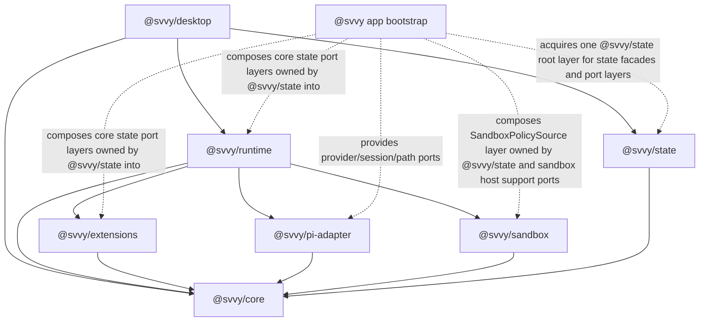

# Package Architecture Spec

## Status

- Date: 2026-06-11
- Status: active package architecture spec; roadmap state is tracked in `docs/progress.md`
- Scope: package-oriented architecture for making `svvy` a reusable runtime plus desktop UI

This spec defines the reusable package architecture for `svvy`. The PRD, feature inventory, and
domain specs must agree with these package boundaries.

## Goal

`svvy` is a vertically integrated desktop app built on a small set of reusable packages. Non-UI
packages must be reusable programmatically without the desktop UI, including runtime, state,
sandbox, pi adaptation, and extension behavior.

The package split must stay intuitive:

- public `@svvy/*` packages are for app developers building with `svvy`
- generated `@svvyx/workflows` and `@svvyx/extensions` packages are for Workflows source-library
  code and Smithers workflow source
- builtin capabilities that agents experience as tools, prompt guidance, or commands live under the
  extension system
- implementation areas that are not independently useful outside extensions remain source folders,
  not public packages
- packaged default actor prompts and builtin extension instructions live as MDX/source contributors
  owned by `@svvy/extensions`; reusable Workflows prompt source remains Workflows source-library
  material validated and built by `@svvy/extensions`
- the runtime API accepts new user-message inputs and emits typed events; consumers refetch durable
  read models instead of receiving renderer-shaped snapshots as the core API
- non-UI packages use Effect v4 services and layers for package-to-package composition; Promise,
  callback, and `AsyncIterable` APIs are edge facades over the exactly one app-owned
  `ManagedRuntime` for the healthy desktop app-runtime instance

## Cross-Cutting Specs

This package architecture is governed by these cross-cutting specs:

| Spec                | Purpose                                                                                                                    |
| ------------------- | -------------------------------------------------------------------------------------------------------------------------- |
| `effect-v4.spec.md` | Effect v4 usage rules, service/layer style, resource lifetimes, streams, schemas, subprocesses, bridge facades, and tests. |

Every package spec in this directory must follow the Effect v4 architecture spec when it describes
dependencies, public implementation APIs, resource lifetimes, event streams, errors, validation,
and tests.

## Public Package Set

The public packages are exactly:

| Package            | Spec                 | Purpose                                                                                                                                                                                                                                         |
| ------------------ | -------------------- | ----------------------------------------------------------------------------------------------------------------------------------------------------------------------------------------------------------------------------------------------- |
| `@svvy/core`       | `core.spec.md`       | Shared stable `svvy` domain vocabulary, branded ids, schema codecs, event/read-model shapes, native-tool declaration shapes, typed errors, boundary issue formatting, annotation allowlist helpers, and explicitly indexed data-only port tags. |
| `@svvy/state`      | `state.spec.md`      | Durable product state, projections, settings, logs, and persistence.                                                                                                                                                                            |
| `@svvy/sandbox`    | `sandbox.spec.md`    | Filesystem/network policy and sandbox helper integration.                                                                                                                                                                                       |
| `@svvy/pi-adapter` | `pi-adapter.spec.md` | Pi integration for scoped sessions, true system prompts, turns, model metadata, helper jobs, and pi event normalization.                                                                                                                        |
| `@svvy/extensions` | `extensions.spec.md` | Extension system plus builtin capability records.                                                                                                                                                                                               |
| `@svvy/runtime`    | `runtime.spec.md`    | Shared orchestration kernel for sessions, surfaces, turns, queues, and extension routing.                                                                                                                                                       |
| `@svvy/desktop`    | `desktop.spec.md`    | Electrobun/Svelte desktop UI over runtime and state.                                                                                                                                                                                            |

The product package surface is the seven-package set above. Repository source folders outside
`packages/`, including app-entry folders such as `src/bun` and renderer folders such as
`src/mainview`, are repo-local implementation locations mapped to the seven-package ownership model
for import and responsibility checks only. They do not create additional product package
boundaries, and physical source location is not a product architecture boundary.

Builtin capability domains remain extension records, state domains, or generated
`@svvyx/workflows` / `@svvyx/extensions` authoring artifacts unless a PRD/spec update creates a new public package boundary. Default actor
prompts and builtin extension instructions are MDX/source contributors owned, validated, and built
by `@svvy/extensions`. Reusable Workflows prompt files are file-backed editable source-library
assets under the app-global/user Workflows source library. `@svvy/extensions` is the only package
service authority for validating, editing, scanning, compiling/building, contributing to generated
context, and emitting generated outputs from those files. `@svvy/state` stores only DB/product-state
facts such as source versions, fingerprints, diagnostics, generated metadata, and readiness. Generated
`@svvyx/workflows` may emit `Prompts` exports for Smithers authoring, but generated packages are
read-only authoring outputs and are not prompt source owners.

## Generated Package Set

The generated workflow/source-authoring packages are:

| Generated package   | Spec                         | Purpose                                                                   |
| ------------------- | ---------------------------- | ------------------------------------------------------------------------- |
| `@svvyx/workflows`  | `generated-packages.spec.md` | Generated reusable workflow assets for Smithers source.                   |
| `@svvyx/extensions` | `generated-packages.spec.md` | Generated extension references for workflow task-agent parameter records. |

`@svvyx/workflows` and `@svvyx/extensions` are local generated packages, not published reusable SDKs.

The public `@svvy/*` namespace is reserved for reusable developer packages. Generated packages use
only the `@svvyx/workflows` and `@svvyx/extensions` package names; the broader `@svvyx/*` namespace
is reserved so unknown generated package names are rejected.

## Dependency Graph

Arrows mean permitted package-level import edges. For `@svvy/desktop`, the `runtime` and `state`
edges are facade/type-consumer edges only: desktop receives prebuilt renderer-safe facades from
app/bootstrap and must not import service tags, layers, ports, or runtime/state implementation
modules. Dashed arrows mean app-bootstrap layer wiring that provides core-owned port
implementations or package-owned host support ports without creating package import edges.



`@svvy/core` is the only bottom public package. It must not import any implementation package.

Package import boundaries follow the graph above. A package may depend on another package only
through the other package's package root or explicit exported subpaths named by that package spec
and package manifest. Importing SQLite tables, renderer modules, pi-native internals, generated build
directories, source-checkout-relative helper files, package-private source files, or test fixtures is
not an allowed dependency even when TypeScript can resolve it.

`@svvy/runtime` has no direct `@svvy/state` package import edge. Runtime-facing orchestration code
consumes core-owned state port service tags and other package-owned Effect services only. App
bootstrap composes the concrete `@svvy/state` layers that satisfy those core-owned ports. Runtime
service code, package tests, and runtime Effect tests must not import state repositories, table
modules, SQLite clients, migration modules, store classes, state Promise facades, state command
facades, read-model facades, or private state implementation helpers. Any runtime test that needs a
state-backed implementation uses an app/bootstrap-level integration fixture named by
package-boundary tests rather than adding `@svvy/state` as a runtime package dependency.

App-entry modules under `src/bun/**` are bootstrap and host-adapter locations, not product ownership
surfaces. They may compose package-owned layers, create app-owned host adapters, register Electrobun
or process callbacks, and expose facades created from the app-owned `ManagedRuntime`. They must not
define product contracts, lifecycle policy, state ownership, queue claiming, prompt assembly,
accepted-tool execution policy, command lifecycle policy, launch-kind selection, launch-policy
adapter semantics, sandbox snapshot request policy, request-input blocking lifecycle policy,
generated-package policy, recovery policy, or direct state mutation semantics. `@svvy/extensions`
owns metadata, prompts, schemas, and handler validation; `@svvy/runtime` owns accepted-tool
execution, launch admission, command-scoped launch-policy acquisition, and lifecycle policy;
`@svvy/state` owns durable facts behind core state ports; app bootstrap wires concrete services and
host adapters. Request-input timeout policy uses
runtime-owned Effect services, scoped wait registries, and committed timeout deadlines. Blocking
waits race the runtime-owned answer `Deferred` against the committed deadline using
`Effect.timeoutOrElse` or an equivalent scoped `Effect.sleep` timer fiber. Runtime computes
remaining time from Effect `DateTime.now` / `Clock`, records the deadline in state, and re-forks the
scoped timer only after committed pause/resume/version changes. App edges do not provide custom
timer policy and do not decide which request waits, expires, defaults, resolves, cancels, or writes
command/session-wait facts.

App-entry modules cross package boundaries through package names and export maps, not
source-checkout-relative paths into package source trees. `src/bun/**`, browser-tool bridge,
headless bridge, and desktop bridge code may compose approved package layers and bootstrap host
ports, but must not import `packages/runtime/src/**`, `packages/state/src/**`, or any relative path
that resolves to package-private runtime/state internals. Runtime wait services, queue dispatchers,
source-invalidation coordinators, generated-package refresh/link-repair internals, runtime scope
services, event buses, accepted-tool service tags/layers/interfaces, runtime-effect appliers, and
internal service constructors are not app/bootstrap dependencies. Accepted native-tool app entry
points use only the named `@svvy/runtime/accepted-native-tool-execution` adapter over the
already-acquired app-owned `ManagedRuntime`; that adapter does not make accepted-tool execution a
desktop, browser-tool, headless, renderer, extension, generated-package, or public facade surface.
Source-invalidation coordinator lifecycle entry points use only the named
`@svvy/runtime/source-invalidation-coordinator-adapter` adapter; that adapter exposes only a
closeable Promise handle and does not make source coordinators package-root exports, bootstrap
exports, semantic callback ports, renderer APIs, extension APIs, generated-package APIs, or public
facade groups.

## Source Folder Map

The public package list is intentionally small. The following product domains are internal
source-folder boundaries, not public packages:

```text
@svvy/extensions/src/
  builtin/
    base-common/
    base-orchestrator/
    base-handler/
    base-workflow-task/
    shell/
    apply-patch/
    execute-typescript/
    extension-loading/
    extension-managing/
    request-user-input/
    thread-orchestration/
    thread-handling/
    artifacts/
    workflows/
    smithers/
    web/
    cx/
    git/
    github/
    external-instructions/
    facade-declarations/
    svvyx/

@svvy/runtime/src/
  workspaces/
  worktrees/
  sessions/
  surfaces/
  queues/
  commands/
  turns/
  handler-threads/
  requests/
  source-invalidation/
  events/
  prompt-refresh/
  recovery/
  title-jobs/
  generated-packages/

@svvy/state/src/
  settings/
  providers/
  sessions/
  workspaces/
  worktrees/
  commands/
  threads/
  artifacts/
  artifact-files/
  snippets/
  request-input/
  runtime-approvals/
  logs/
  generated-packages/
  read-models/
  migrations/
```

These folders remain source folders. Adding a concrete public package boundary for a non-extension
or non-runtime consumer requires agreement across the PRD, feature inventory, and package specs.
Splitting them by default would make the package surface less intuitive.

## File-Backed Vs Product-State-Backed Boundaries

Runtime architecture must not duplicate file-backed source truth into product state as a second
editable truth. `@svvy/state` persists product facts, indexes, fingerprints, and read-model
projections; source-owning packages write the source files; runtime listens for typed invalidations
and refreshes projections through package services.

| Domain                                                           | Editable file-backed source or generated file evidence                                                                                                                                                                                    | DB/product-state-backed facts                                                                                                                                       | Writer                                                                                                                                                                                                                                                                                                                                                                         | Invalidation/read-model owner                                                                                                                                                                                                                                                                                         |
| ---------------------------------------------------------------- | ----------------------------------------------------------------------------------------------------------------------------------------------------------------------------------------------------------------------------------------- | ------------------------------------------------------------------------------------------------------------------------------------------------------------------- | ------------------------------------------------------------------------------------------------------------------------------------------------------------------------------------------------------------------------------------------------------------------------------------------------------------------------------------------------------------------------------ | --------------------------------------------------------------------------------------------------------------------------------------------------------------------------------------------------------------------------------------------------------------------------------------------------------------------- |
| Orchestrator and handler agent profiles and extension usage      | none                                                                                                                                                                                                                                      | profile records, defaults, override rows, actor bindings, generated-context binding refs                                                                            | `@svvy/state` through state-backed command ports invoked by runtime/app command facades; desktop submits typed UI intent only                                                                                                                                                                                                                                                  | `@svvy/state` returns read-model after-commit descriptors; `@svvy/runtime` publishes notifications and refreshes affected surfaces                                                                                                                                                                                    |
| Workflow-agent records                                           | Workflows source-library `.agent.json` files                                                                                                                                                                                              | source fingerprints, source versions, diagnostics, generated agent metadata, Agents-pane links                                                                      | `@svvy/extensions` writes source files and returns file-write/build/diagnostic evidence; `@svvy/runtime` performs source-version CAS and records source-version/fingerprint/diagnostic facts through core-owned `@svvy/state` ports                                                                                                                                            | `@svvy/runtime` computes observed source-scan fingerprints during reconciliation; `@svvy/state` stores committed facts; `@svvy/runtime` schedules refresh                                                                                                                                                             |
| Builtin extension prompts and instructions                       | packaged builtin templates under `@svvy/extensions`; live editable builtin sources scaffolded/reset under app config                                                                                                                      | prompt fingerprints, generated actor-context facts, dependency/readiness facts                                                                                      | `@svvy/extensions` scaffolds/resets/builds live sources and returns file/build evidence                                                                                                                                                                                                                                                                                        | `@svvy/runtime` computes observed source-scan fingerprints during reconciliation; `@svvy/state` stores committed facts; `@svvy/runtime` schedules refresh                                                                                                                                                             |
| User Extension source                                            | app-owned Extension source files/directories defined by Extension specs                                                                                                                                                                   | source fingerprints, package build facts, env/dependency readiness, actor usage projections                                                                         | `@svvy/extensions` writes/validates extension source and returns file/build evidence                                                                                                                                                                                                                                                                                           | `@svvy/runtime` watches/reconciles source changes and computes observed source-scan fingerprints; `@svvy/extensions` returns build facts; `@svvy/state` stores committed facts                                                                                                                                        |
| Extension env declarations and secret values                     | extension source manifests and env declarations; secret values are never source files                                                                                                                                                     | encrypted/OS-protected secret references, non-secret overrides, readiness/status, coarse snapshot secret state; encrypted material remains in the host secret store | `@svvy/extensions` declares and validates env requirements; `@svvy/state` persists user-owned values through app/runtime state commands and coordinates host secret-store writes/removals through the core-owned `SecretStoreMutationPort` service provided by the app layer; trusted invocation reads use `SecretStorePort`                                                   | `@svvy/state` returns env/readiness after-commit descriptors; `@svvy/runtime` publishes notifications and refreshes affected actor readiness at safe boundaries                                                                                                                                                       |
| External instruction files                                       | discovered read-only files such as `AGENTS.md` and `CLAUDE.md`; `svvy` never writes these files                                                                                                                                           | external-instruction records, source fingerprints, diagnostics, generated-context participation                                                                     | external host/workspace writes files; `@svvy/extensions` discovers, validates, and renders contributions; `@svvy/state` stores rows, enablement, ordering, fingerprints, diagnostics, and read models                                                                                                                                                                          | `@svvy/runtime` watches/reconciles; `@svvy/state` stores facts/read models                                                                                                                                                                                                                                            |
| Discovered read-only host snippets                               | host-owned Markdown snippet source files; `svvy` never writes these files                                                                                                                                                                 | discovered snippet records, enablement, provenance, fingerprints, diagnostics                                                                                       | external host writes files; `@svvy/state` owns discovered snippet records, enablement, fingerprints, diagnostics, and read models                                                                                                                                                                                                                                              | `@svvy/runtime` watches/reconciles; `@svvy/state` projects snippet read models                                                                                                                                                                                                                                        |
| Managed svvy snippets                                            | none                                                                                                                                                                                                                                      | managed snippet records, placeholders, enablement, provenance, source versions                                                                                      | `@svvy/state` through typed app/runtime commands                                                                                                                                                                                                                                                                                                                               | `@svvy/state` returns read-model after-commit descriptors; runtime publishes notifications                                                                                                                                                                                                                            |
| App-global settings and preferences                              | none                                                                                                                                                                                                                                      | appearance, external editor, artifact directory, approval mode, network access, ambient resource category ledger                                                    | `@svvy/state` through typed app/runtime commands                                                                                                                                                                                                                                                                                                                               | `@svvy/state` returns app preferences/settings descriptors; runtime publishes notifications                                                                                                                                                                                                                           |
| Generated `@svvyx/extensions`                                    | generated package files and generated manifest in the app-owned generated package area; generated evidence only, not editable source truth; workspace links are runtime-applied effects, not generated package source truth               | manifest build id, source/output fingerprints, build status, diagnostics, workspace link facts                                                                      | `@svvy/extensions` writes generated files and manifest evidence only; when runtime asks for one workspace/package link repair, `@svvy/extensions` returns an immutable repair plan; `@svvy/runtime` schedules refresh/link repair, applies workspace links, and records generated-package and workspace-link facts through core-owned state ports implemented by `@svvy/state` | `@svvy/state` stores generated-package facts; `@svvy/runtime` schedules manifest reconciliation/generated-context refresh and publishes read-model invalidations only from committed after-commit descriptors                                                                                                         |
| Workflow source library prompts/components/workflows             | Workflows source-library prompt, component, and workflow source files                                                                                                                                                                     | source fingerprints, source versions, generated metadata, source diagnostics                                                                                        | `@svvy/runtime` admits source edits against DB-backed source-version facts, then `@svvy/extensions` Workflows source services write source files and return evidence only; `@svvy/runtime` records source facts through `@svvy/state` ports                                                                                                                                    | `@svvy/runtime` computes observed source-scan fingerprints during reconciliation; `@svvy/state` stores committed facts; `@svvy/runtime` schedules refresh and publishes notifications after committed descriptors                                                                                                     |
| Generated `@svvyx/workflows`                                     | generated package files and generated manifest in the app-owned generated package area; runtime applies workspace `.smithers/node_modules/@svvyx/*` links only from immutable link plans; generated evidence is not editable source truth | manifest build id, source/output fingerprints, build status, diagnostics, link status, generated export metadata                                                    | `@svvy/extensions` writes generated files and returns immutable link repair plans only; `@svvy/runtime` applies workspace links and records generated-package and workspace-link facts through core-owned state ports implemented by `@svvy/state`                                                                                                                             | `@svvy/state` stores facts; `@svvy/runtime` reconciles manifests/links and publishes notifications                                                                                                                                                                                                                    |
| Smithers workflow execution                                      | Smithers-owned `.smithers` project files and official Smithers CLI/API-observed execution artifacts/events; `svvy` reads only official Smithers CLI/API-observed data and does not read Smithers SQLite/event-log internals               | observed Smithers run/task/node/iteration/attempt facts, bridge command links, task-attempt surfaces, summaries needed by svvy UI                                   | Smithers writes Smithers state; `@svvy/runtime` records bridge/CLI-observed svvy facts                                                                                                                                                                                                                                                                                         | `@svvy/runtime` observes bridge/CLI results; `@svvy/state` projects read models                                                                                                                                                                                                                                       |
| Bridge tokens and env injection                                  | command-scoped child-process environment only                                                                                                                                                                                             | source command binding, task-attempt linkage, and terminal accept/reject facts only                                                                                 | `@svvy/runtime` creates, validates, expires, and revokes token values in runtime memory for the owning command scope                                                                                                                                                                                                                                                           | token value, fingerprint, expiry, and revocation changes are runtime-local; visible facts are command/task-attempt invalidations                                                                                                                                                                                      |
| Surface queues, turns, commands, waits, request input, approvals | none                                                                                                                                                                                                                                      | authoritative product rows and read models                                                                                                                          | `@svvy/runtime` via `@svvy/state` ports                                                                                                                                                                                                                                                                                                                                        | `@svvy/state` returns after-commit descriptors; runtime publishes notifications                                                                                                                                                                                                                                       |
| Command output artifacts                                         | artifact files under the app artifact store, with immutable files isolated under the session immutable child directory                                                                                                                    | artifact metadata, digests, command links, immutability state                                                                                                       | `@svvy/runtime` materializes, deletes, and recovers artifact bytes through runtime-owned file-effect services, then commits metadata, stored-path, byte-size, digest, lifecycle, and linkage facts through the core-owned artifact state port implemented by `@svvy/state`                                                                                                     | `@svvy/state` returns after-commit descriptors from committed metadata; runtime publishes artifact read-model notifications                                                                                                                                                                                           |
| Generated context cache material                                 | optional app-owned cache files written by `@svvy/extensions` only when needed for large rendered context blobs                                                                                                                            | binding rows, aggregate cache key, generated-context fingerprint, and surface stale/current state keyed by bound generated-context fingerprint                      | `@svvy/extensions` renders and writes optional cache files; `@svvy/state` persists product facts, aggregate cache keys, and fingerprints, not concrete cache file paths                                                                                                                                                                                                        | `@svvy/runtime` refreshes stale bindings and publishes surface/read-model notifications from committed descriptors                                                                                                                                                                                                    |
| Source fingerprints and source versions                          | source files remain owned by their domain                                                                                                                                                                                                 | latest observed digest, compare-and-swap source version, build/reconcile status, diagnostics                                                                        | source-owning packages write source files and compute source evidence; `@svvy/state` alone writes source fingerprint/version rows through named state ports                                                                                                                                                                                                                    | `@svvy/runtime` coordinates file-backed source watching/reconciliation; source-owning package saves return file-write receipts and decoded source evidence; runtime then calls named state-backed source-version/source-fact ports, and `@svvy/state` returns after-commit descriptors from the committed transaction |

`svvy` must not open, migrate, query, checkpoint, copy, repair, or treat `.smithers/**/smithers.db`
or any Smithers `smithers.db` file as product state. Only official Smithers CLI/API-observed output
may become `svvy` facts.

Adding a new durable fact requires choosing exactly one owner row in this table or updating the table
first. A field that can be recomputed directly from a file-backed source must not be persisted as an
independent editable product value.

## Composition Model

Non-UI packages compose through Effect services and layers. The desktop app and other non-Effect
consumers use facades created from the exactly one app-owned `ManagedRuntime` for the healthy
app-runtime instance; they do not directly assemble hidden globals, private app-global runtimes,
per-window runtimes, per-workspace runtimes, or ad hoc per-call runtimes.

Canonical bootstrap shape:

The bootstrap graph derives every state-backed port layer from one named `StateLayer` value. The
final app bootstrap exposes the runtime facade plus state read facades and the state command facade
for state-owned UI-intent commands to desktop, browser tools, and headless automation edges, and
wires state-backed port layers into sandbox, pi-adapter, extensions, and runtime package services.
It does not expose a broad state store to package consumers.

The app bootstrap owns `ManagedRuntime` creation and root layer wiring. Every named layer, layer
factory, facade factory, or port factory in the example below must be one of:

- an exported package service/layer/facade named in that package spec
- a state-owned implementation layer for a core-owned port tag named in `state.spec.md`
- an app-owned host adapter for packaged paths, app config directories, platform services, or native
  process integration

Adding a new name to this bootstrap example requires adding the corresponding owner package/export
contract to the package spec in the same change. Example names are not allowed to become hidden
globals, source-checkout-relative helper imports, or package-private dependency shortcuts.
The final app root layer is the only layer passed to `ManagedRuntime.make(...)` in the shipped
product process. Package-private intermediate layers remain inside their owning packages; app
bootstrap must not export them, pass them to facade creators, use them to construct secondary
runtimes, or use them as shortcuts around the owning package's public root layer and bootstrap
ports.
App bootstrap inputs in this sketch are either host facts, host/live port layers, or facade bridge
adapters. Host facts such as `selectedEnv`, `appConfigDir`, `resourcesDir`, `secretStore`, and
provider credential helper handles are decoded before package layer acquisition and are not reusable
package services. Host/live layer helpers each produce the single service tag named by the consuming
package spec. No bootstrap helper may own product state, queue/runtime policy, prompt assembly,
extension semantics, sandbox decisions, command execution, or recovery. State-owned SQLite/file
layers are provided with the platform filesystem/path services they require; host adapter layers may
depend on the same platform services but must expose only the explicit port tags consumed by package
layers. A host-backed layer may resolve packaged paths, app-config roots, platform facts, helper
candidates, live credential snapshots, or invocation-local redacted secret values only. Durable
provider status, secret readiness, extension env settings, and UI-intent mutation commands remain
state-owned. The package spec that consumes the port defines the port shape and test fixture before
the bootstrap helper name may appear here.

### App Bootstrap Host Adapter Contract

Every app/bootstrap host adapter used by the root layer graph is declared in this table and in the
owning package spec before it is used. An adapter that needs additional behavior gets a new row and a
new owner-package port; it does not grow hidden policy inside app-entry code.

| Adapter / layer name                             | Provides service tag                                     | Owning package spec                               | Allowed host reads                                                                                                                                                                                                              | Forbidden product policy                                                                                                                                                   | Lifetime                                         | Readiness receipt                                                                                                                                                                                                                                    | Shutdown behavior                                                                                                        | Fake/test layer requirement                                                                                                          | Boundary check                                                                                                                                                     |
| ------------------------------------------------ | -------------------------------------------------------- | ------------------------------------------------- | ------------------------------------------------------------------------------------------------------------------------------------------------------------------------------------------------------------------------------- | -------------------------------------------------------------------------------------------------------------------------------------------------------------------------- | ------------------------------------------------ | ---------------------------------------------------------------------------------------------------------------------------------------------------------------------------------------------------------------------------------------------------- | ------------------------------------------------------------------------------------------------------------------------ | ------------------------------------------------------------------------------------------------------------------------------------ | ------------------------------------------------------------------------------------------------------------------------------------------------------------------ |
| `createSecretStorePortLayer(...)`                | `SecretStorePort`, `SecretStoreMutationPort`             | `core.spec.md` / `state.spec.md`                  | host secret-store handle and availability facts                                                                                                                                                                                 | profile policy, env readiness policy, prompt construction, command execution, raw secret projection outside state-owned trusted ingress and invocation-local trusted reads | app runtime layer                                | startup proves the adapter can answer configured status, invocation-resolution, and mutation-only write/remove operations                                                                                                                            | finalizer closes adapter when the host implementation has a lifecycle                                                    | fake secret store with redaction/no-raw-secret assertions                                                                            | no public package imports host secret-store implementation                                                                                                         |
| `createProviderAuthPortLayer(...)`               | `ProviderAuthPort`                                       | `core.spec.md` / `pi-adapter.spec.md`             | host provider credential helpers, OAuth refresh helper facts, and invocation-local secret resolution through `SecretStorePort`                                                                                                  | durable provider status persistence, model selection, prompt construction, command execution, raw secret projection                                                        | app runtime layer                                | startup proves supported providers can return missing, expired, refresh-failed, and usable snapshots with redacted diagnostics                                                                                                                       | finalizer closes adapter-owned refresh/browser/device-flow handles when present                                          | fake provider-auth layer with usable, missing, expired, refresh-failed, and redaction assertions                                     | no package imports host provider credential implementations                                                                                                        |
| `PackagedPiRuntimePathsLayer`                    | `PiRuntimePathsPort`                                     | `pi-adapter.spec.md`                              | packaged pi runtime path, helper bundle root, resource existence                                                                                                                                                                | pi session creation, provider/model selection, turn dispatch, source-checkout runtime path resolution                                                                      | app runtime layer                                | pi-adapter startup validates packaged paths before opening a pi session                                                                                                                                                                              | no state mutation; closes only adapter-owned handles if any                                                              | fake packaged-path layer with missing/wrong-path diagnostics                                                                         | `@svvy/pi-adapter` does not import app-entry path helpers and never resolves source-checkout runtime paths                                                         |
| `HostProcessReferenceLayer`                      | `HostProcessReferencePort`                               | `sandbox.spec.md`                                 | host platform and architecture facts, plus packaged app/support/temp roots declared by `HostProcessReferenceSnapshot`                                                                                                           | sandbox profile decisions, native-tool approval admission or approval decision policy, command lifecycle, output capture                                                   | app runtime layer                                | sandbox startup/command launch validates the exact host facts it consumes                                                                                                                                                                            | no command cancellation; only host-fact handles are released                                                             | fake host-process layer for launch-policy tests                                                                                      | sandbox package imports only the port tag, not app process globals                                                                                                 |
| `SandboxHelperCandidatesLayer`                   | `SandboxHelperCandidatesPort`                            | `sandbox.spec.md`                                 | exact packaged helper candidate paths, platform, arch, expected digest, and allowed helper roots                                                                                                                                | sandbox allow/deny decisions, source-checkout helper discovery, command retry fallback, broad `PATH` probing                                                               | app runtime layer                                | sandbox launch-policy tests prove missing, non-executable, wrong-platform/arch, outside-root, and digest-mismatched candidates are rejected as unusable, and launch fails closed with typed `helper-unavailable` when no candidate passes validation | no state mutation; no command cleanup beyond helper-adapter handles                                                      | fake helper-candidate layer with exact candidate fixtures                                                                            | boundary tests reject source-checkout helper paths, broad `PATH` probing, and retry fallback in product code                                                       |
| `createExtensionSourceRootsLayer(...)`           | `ExtensionSourceRootsPort`                               | `extensions.spec.md`                              | app-owned extension roots under configured app-data locations                                                                                                                                                                   | extension registry semantics, generated context policy, dependency approval, runtime refresh scheduling                                                                    | app runtime layer                                | extensions startup validates root ownership before source reads or saves                                                                                                                                                                             | closes file-watch/root handles if acquired; does not delete source files                                                 | temp-root source layer for extension source tests                                                                                    | extensions package does not import app-entry config globals                                                                                                        |
| `createPackagedExtensionTemplatesLayer(...)`     | `PackagedExtensionTemplatesPort`                         | `extensions.spec.md`                              | packaged builtin extension template roots and readonly resource existence                                                                                                                                                       | builtin extension enablement policy, prompt rendering, generated package facts                                                                                             | app runtime layer                                | extensions startup verifies packaged template roots before builtin materialization                                                                                                                                                                   | readonly handles only; no source cleanup                                                                                 | fake packaged-template layer with missing-template diagnostics                                                                       | no source-checkout template paths in shipped architecture                                                                                                          |
| `createWorkspaceSourceLinkLayer(...)`            | `WorkspaceSourceLinkPort`                                | `extensions.spec.md`                              | trusted workspace root/session facts needed to compute `<workspace>/.smithers/node_modules/@svvyx/<package>` link paths                                                                                                         | generated-package build policy, link application, status classification, runtime recovery policy, workflow/run execution semantics, state writes                           | app runtime layer / host link-path port boundary | `Extensions.generatedPackages.planWorkspaceLink(...)` receives only canonical link-path candidates; it does not mutate the filesystem                                                                                                                | no link handles; runtime-owned repair applies the plan through a primitive file host during command/recovery-scoped work | fake link-path layer for valid path, missing Smithers root, and rejected workspace inputs                                            | app/bootstrap provides path/file primitives; runtime owns scheduling, apply semantics, status classification, and facts                                            |
| `RuntimeGeneratedPackageWorkspaceLinkFileHost`   | runtime refresh boundary host, not an Effect service tag | `runtime.spec.md` / `generated-packages.spec.md`  | primitive filesystem operations for path existence, directory checks, symlink reads, parent creation, remove, and symlink creation                                                                                              | generated-package source validation, link-plan construction, status classification, recovery scheduling, state writes, product notifications                               | runtime command/recovery file-host boundary      | runtime calls `applyGeneratedPackageWorkspaceLinkRepairPlan(...)` with this primitive host after receiving an immutable extension link plan                                                                                                          | no lifecycle beyond the enclosing runtime command/recovery operation                                                     | fake file host tests for linked, unchanged, blocked non-symlink, missing Smithers root, and failed write                             | no app callback named or shaped like semantic `applyWorkspaceLinkRepairPlan`                                                                                       |
| `createGeneratedPackageRootLayer(...)`           | `GeneratedPackageRootPort`                               | `extensions.spec.md`                              | app-owned generated package root under configured app-data locations                                                                                                                                                            | generated manifest schema, source eligibility, workspace link scheduling, state fact writes                                                                                | app runtime layer                                | extensions generated-package service validates root ownership before atomic generated-output publish                                                                                                                                                 | does not delete durable generated roots except through explicit cleanup commands                                         | temp generated-root layer proving atomic publish and recovery receipts                                                               | generated-package services never resolve source-checkout-relative generated roots                                                                                  |
| `createRuntimePromptControlHostLayer(...)`       | `RuntimeLayerPromptControlHostPort`                      | `runtime.spec.md`                                 | live app-owned prompt cancellation handle for the addressed pi/runtime surface                                                                                                                                                  | prompt default resolution, queue work, turn settlement, state mutation, runtime event publication, prompt materialization, pi session exposure                             | app runtime layer                                | runtime startup validates the adapter can cancel active turns and whole-surface prompts through typed failures                                                                                                                                       | cancellation facts are recorded by runtime before or after the host call as specified by the runtime method              | fake prompt-control host layer with active-turn, whole-surface, and failure cases                                                    | prompt-control is the only semantic-looking public runtime bootstrap host port; no broad prompt host port or catalog port                                          |
| `createRuntimeSurfaceQueueWakeHostLayer(...)`    | `RuntimeLayerSurfaceQueueWakePort`                       | `runtime.spec.md`                                 | primitive app-owned `wakeSurfaceQueue({ target, reason })` handle for the addressed runtime surface queue; `reason` is exactly `message-submitted`, `request-input-answer-queued`, `queue-steered`, or `runtime-queue-inserted` | queue policy, queue claiming, turn dispatch, state mutation, runtime event publication, queued-row payload inspection, renderer snapshot reads                             | app runtime layer                                | runtime startup validates the adapter can wake addressed runtime surfaces through typed failures                                                                                                                                                     | no state mutation; runtime records queue/request/command facts before invoking wake                                      | fake wake host layer with message, answer, steer, and runtime queue-insert reasons                                                   | queue semantics stay inside `RuntimeQueueWakeService`; bootstrap port receives only target plus closed reason; no drain/claim/materialize callback escapes runtime |
| `createRuntimeCommandStdinHostLayer(...)`        | `RuntimeLayerCommandStdinPort`                           | `runtime.spec.md`                                 | primitive stdin write handle for runtime-owned live command processes keyed by durable `CommandId`                                                                                                                              | command lookup policy, shell session ids, process registry ownership, command facts, command cancellation, output capture                                                  | app runtime layer                                | runtime startup validates stdin failures map to typed runtime errors                                                                                                                                                                                 | no process cleanup beyond the addressed stdin write; runtime records stdin receipts and terminal facts                   | fake stdin host layer with accepted, closed, missing, and failed write cases                                                         | command stdin is exposed publicly only through `runtime.commands.writeStdin(...)` by durable command id                                                            |
| `createRuntimeCommandControlHostLayer(...)`      | `RuntimeLayerCommandControlPort`                         | `runtime.spec.md`                                 | primitive cancel/stop handle for runtime-owned live command processes keyed by durable `CommandId`                                                                                                                              | command admission policy, native-tool approval admission or approval decision policy, command fact settlement, recovery policy, broad process registry exposure            | app runtime layer                                | runtime startup validates command-control failures map to typed runtime errors                                                                                                                                                                       | no state mutation; runtime records terminal/recovery facts around the host control call                                  | fake command-control host layer with running, already-terminal, missing, and failure cases                                           | command cancellation is exposed publicly only through `runtime.commands.cancel(...)` by durable command id                                                         |
| `createRuntimeProviderAuthHostLayer(...)`        | `RuntimeLayerProviderAuthPort`                           | `runtime.spec.md`                                 | provider credential availability and redacted unusable-provider message helpers                                                                                                                                                 | provider settings persistence, secret material projection, model policy, prompt construction, pi session ownership                                                         | app runtime layer                                | runtime startup validates provider-auth adapter can return usable and unavailable snapshots with redacted errors                                                                                                                                     | closes adapter-owned credential refresh/device-flow handles when present                                                 | fake provider-auth host layer with usable, missing, expired, refresh-failed, and redaction assertions                                | runtime owns admission/error mapping; provider auth state remains state/app-owned                                                                                  |
| `createRuntimeModelResolverHostLayer(...)`       | `RuntimeLayerModelResolverPort`                          | `runtime.spec.md`                                 | app model registry lookup from provider/model ids to pi-normalized model identity                                                                                                                                               | model selection policy, provider auth, prompt construction, implicit alternate-model selection, pi session ownership                                                       | app runtime layer                                | runtime startup validates configured/default model ids can resolve or fail with typed errors                                                                                                                                                         | no lifecycle beyond model registry handle                                                                                | fake model resolver layer with valid, missing, and unsupported model cases                                                           | runtime methods receive resolved model identity only through the named port                                                                                        |
| `createRuntimeGeneratedContextRefreshLayer(...)` | `RuntimeGeneratedContextRefreshHostPort`                 | `runtime.spec.md` / `extensions.spec.md`          | primitive generated-context refresh invocation against the extension-owned generated-context build service                                                                                                                      | refresh scheduling, source invalidation policy, stale-surface policy, generated-context facts, event publication, state mutation outside ports                             | app runtime layer                                | runtime startup validates refresh host can return typed success/failure for addressed scope                                                                                                                                                          | no state mutation except through runtime-owned state ports and extension services                                        | fake generated-context refresh host with target, workspace, stale, and failure cases                                                 | `RuntimeGeneratedContextRefreshService` owns scheduling and publication; host port is only the primitive refresh call                                              |
| `createRuntimeGeneratedPackageRefreshLayer(...)` | `RuntimeGeneratedPackageRefreshHostPort`                 | `runtime.spec.md` / `generated-packages.spec.md`  | primitive generated-package refresh bridge for the app-owned generated-package service boundary, including app-owned `@svvy/core` type-contract package materialization                                                         | generated-package source validation, state fact ownership, workspace-link scheduling, recovery policy, runtime event publication                                           | app runtime layer                                | runtime startup validates refresh host can return typed package build/link evidence, materialize the declaration-only core type-contract package, or return typed failure                                                                            | no lifecycle beyond the enclosing runtime refresh operation                                                              | fake generated-package refresh host with app-global build, core type-contract materialization, failure, and link-plan evidence cases | runtime owns refresh scheduling, state facts, link repair admission, and notifications; app/bootstrap writes the supporting core type-contract package             |
| `createRuntimeSourceInvalidationScanLayer(...)`  | `RuntimeSourceInvalidationScanPort`                      | `runtime.spec.md` / `source-invalidation.spec.md` | primitive deterministic source scan trigger over app/workspace source roots                                                                                                                                                     | debounce policy, dirty-domain ownership, generated-package refresh scheduling, stale-surface marking, state fact writes, event publication                                 | app runtime layer                                | runtime startup validates scan host can scan app-global and workspace domains with typed diagnostics                                                                                                                                                 | no watcher ownership beyond the runtime-owned coordinator scope                                                          | fake source-scan host with app-global, workspace, ignored generated output, and failure cases                                        | `RuntimeSourceInvalidationService` owns source policy; host port performs only the primitive scan                                                                  |
| `createRuntimeSourceInvalidationHost(...)`       | `SourceInvalidationHost` for runtime coordinator options | `runtime.spec.md` / `source-invalidation.spec.md` | primitive filesystem/path reads, deterministic hashing, and host file-watch registration for runtime-selected source paths/domains                                                                                              | source invalidation policy, debounce/coalescing semantics, generated-package refresh decisions, state writes, read-model invalidation publication                          | app runtime layer / coordinator host boundary    | runtime source coordinator startup validates watcher registration and deterministic scan reads before watcher-driven hints can schedule work                                                                                                         | runtime coordinator finalizers close registered watcher handles; host close handles do not mutate state                  | fake source-invalidation host with deterministic scan inputs, watcher hints, watch errors, and close-handle assertions               | runtime owns watch selection and invalidation policy; packages do not consume `FileSystem.WatchBackend` or app-entry watcher implementations                       |

The table is intentionally host-adapter-specific. Package-owned layers such as `@svvy/state.layer`,
`@svvy/extensions.layer`, `@svvy/pi-adapter.layer`, `@svvy/sandbox.layer`, and
`@svvy/runtime.layer` are not host adapters and must not appear here.

App network preference and loopback policy are app-bootstrap-local product settings. This
architecture excludes an Effect `HttpClient.HttpClient` layer from the canonical app runtime graph.
No package may require outbound HTTP or a reusable network policy unless the owning package spec
first promotes a named port contract or HTTP adoption record, adds it to the relevant layer
requirements, defines the raw host client and policy wrapper, and defines its fake/test layer plus
boundary allowlist.

The following sketch is app-bootstrap-only and normative for ownership, layer identity, readiness,
and facade exposure. It is not a template for package services, tests, extension handlers, runtime
workers, or request handlers. Symbol names in the example are public package exports or host
adapters named in the table above; they are not app-entry extension points. The only
allowed process-edge runner calls shown are exact app-bootstrap config parsing with
`Effect.runSync(...)` in files named by `effect-v4.spec.md` and one app-owned
`ManagedRuntime.make(...)`; package code must use supplied services/layers and must not create
runners.

```ts
import * as Layer from "effect/Layer";
import * as ManagedRuntime from "effect/ManagedRuntime";
import * as ConfigProvider from "effect/ConfigProvider";
import * as Effect from "effect/Effect";
import * as FileSystem from "effect/FileSystem";
import type {
  PiRuntimePathsPort,
  ProviderAuthPort,
  SecretStorePort,
  SecretStoreMutationPort,
  type StateContractError,
  SurfacePiSessionId,
  WorkspaceSessionId,
} from "@svvy/core";
import {
  createDesktopApp,
  type CreateDesktopAppInput,
  type DesktopNotificationBridge,
} from "@svvy/desktop";
import {
  layer as ExtensionsLayerBase,
  type ExtensionSourceRootsPort,
  type GeneratedPackageRootPort,
  type PackagedExtensionTemplatesPort,
  type WorkspaceSourceLinkPort,
} from "@svvy/extensions";
import { layer as PiAdapterLayerBase } from "@svvy/pi-adapter";
import { createRuntimeFacade, layer as RuntimeLayerBase } from "@svvy/runtime";
import {
  awaitRuntimeStartupReadiness,
  createRuntimeLayerConfigLayer,
  layerRuntimeBunPlatform,
  prepareRuntimeShutdown,
  RuntimeLayerConfigFromEnv,
  type RuntimeLayerPromptControlHostPort,
} from "@svvy/runtime/bootstrap";
import {
  layer as SandboxLayerBase,
  type HostProcessReferencePort,
  type SandboxHelperCandidatesPort,
} from "@svvy/sandbox";
import {
  createStateCommandsFacade,
  createStateFacade,
  layerAppLogWritePort,
  layerExtensionStatePort,
  layerPiSessionReferencePort,
  layerProviderAuthStatusStatePort,
  layerRuntimeActorExtensionBindingStatePort,
  layerRuntimeApprovalStatePort,
  layerRuntimeArtifactStatePort,
  layerRuntimeCommandStatePort,
  layerRuntimeComposerDraftStatePort,
  layerRuntimeEpisodeStatePort,
  layerRuntimeExtensionContextImpactStatePort,
  layerRuntimeGeneratedPackageStatePort,
  layerRuntimePromptDefaultsStatePort,
  layerRuntimeQueueStatePort,
  layerRuntimeReadModelStatePort,
  layerRuntimeRecoveryStatePort,
  layerRuntimeRequestStatePort,
  layerRuntimeSessionWaitStatePort,
  layerRuntimeSourceStatePort,
  layerRuntimeSurfaceLifecycleStatePort,
  layerRuntimeThreadStatePort,
  layerRuntimeTurnStatePort,
  layerRuntimeWorkspaceStatePort,
  layerSandboxPolicySource,
  layer as createStateLayer,
  type StateLayerConfig,
} from "@svvy/state";

// Provided by app host bootstrap, not by a public package API.
declare const secretStore: unknown;
declare const createSecretStorePortLayer: (input: {
  secretStore: unknown;
}) => Layer.Layer<SecretStorePort | SecretStoreMutationPort>;
declare const createProviderAuthPortLayer: (input: {
  secretStore: unknown;
}) => Layer.Layer<ProviderAuthPort>;
declare const appConfigDir: string;
declare const resourcesDir: string;
declare const selectedEnv: Readonly<Record<string, string>>;
declare const readStateLayerConfigFromEnv: (
  env: Readonly<Record<string, string>>,
) => Effect.Effect<StateLayerConfig, StateContractError>;
declare const SandboxHelperCandidatesLayer: Layer.Layer<SandboxHelperCandidatesPort>;
declare const HostProcessReferenceLayer: Layer.Layer<HostProcessReferencePort>;
declare const PackagedPiRuntimePathsLayer: Layer.Layer<PiRuntimePathsPort>;
declare const createDesktopNotificationBridge: (input: {
  runtimeEvents: ReturnType<typeof createRuntimeFacade>["events"];
  state: ReturnType<typeof createStateFacade>;
  rendererEmit: CreateDesktopAppInput["host"]["bridge"]["sendToRenderer"];
}) => DesktopNotificationBridge;
declare const omitRuntimeEventsCloseAndCommands: (
  runtime: ReturnType<typeof createRuntimeFacade>,
) => unknown;
declare const createExtensionSourceRootsLayer: (input: {
  appConfigDir: string;
}) => Layer.Layer<ExtensionSourceRootsPort>;
declare const createPackagedExtensionTemplatesLayer: (input: {
  resourcesDir: string;
}) => Layer.Layer<PackagedExtensionTemplatesPort>;
declare const createWorkspaceSourceLinkLayer: (input: {
  appConfigDir: string;
}) => Layer.Layer<WorkspaceSourceLinkPort>;
declare const createGeneratedPackageRootLayer: (input: {
  appConfigDir: string;
}) => Layer.Layer<GeneratedPackageRootPort>;
declare const createRuntimePromptControlHostLayer: () => Layer.Layer<RuntimeLayerPromptControlHostPort>;
declare const createRuntimeSourceInvalidationHost: (input: {
  appConfigDir: string;
  resourcesDir: string;
}) => SourceInvalidationHost;
// Process-edge config parsing only; packages receive typed config/layers.
const stateConfig = Effect.runSync(readStateLayerConfigFromEnv(selectedEnv));
const bootstrapConfigProvider = ConfigProvider.fromEnv({ env: selectedEnv });
const runtimeConfig = Effect.runSync(RuntimeLayerConfigFromEnv.parse(bootstrapConfigProvider));
const StateLayer = createStateLayer({ config: stateConfig });
const RuntimeLayerConfigLayer = createRuntimeLayerConfigLayer(runtimeConfig);
const ExtensionSourceRootsLayer = createExtensionSourceRootsLayer({ appConfigDir });
const PackagedExtensionTemplatesLayer = createPackagedExtensionTemplatesLayer({ resourcesDir });
const WorkspaceSourceLinkLayer = createWorkspaceSourceLinkLayer({ appConfigDir });
const GeneratedPackageRootLayer = createGeneratedPackageRootLayer({ appConfigDir });
const RuntimeSourceInvalidationHost = createRuntimeSourceInvalidationHost({
  appConfigDir,
  resourcesDir,
});
const SecretStoreLayer = createSecretStorePortLayer({ secretStore });
const ProviderAuthLayer = createProviderAuthPortLayer({ secretStore });
const RuntimePromptControlHostLayer = createRuntimePromptControlHostLayer();
const HostPlatformBaseLayer = layerRuntimeBunPlatform;

const StateWithPlatformLayer = StateLayer.pipe(
  Layer.provide(Layer.mergeAll(HostPlatformBaseLayer, SecretStoreLayer)),
);

const SandboxPolicySourceLayer = layerSandboxPolicySource.pipe(
  Layer.provide(StateWithPlatformLayer),
);
const ProviderAuthStatusLayer = layerProviderAuthStatusStatePort.pipe(
  Layer.provide(StateWithPlatformLayer),
);
const PiSessionReferenceLayer = layerPiSessionReferencePort.pipe(
  Layer.provide(StateWithPlatformLayer),
);
const ExtensionStateLayer = layerExtensionStatePort.pipe(Layer.provide(StateWithPlatformLayer));
const AppLogWriteLayer = layerAppLogWritePort.pipe(Layer.provide(StateWithPlatformLayer));

const RuntimeStatePortsLayer = Layer.mergeAll(
  layerRuntimeWorkspaceStatePort,
  layerRuntimeSurfaceLifecycleStatePort,
  layerRuntimeComposerDraftStatePort,
  layerRuntimeQueueStatePort,
  layerRuntimeTurnStatePort,
  layerRuntimeThreadStatePort,
  layerRuntimeActorExtensionBindingStatePort,
  layerRuntimeApprovalStatePort,
  layerRuntimeEpisodeStatePort,
  layerRuntimeCommandStatePort,
  layerRuntimeRequestStatePort,
  layerRuntimeSessionWaitStatePort,
  layerRuntimeSourceStatePort,
  layerRuntimeExtensionContextImpactStatePort,
  layerRuntimeGeneratedPackageStatePort,
  layerRuntimePromptDefaultsStatePort,
  layerRuntimeArtifactStatePort,
  layerRuntimeRecoveryStatePort,
  layerRuntimeReadModelStatePort,
).pipe(Layer.provide(StateWithPlatformLayer));

// RuntimeArtifactStatePort is provided only by the imported @svvy/state layer factory.
// App bootstrap does not define a parallel artifact port implementation.

const SandboxHostSupportLayer = Layer.mergeAll(
  SandboxHelperCandidatesLayer,
  HostProcessReferenceLayer,
  HostPlatformBaseLayer,
);

const SandboxLayer = SandboxLayerBase.pipe(
  Layer.provide(Layer.mergeAll(SandboxPolicySourceLayer, SandboxHostSupportLayer)),
);

const PiLayer = PiAdapterLayerBase.pipe(
  Layer.provide(
    Layer.mergeAll(ProviderAuthLayer, ProviderAuthStatusLayer, PiSessionReferenceLayer),
  ),
  Layer.provide(PackagedPiRuntimePathsLayer),
);

const ExtensionsLayer = ExtensionsLayerBase.pipe(
  Layer.provide(
    Layer.mergeAll(
      ExtensionStateLayer,
      ExtensionSourceRootsLayer,
      PackagedExtensionTemplatesLayer,
      WorkspaceSourceLinkLayer,
      GeneratedPackageRootLayer,
      HostPlatformBaseLayer,
    ),
  ),
);

const RuntimeLayerProviderAuthPortLayer = createRuntimeProviderAuthHostLayer({ providerAuth });
const RuntimeLayerModelResolverPortLayer = createRuntimeModelResolverHostLayer({ models });
const RuntimeLayerCommandStdinPortLayer = createRuntimeCommandStdinHostLayer({ commandIo });
const RuntimeLayerCommandControlPortLayer = createRuntimeCommandControlHostLayer({
  commandControl,
});
const RuntimeLayerSurfaceQueueWakePortLayer = createRuntimeSurfaceQueueWakeHostLayer({
  queueWake: surfaceQueueWake,
});
const RuntimeGeneratedContextRefreshHostLayer = createRuntimeGeneratedContextRefreshHostLayer({
  extensions: ExtensionsLayer,
});
const RuntimeGeneratedPackageRefreshHostLayer = createRuntimeGeneratedPackageRefreshHostLayer({
  extensions: ExtensionsLayer,
});
const RuntimeSourceInvalidationScanPortLayer = createRuntimeSourceInvalidationScanHostLayer({
  sourceInputs,
});

const RuntimePiPortsLayer = Layer.mergeAll(
  RuntimeLayerProviderAuthPortLayer,
  RuntimeLayerModelResolverPortLayer,
  RuntimeLayerCommandStdinPortLayer,
  RuntimeLayerCommandControlPortLayer,
);

const RuntimeSandboxPortsLayer = Layer.mergeAll(
  SandboxPolicySourceLayer,
  SandboxHelperCandidatesLayer,
  HostProcessReferenceLayer,
);

const RuntimeRequirementsLayer = Layer.mergeAll(
  RuntimeStatePortsLayer,
  AppLogWriteLayer,
  ExtensionStateLayer,
  PiSessionReferenceLayer,
  RuntimePiPortsLayer,
  RuntimeSandboxPortsLayer,
  ExtensionsLayer,
  RuntimeLayerConfigLayer,
  RuntimePromptControlHostLayer,
  RuntimeLayerSurfaceQueueWakePortLayer,
  RuntimeGeneratedContextRefreshHostLayer,
  RuntimeGeneratedPackageRefreshHostLayer,
  RuntimeSourceInvalidationScanPortLayer,
  HostPlatformBaseLayer,
);

const SvvyRuntimeLayer = RuntimeLayerBase.pipe(Layer.provide(RuntimeRequirementsLayer));

const appLayer = Layer.mergeAll(StateWithPlatformLayer, SandboxLayer, PiLayer, SvvyRuntimeLayer);

// The single app-owned ManagedRuntime for this healthy app-runtime instance.
const managedRuntime = ManagedRuntime.make(appLayer);
await managedRuntime.context();
await awaitRuntimeStartupReadiness(managedRuntime);
const runtime = createRuntimeFacade(managedRuntime);
const state = createStateFacade(managedRuntime);
const stateCommands = createStateCommandsFacade(managedRuntime);
const rendererState = createRendererSafeStateReadFacade(state);
const rendererStateCommands = createRendererSafeStateCommandsFacade(stateCommands);

const commands = {
  runtime: runtime.commands,
  state: rendererStateCommands,
};

// Provided by app host bootstrap as a transport/window adapter only; not a package API and not a
// product policy owner.
declare const createElectrobunDesktopHostAdapter: (input: {
  bridge: unknown;
  windows: unknown;
  menus: unknown;
  browserTools: unknown;
}) => CreateDesktopAppInput["host"];

const desktopHost = createElectrobunDesktopHostAdapter({
  bridge,
  windows,
  menus,
  browserTools,
});

const notifications = createDesktopNotificationBridge({
  runtimeEvents: runtime.events,
  state: rendererState,
  rendererEmit: desktopHost.bridge.sendToRenderer,
});

const desktop = createDesktopApp({
  runtime: omitRuntimeEventsCloseAndCommands(runtime),
  state: rendererState,
  commands,
  notifications,
  host: desktopHost,
});
await desktop.start();

await runtime.messages.submit({
  target: {
    workspaceSessionId: "wsess_01" as WorkspaceSessionId,
    surface: "orchestrator",
    surfacePiSessionId: "pi_orch_01" as SurfacePiSessionId,
  },
  message: { text: "Refactor the transcript projection and report risks." },
  delivery: "enqueue-and-run",
  clientSubmission: {
    clientRequestId: "desktop-submit-001",
    source: "desktop",
  },
});

// Facade close methods release facade-owned subscriptions/callbacks only. App shutdown then
// prepares the runtime, disposes UI/bridge facades, and disposes the same app-owned ManagedRuntime.
const shutdown = await prepareRuntimeShutdown(managedRuntime, {
  reason: "app-shutdown",
  drainTimeoutMs: 5000,
});
// {
//   status: "drained",
//   interruptedTurns: 0,
//   interruptedCommands: 0,
//   releasedQueueClaims: 0,
//   recoveryRowsScheduled: 0,
// }
await desktop.dispose();
await runtime.close();
await state.close();
await managedRuntime.dispose();
```

There is no separate desktop/headless/browser-tool runtime adapter beyond the bootstrap-created
`createRuntimeFacade(managedRuntime)`, `createStateFacade(managedRuntime)`, and
`createStateCommandsFacade(managedRuntime)` outputs plus runtime event subscriptions exposed by the
runtime facade. Browser-tool and headless callers receive a narrow object assembled by
app/bootstrap:

```ts
type SvvyProgrammaticApp = {
  runtime: Pick<
    ReturnType<typeof createRuntimeFacade>,
    "messages" | "queues" | "requestInput" | "commands" | "events"
  >;
  state: ReturnType<typeof createStateFacade>;
  stateCommands: ReturnType<typeof createStateCommandsFacade>;
  close(input: RuntimePrepareShutdownRequest): Promise<RuntimePrepareShutdownResult>;
};
```

App/bootstrap may pass a narrowed projection of these facades to each edge. The programmatic object
never exposes runtime internals, package services, raw state descriptors, or policy-bearing wrapper
methods.

`close(...)` calls `prepareRuntimeShutdown(managedRuntime, input)`, closes app-owned bridge
subscriptions, and then disposes the same app/bootstrap-owned `ManagedRuntime`. Startup failure rejects
creation with a typed startup error and exposes no partial facade object. Restart is an
app-bootstrap lifecycle operation that first shuts down and disposes the active app runtime, then
creates one replacement `ManagedRuntime` and one replacement `SvvyProgrammaticApp`; disposed facade
objects fail closed with the runtime disposed/shutdown error mapping. Programmatic callers do not
receive transcript/debug escape hatches, raw state descriptors, runtime internals, `LayerMap`
helpers, or package-private service handles.

The canonical app layer does not include an Effect HTTP client. `runtime.spec.md` defines the exact
runtime layer requirement set, and `HttpClient.HttpClient` is not one of them. Separately named
transport layers may receive an HTTP client only after their owning spec adds a coherent Effect HTTP
adoption record with import paths, owner files, network policy source, timeout and body-size limits,
raw host layer choice, fake test layer, and package-boundary allowlist. Without that adoption,
domain packages must not import or provide `BunHttpClient.layer`, `NodeHttpClient.layer*`,
`FetchHttpClient.layer`, or raw `HttpClient` modules directly.

`layerRuntimeBunPlatform` is the Bun/Electrobun platform bootstrap layer that provides abstract
`FileSystem.FileSystem`, `Path.Path`, and `Crypto.Crypto` from `@effect/platform-bun`
`BunFileSystem.layer`, `BunPath.layer`, and `BunCrypto.layer`. `HostPlatformBaseLayer` is exactly
that platform layer. File watching is not part of the shared Effect filesystem platform in the
active architecture: runtime source coordinators receive `SourceInvalidationHost.watch(...)` as a
primitive app/bootstrap host callback, store returned close handles inside runtime-owned
coordinator scope, and treat callbacks only as non-authoritative source-invalidation hints.
Concrete platform modules are private app-bootstrap implementation details only when this spec names
them; package layers consume only the abstract services.
`Crypto.Crypto` is part of the platform bundle because source fingerprints, generated-package
fingerprints, artifact digests, secure ids, tokens, and persisted checksum facts are host services,
not ad hoc `node:crypto`, Bun global, or package-local helpers. Packages that compute such values
declare `Crypto.Crypto` or a narrower explicit digest/id port in their layer requirements.

Runtime and extension services consume only the abstract `FileSystem.FileSystem` service for file
reads/writes named by their package specs and never import Bun, Node, Electron watcher APIs,
`FileSystem.WatchBackend`, or `FileSystem.FileSystem.watch(...)` directly. Tests that need fake
watcher behavior fake the runtime source-invalidation host/coordinator boundary and assert runtime
registers source watches, receives hints, rescans deterministically, and closes watcher handles
inside coordinator scope.

`StateWithPlatformLayer` is one shared layer value for the app runtime graph. App/bootstrap must not
call `createStateLayer(...)` more than once for one `ManagedRuntime`, and state-backed port layers
must not open their own database handles. State exposes a single-acquisition receipt in test layers;
app-bootstrap integration tests assert one SQLite acquisition per app runtime graph even when many
state-backed port layers are composed.

`managedRuntime.context()` proves the app layer graph was acquired. App/bootstrap then awaits the
runtime-owned startup readiness effect before exposing facades. That readiness covers app-scoped
runtime workers, startup recovery scans, app-global source reconciliation, generated-package
startup reconciliation, and any other worker whose readiness is required before bridge calls can be
accepted. `context()` alone is not treated as proof that forked workers are semantically ready.

Target ownership is the package path plus the public service/schema contract. A package service owns
the behavior named in its contract, including validation, dependency wiring, lifecycle, and tests.
App entrypoints may adapt OS, Electrobun, browser-tool, and process-edge callbacks into package
facades, but host callback adaptation is limited to transport and host lifecycle edges. App
bootstrap must not adapt callbacks into runtime event publication, source invalidation, queue
policy, prompt assembly, state writes, generated-package policy, command lifecycle, recovery, pi
delivery, extension semantics, or sandbox decisions.

Desktop chrome and layout commands are renderer UI intents normalized by `@svvy/desktop` and
forwarded to bootstrap-provided command facades. The Effect command services that mutate app or
workspace state live in `@svvy/state` as explicit state-owned command ports, or in `@svvy/runtime`
when lifecycle work is required. `@svvy/desktop` exposes only renderer/window/bridge adapters over
those prebuilt facades through `createDesktopApp(input)`; it must not create a `ManagedRuntime`
facade that owns state mutation semantics.
`stateCommands` in the bootstrap example is the `StateCommandsFacade` produced by
`createStateCommandsFacade(managedRuntime)` exported by `@svvy/state`. Its exact method groups are
specified in the state package spec. It is separate from the read-only `createStateFacade(...)`
surface and contains only DB/product-state-backed UI-intent commands. State command effects commit
through state-owned command services and return committed output plus `StateCommandReceipt`. Their
internal `afterCommit` descriptors are handed only to the core-owned
`StateCommandPostCommitNotificationPort` implemented inside `@svvy/runtime` and composed in the
single app-owned `ManagedRuntime`; runtime publishes descriptor-derived events and schedules any
runtime-owned follow-up after the state commit. App/bootstrap wires layers and renderer fanout only.
It does not implement an invalidation sink, event callback table, source-invalidation callback table,
or runtime event publisher.

Primary service exports are exact package API names:

| Package            | Effect service export                                  | Primary layer export                               | Non-Effect facade export                                                                                                                                                                                                      |
| ------------------ | ------------------------------------------------------ | -------------------------------------------------- | ----------------------------------------------------------------------------------------------------------------------------------------------------------------------------------------------------------------------------- |
| `@svvy/core`       | no service implementation export                       | no layer export                                    | no executable facade export; exports shared schema-backed contracts, typed errors, ids, helper symbols, and core-owned port tags only                                                                                         |
| `@svvy/state`      | no public umbrella service export                      | `layer(input)` plus named state-backed port layers | `createStateFacade(managedRuntime)` for read models; `createStateCommandsFacade(managedRuntime)` for state-owned UI-intent commands                                                                                           |
| `@svvy/sandbox`    | `Sandbox` plus root pure `checkSandboxPathAccess(...)` | `layer`                                            | no reusable non-Effect launch facade export; root pure path access is limited to immutable snapshot evaluation, and `@svvy/sandbox/diagnostics` is the only diagnostics-only non-Effect subpath for app-edge denial telemetry |
| `@svvy/pi-adapter` | `PiAdapter`                                            | `layer`                                            | no Promise, callback, `AsyncIterable`, app, or diagnostics facade export                                                                                                                                                      |
| `@svvy/extensions` | `Extensions`                                           | `layer`                                            | no non-Effect facade export; package inspection is Effect-native through the `Extensions` service and explicitly named public subpaths only                                                                                   |
| `@svvy/runtime`    | `Runtime`                                              | `Runtime.layer` plus root `layer` alias            | `createRuntimeFacade(managedRuntime)`                                                                                                                                                                                         |
| `@svvy/desktop`    | no Effect service export                               | no layer export                                    | `createDesktopApp(input)` for desktop/window/renderer lifecycle over injected runtime facade, state read/command facades, and host desktop adapters                                                                           |

Public package interfaces also include the named subpaths specified by the owning package specs and
package manifests. `@svvy/runtime` exposes only the root service/facade entrypoint plus `./bootstrap`
and `./prompt-execution-context`. `@svvy/pi-adapter` exposes the root `PiAdapter` service/layer plus
restricted `./messages` and `./session` subpaths named by `pi-adapter.spec.md`. `@svvy/state` exposes
root facades/layers plus `./session-navigation` as a renderer-safe pure helper for read-model
navigation decisions, and the restricted bootstrap/test wiring subpaths `./structured-session-state`,
`./structured-session-adapters`, `./structured-session-projections`, and
`./generated-package-maintenance`. Restricted subpaths have explicit consumer allowlists; they are
not open extension points and are not renderer APIs.
`@svvy/sandbox` exposes root service/layer/contracts, the root pure
`checkSandboxPathAccess(...)` helper, restricted implementation/test subpaths, and the restricted
`@svvy/sandbox/diagnostics` subpath named by `sandbox.spec.md`; it exposes no app-edge
launch-policy subpath. Runtime-owned launch paths use package-private
`RuntimeLaunchPolicyService` over `Sandbox.buildLaunchPolicy(...)`. App-entry modules provide host
support layers and renderer-safe facades; they do not import launch-policy internals, synthesize
sandbox policy, assemble helper argv, or own Shell/Apply Patch/Execute TypeScript launch semantics.

`@svvy/core` exports schemas, branded ids, typed errors, read-model contracts, command contracts,
runtime event contracts, `RuntimeEffectRequest` contracts, `ExtensionExecutionPlan` contracts,
cross-package port `Context.Service` tags, boundary issue formatting, annotation allowlist helpers,
and the exact helper symbols listed by `core.spec.md` and package-boundary tests. It has no service
implementation, layer, managed runtime, resource, facade export, or open-ended utility/helper
category.

`@svvy/desktop` receives facades and starts the app. It is not a dependency provider for non-UI
packages.

Dependency ownership:

- `@svvy/core` owns the shared port service tags and schema-backed records exchanged through those
  ports. `@svvy/state` exports state-backed implementations/layers for the core-owned runtime,
  extension, provider auth status, pi session reference, sandbox policy source, runtime artifact,
  and app-log write port contracts consumed by runtime and other non-UI packages. App/bootstrap
  provides the host/live `ProviderAuthPort` and `SecretStorePort`, plus the state-backed
  `ProviderAuthStatusStatePort`, `PiSessionReferencePort`, and `SandboxPolicySource` services to
  dependent layers. `@svvy/pi-adapter` and `@svvy/sandbox` consume the narrowed services they
  require and must not import state repositories, store objects, SQL clients, or migration
  internals.
- `@svvy/sandbox` consumes immutable sandbox policy snapshots plus sandbox-owned host support ports
  implemented by app/bootstrap, and returns launch constraints.
- `@svvy/pi-adapter` consumes provider auth, pi session references, and packaged runtime paths
  through Effect port services.
- `@svvy/extensions` consumes extension/product-state ports,
  app/bootstrap-provided source-root/template/link/generated-package path providers, and explicit
  filesystem/path services. It has no `@svvy/state` or `@svvy/sandbox` package dependency. It does
  not receive `RuntimeArtifactStatePort`, `ArtifactFileStorePort`, or any other artifact mutation
  port. Artifact command metadata, schemas, validation, and model-facing command descriptions live
  in `@svvy/extensions`; artifact byte materialization, deletion, recovery, and metadata commit are
  applied by `@svvy/runtime`, with committed facts written through the state-backed
  `RuntimeArtifactStatePort`. Any operation that needs sandbox launch policy, durable queue
  ordering, command-session ownership, artifact mutation, or runtime scheduling returns an
  `ExtensionHandlerResult` containing one model-facing result plus ordered
  `ExtensionRuntimeOperation` items for `@svvy/runtime` to process.
- `@svvy/runtime` consumes runtime state ports, sandbox, pi-adapter, and extensions.
- `@svvy/desktop` consumes the runtime facade plus state read/command facades; it does not become a dependency of the
  runtime graph.

Dashed composition edges where app/bootstrap composes `@svvy/state`-owned implementations of
core-owned ports into `@svvy/pi-adapter`, `@svvy/sandbox`, `@svvy/extensions`, and `@svvy/runtime`
are allowed only as layer wiring. They are not package import edges and must not expose
repositories, tables, SQL clients, migrations, or `StateStore` internals.

Port ownership rule: `@svvy/core` owns port tags only when the tag is a cross-package contract or
when a state-backed implementation is shared with another package. A package may own a private host
support port, such as a sandbox native-helper launcher or packaged-path resolver, when the port is
consumed only by that package and its implementation is supplied by app/bootstrap. Private host
support ports must not carry product-state records, branded ids beyond their package input/output
schemas, repositories, runtime events, queue policy, or generated-context behavior. When a second
package needs the same port, the contract is promoted to `@svvy/core` in the same change that adds
the second consumer.

Packages compose through explicit Effect services, layers, and ports, not hidden globals, renderer
singletons, ambient pi state, source checkout paths, implicit global package resolution, or manual
runtime creation inside services.

Package-to-package code must depend on Effect-native services. Promise-returning, callback, and
`AsyncIterable` bridge/facade helpers are allowed only at non-Effect boundaries such as
app/bootstrap-owned bridge adapters for Electrobun RPC binding, browser tools, and headless scripts.
Only package-owned public facade factories and app/bootstrap bridge adapters named by
`effect-v4.spec.md` may call allowlisted caller-owned `managedRuntime.run*` methods when mapping
success, typed failure, defect, and interruption into stable bridge results.
`managedRuntime.runPromise(...)` is allowed only for calls whose rejection mapping is intentionally
closed by the facade contract and whose file is named by the Effect adoption manifest and boundary
tests. Desktop package modules, renderer/shared RPC modules, and individual RPC handlers receive
prebuilt methods or emitters; they do not hold or call a raw `ManagedRuntime`.

App shell bootstrap code owns only Electrobun process startup, platform-layer selection, packaged
path resolution, app-layer construction, RPC handler registration, and construction of package
facades for renderer/headless callers. It may adapt Promise/RPC calls into package-owned Effect
services at the edge, but it must not own product logic. Prompt submission, queue claiming, active
turn state, pi session lifecycle, structured state tables, generated-context cache storage,
extension handlers, generated-package builds, source invalidation, command tracking, request-input
delivery, timeout/wait coordination, and recovery belong to the public packages above.

## End-To-End Programmatic Flow

The programmatic runtime flow is target plus one new message, followed by events and read-model
refetches. The desktop UI uses the same flow as headless tests and alternate apps.

Input:

```ts
await runtime.messages.submit({
  target: {
    workspaceSessionId: "wsess_01" as WorkspaceSessionId,
    surface: "orchestrator",
    surfacePiSessionId: "pi_orch_01" as SurfacePiSessionId,
  },
  message: {
    text: "Inspect the failing queue delivery path and report the smallest fix.",
  },
  delivery: "enqueue-and-run",
  clientSubmission: {
    clientRequestId: "desktop-submit-218",
    source: "desktop",
  },
});
```

Execution sequence:

1. `@svvy/desktop` or another consumer decodes its UI/RPC payload with `@svvy/core` schemas,
   resolves any renderer-local placement such as `panelId` through authoritative state-backed
   binding read models, rejects mismatches, and then calls `runtime.messages.submit(...)` through
   the bootstrap-provided facade.
2. `@svvy/runtime` decodes `SubmitMessageInput`, reads the addressed surface, actor binding,
   generated-context binding, model settings, worktree context, and queue state through
   `RuntimeSurfaceLifecycleStatePort`, `RuntimeActorExtensionBindingStatePort`,
   `RuntimePromptDefaultsStatePort.resolvePromptDefaults(...)`, `RuntimeQueueStatePort`, and
   `RuntimeWorkspaceStatePort`, then commits one durable `user_message` queue row through
   `RuntimeQueueStatePort.acceptSubmittedSurfaceMessage(...)`.
3. `@svvy/state` commits the queue row and returns after-commit invalidation descriptors. It does
   not dispatch pi work.
4. `@svvy/runtime` publishes typed queue/read-model notifications after the commit, then calls the
   package-private `RuntimeQueueWakeService.wakeSurface({ target, reason })`. That service may use
   process-local wake hints, but durable queue rows remain the source of truth and
   `RuntimeSurfaceQueueDispatcherService` claims work only through `RuntimeQueueStatePort`.
5. The surface queue dispatcher claims the next eligible row transactionally through
   `RuntimeQueueStatePort.claimNextQueuedSurfaceMessage(...)`. Claiming and marking `dispatching`
   is a short uninterruptible transaction. The pi turn is not run inside that transaction.
6. Before prompt-bearing dispatch, `@svvy/runtime` refreshes the bound generated actor context when
   the surface is stale and opted in. It calls `@svvy/extensions` to build generated context and
   `@svvy/state` to persist the new binding facts.
7. `@svvy/runtime` builds `PromptExecutionContext` from state. The UI, tests, generated packages,
   and Smithers bridge callers never submit this context.
8. `@svvy/runtime` asks `@svvy/extensions` for actor-specific native tool declarations and metadata,
   then passes those pi-free declarations to `@svvy/pi-adapter`.
9. `@svvy/pi-adapter` opens or creates the scoped pi session, loads the bound generated context
   through pi's real `systemPrompt` channel, disables ambient pi resources that were not explicitly
   enabled, and sends the queue row's prompt text as one real pi user message.
10. `@svvy/runtime` receives `PiAdapterTurnStream` from `@svvy/pi-adapter` and consumes its
    `stream: Stream<PiRuntimeEvent, PiAdapterError>`. Assistant text, thinking, and tool-call
    argument deltas become ordered live `surface.stream` patches and command argument snapshots.
11. When pi accepts a tool call, `@svvy/runtime` routes the accepted invocation by tool family.
    Runtime-built-in tools such as Shell `exec_command`, Apply Patch, and Execute TypeScript use
    runtime-private runners over extension-owned declarations and metadata; they do not execute
    through `@svvy/extensions` handlers. Extension-backed tools route to the matching
    `@svvy/extensions` handler, which validates arguments and returns one tool result plus zero or
    more ordered `ExtensionRuntimeOperation` items. Extension handlers do not publish events, claim
    queues, create desktop panes, synthesize sandbox launch policy, or execute runtime-owned
    subprocess/file-effect work.
12. `@svvy/runtime` applies `runtime_effect` operation items through core-owned state ports,
    `@svvy/extensions`, or `@svvy/pi-adapter` as required by the request kind, and executes
    `execution_plan` operation items through runtime-owned command lanes. Sandbox launch policy is
    acquired only inside runtime-owned command/session lanes through the package-private
    `RuntimeLaunchPolicyService`; handler-returned effects or plans do not carry launch policy or
    call `@svvy/sandbox` directly.
    Before command facts, logs, artifacts, events, or transcript-derived text are persisted or
    emitted, runtime invokes extension redaction hooks and `@svvy/state` enforces the final
    persistence/read-model redaction boundary. Runtime records command lifecycle facts and publishes
    notifications only after commits.
13. When the pi turn ends, `@svvy/runtime` records delivered/failed/cancelled queue and turn facts
    through `@svvy/state`, releases the surface prompt lock, and drains the next eligible queued
    item for the same `surfacePiSessionId`.
14. Consumers handle runtime events as notifications. They refetch state-backed read models such as
    transcript, command inspector, request-input, app logs, generated packages, Agents, Extensions,
    Snippets, Settings, and session navigation from `@svvy/state`.

Output event example:

```json
{
  "type": "workspace_read_model.changed",
  "sequence": 839,
  "workspaceId": "workspace_01",
  "invalidation": {
    "model": "commandInspector",
    "ids": ["cmd_44"]
  }
}
```

Headless/non-UI facade consumer reaction:

```ts
for await (const event of await runtime.events({ workspaceId: "workspace_01" as WorkspaceId })) {
  if (
    event.type === "workspace_read_model.changed" &&
    event.invalidation.model === "commandInspector" &&
    event.invalidation.ids.length === 1
  ) {
    const inspector = await state.readModels.fetch({
      kind: "commandInspector",
      commandId: event.invalidation.ids[0] as CommandId,
    });
    renderInspector(inspector);
  }
}
```

The event is not the command inspector data. It is a typed invalidation that tells consumers which
state-backed read model to refetch.

## Effect v4 Architecture

Effect v4 is part of the package architecture.

Required rules:

- `@svvy/runtime`, `@svvy/state`, `@svvy/sandbox`, `@svvy/pi-adapter`, and `@svvy/extensions`
  expose Effect-native service/layer APIs for package-to-package use.
- `@svvy/core` exposes shared `Schema` shapes, branded ids, native-tool declaration shapes, typed
  errors, boundary issue formatting, annotation allowlist helpers, and data-only cross-package port
  `Context.Service` tags. It does not expose service implementations, layers, managed runtimes,
  fibers, queues, database handles, pi sessions, subprocesses, or UI bridges.
- Product app bootstrap creates exactly one app `ManagedRuntime` per healthy app-runtime instance;
  `@svvy/desktop` receives facades and exposes renderer-safe RPC calls plus renderer-local
  callback/notification bindings supplied by app/bootstrap. Desktop does not expose or own runtime
  event subscription calls. The product process must not create additional private, app-global,
  per-window, per-workspace, or per-request runtimes.
- Runtime events are Effect `Stream`s internally and may be adapted to `AsyncIterable` by facades.
- Durable product queues, command facts, app logs, read models, recovery rows, and generated package
  facts remain SQLite/product-state facts in `@svvy/state`; Effect `Queue` and `PubSub` are only
  in-memory coordination and fanout.
- Long-lived resources are scoped: workspace runtime scopes, surface runtime scopes, pi sessions,
  source watchers, bridge subscriptions, subprocesses, title jobs, recovery workers, and queue
  workers all have explicit finalizers. These scopes are child scopes inside the single app-owned
  `ManagedRuntime`; they are not private, app-global, per-window, per-workspace, per-surface, or
  per-request `ManagedRuntime` instances.
- Target Effect service/layer tests use `@effect/vitest`, `it.effect`, test layers, fake ports, and
  test clocks through the `test:effect` lane. Bun tests may cover pure contracts,
  package-boundary gates, non-service behavior, SQLite-backed `@svvy/state` tests that directly or
  transitively depend on the active `bun:sqlite` adapter, and the exact app-side facade/bootstrap
  harness exceptions named by `effect-v4.spec.md`.
- This architecture uses Effect v4 APIs and v4 import paths only.

Allowed Effect v4 modules and disallowed architecture shortcuts are defined in
`effect-v4.spec.md`.

## Runtime Execution Responsibility Flow

This sequence describes execution ownership from the pi callback substrate toward product
consumers. It is not the package dependency graph; `@svvy/core` remains the bottom public package
and owns shared contracts. The package architecture preserves this responsibility chain:

1. pi runs the raw agent session: pi transcript/history, model turn, streamed assistant output,
   streamed tool-call arguments, and invocation of runtime-provided custom-tool callbacks. pi does
   not own native-tool declarations, handlers, command lifecycle, durable state, extension binding,
   queue delivery, request-input behavior, recovery, or UI read models.
2. `@svvy/pi-adapter` owns scoped pi session/turn handles and translates between pi-native
   callbacks/streams and pi-free `@svvy/core` contracts. It loads the true pi `systemPrompt` for
   each prompt-bearing turn, sends one real user message, forwards cancellation to pi/host APIs when
   supported, cleans up event/callback bridges in the owning scope, and emits
   `PiRuntimeEvent` streams to runtime. It does not expose pi-native objects or a public Promise
   facade.
3. `@svvy/core` supplies the stable shared language: ids, target shapes, submission inputs,
   runtime events, schemas, typed errors, read-model types, command fact envelopes,
   `RuntimeEffectRequest`, `ExtensionExecutionPlan`, `ExtensionRuntimeOperation`, and
   cross-package port service tags. Core has no service implementation, layer, managed runtime,
   resource, state, pi handle, extension registry, subprocess, or UI bridge.
4. `@svvy/state` persists durable product facts and projects read models. Every mutating
   state-backed port returns `StateMutationResult<T>` containing the committed domain value and
   post-commit invalidation descriptors. State does not execute work, dispatch pi turns, publish
   runtime events, watch source files, claim queue work outside transactional state changes, or own
   runtime policy.
5. `@svvy/sandbox` turns immutable policy snapshots into filesystem/network launch constraints and
   denial classification. It does not request approval, execute subprocesses, own command rows, or
   read mutable product state directly.
6. `@svvy/extensions` resolves actor capability bindings, composes extension-owned MDX/generated
   instruction source, builds generated context, declares actor-specific tools, validates accepted
   tool calls, runs extension-local semantics, redacts extension-provided output, writes
   extension-owned file-backed/generated package outputs, and returns one model-facing result plus
   ordered `ExtensionRuntimeOperation` items wrapping closed `runtime_effect` requests or immutable
   `execution_plan` values. It does not write product state directly, publish runtime events,
   execute runtime-owned subprocess/file/approval work, or mutate workspace package links.
7. `@svvy/runtime` owns the agentic program: message submission, durable queue insertion and
   claiming, in-memory wake hints, prompt locks, generated-context pre-dispatch refresh, turn record
   creation, pi stream consumption, accepted tool routing, ordered runtime-operation application,
   execution-plan lanes, handler-thread lifecycle, request-input waits and answers, generated-package
   refresh scheduling, workspace-link repair application, recovery, command tracking, event
   publication, and facade construction. Runtime publishes notifications only from committed
   state descriptors or live stream patches whose authoritative backing state can be rebaselined.
8. `@svvy/desktop` is one consumer. It receives app/bootstrap-created renderer-safe runtime and
   state facades, sends runtime requests, receives bootstrap fanout of renderer-safe runtime
   notifications, refetches read models from state, and renders the result. It owns renderer
   projection, DOM state, bridge/window lifecycle, and UI intent normalization only; it owns no
   queue, prompt, pi, extension, command, request-input, generated-package, recovery, subscription
   bus, or state mutation policy.

The Effect ownership for this chain is defined in `effect-v4.spec.md` and constrained by
`packages/effect-adoption-manifest.ts`. Manifest-adopted process-local Effect primitives express
runtime coordination and scoped lifetimes only. Only manifest-adopted primitives are production
permission. `PubSub`, `FiberMap`, `FiberSet`, `LayerMap`, and `ScopedRef` are not production
permission unless exact owning spec, manifest, boundary allowlist, and test rows exist.
SQLite/product state remains the durable truth for queues, turns, commands, waits, approvals,
generated-package facts, app logs, recovery, and read models.
File-backed sources remain the editable truth for extension/workflow/external-instruction source
domains. Runtime events tell consumers what to refetch; they are not replacement read models,
command facts, state snapshots, or renderer transcript state.

The desktop UI must not be required for programmatic runtime use. Headless tests and alternate apps
must be able to submit messages, subscribe to events, and fetch read models through the same lower
packages.

## Extension Principle

If agents experience a capability as a model-callable tool, prompt-only guidance, `svvyx` command
family, generated `execute_typescript` facade declaration, or loaded instruction block, it belongs in
`@svvy/extensions`.

That includes:

- Shell
- Apply Patch
- Execute TypeScript
- Extension Loading
- Extension Managing
- Request User Input
- Thread Orchestration
- Thread Handling
- Artifacts
- Workflows
- Smithers
- Web
- cx
- Git
- GitHub
- External Instructions
- Base actor prompts

The package architecture must not create separate public packages for those builtin extension
domains. A new public package requires a PRD/spec update that assigns it a concrete non-extension
consumer and package boundary.

## Prompt And Instruction Source Ownership

All packaged default agent-facing prompt templates and instruction generators live in
`@svvy/extensions` as builtin extension assets because prompt material is part of extension binding,
extension ordering, loaded / available / unavailable state (displayed as Off in UI), token
estimation, source invalidation, reset behavior, generated-context facts, and actor capability
slicing. State owns committed generated-context projections, and desktop inspects those projections
through read facades. The shipped product does not
treat those package files as the mutable runtime source. Runtime-editable builtin sources and user
sources are scaffolded or reset into `~/.config/svvy/extensions/sources/...`; those app-config files
are the live prompt source used for source invalidation, generated context, and UI inspection.

This includes:

- base common prompt
- base orchestrator prompt
- base handler prompt
- base workflow-task prompt
- native tool guidance
- prompt-only CLI guidance such as Smithers, Git, GitHub, Web, and cx
- Extension Loading and Extension Managing guidance
- Workflows and Artifacts guidance

Default builtin instruction contributors are MDX template files declared by the extension record
unless a generator is required. Generated instruction outputs are checked-in
packaged templates only when they are derived from pinned tool/package artifacts. The preferred
packaged template shape is:

```text
@svvy/extensions/src/builtin/
  base-common/
    instructions/full/010-base-common.mdx
  base-orchestrator/
    instructions/full/010-base-orchestrator.mdx
  base-handler/
    instructions/full/010-base-handler.mdx
  base-workflow-task/
    instructions/full/010-base-workflow-task.mdx
  shell/
    instructions/full/010-shell.mdx
    native-tool.schema.ts
  apply-patch/
    instructions/full/010-apply-patch.mdx
    native-tool.schema.ts
  smithers/
    scripts/generate-instructions.ts
    instructions/full/010-smithers-core.generated.md
    instructions/full/040-smithers-memory.generated.md
  workflows/
    instructions/full/010-workflows.mdx
    svvyx/
      commands.ts
```

Editable/default prompt source is `.mdx`. `@svvy/extensions` validates MDX/source contributors and
builds validated Markdown/text strings before they enter generated context or pi `systemPrompt`;
arbitrary runtime UI components are not prompt output. Generated prompt output, such as
Smithers-docs-derived guidance, is produced from an editable generator/source pair and may be stored
as read-only validated generated Markdown/text such as `*.generated.md`. Generated output is not an
independent top-level source type. Runtime prompt bindings store composed generated context in
product state; they do not make prompt source part of `@svvy/runtime`.

## Smithers And Workflows Boundary

Smithers and Workflows are separate extensions.

The Smithers extension is a prompt-only generated instruction extension surface. Smithers
instruction content is governed by the Smithers extension spec and generation pipeline.

The Workflows extension is the reusable asset/source-library extension. It owns guidance,
source-edit command validation, generated-context contribution, command surface for saving, listing,
building, and reusing app-global workflow assets, and generated-package build authority for
app-global Workflows source-library files. The editable source files remain app-global/user
Workflows source-library assets; generated `@svvyx/workflows` and `@svvyx/extensions` package files
are read-only outputs. It is separate from the Smithers extension and must not rely on Smithers
guidance to teach Workflows-specific imports or commands.

The Workflows extension is a source-library capability. It does not run, resume, approve, inspect, or
debug active Smithers workflows.

Smithers guidance may include only the boundary pointer that reusable svvy workflow assets are
Workflows-extension material and that workspace `.smithers` TypeScript/TSX source imports those
assets from generated `@svvyx/workflows`. Detailed Workflows source-library imports,
`@svvyx/extensions` reference authoring, save/build/model-selection guidance, and Workflows
extension commands stay in Workflows guidance.

Smithers workflow execution remains official Smithers CLI usage through Shell in handler threads.
`svvy` must not expose Smithers as native tools, `svvyx smithers`, generated Smithers TypeScript
facades, Smithers runtime-control APIs or broad bridge tools, or product `workflow.*` APIs.

The generated Smithers task-agent `runTaskAgent` bridge operation is the only Smithers bridge
exception. Generated `@svvyx/workflows` task-agent code may invoke only the runtime-owned,
command-scoped loopback endpoint whose URL/token are injected into eligible handler-thread Smithers
CLI child-process environments. It is not a public facade, not an agent-facing workflow control API,
not callable from desktop, headless callers, `execute_typescript`, or arbitrary generated-package
imports, does not inspect or mutate Smithers workflow state, and leaves official Smithers CLI
operations on the Shell `exec_command` path.

`RuntimeGeneratedPackageRefreshService` schedules and reconciles app-global generated-package work.
Runtime never writes generated package files directly, and extensions never mutate workspace package
links directly. Runtime calls `@svvy/extensions` generated-package services for app-global
build/manifest output and separately asks for typed workspace-link repair plans only when
`RuntimeGeneratedPackageRefreshService` repairs one workspace/package link through
`RuntimeGeneratedPackageRefreshHostPort` primitives. Runtime-owned workspace repair applies link
changes from those plans. Runtime records build,
diagnostic, and manifest facts through
`RuntimeGeneratedPackageStatePort.recordGeneratedPackageBuild(...)` or
`RuntimeGeneratedPackageStatePort.recordGeneratedPackageFailure(...)`, records workspace-link facts
through `RuntimeGeneratedPackageStatePort.recordWorkspaceLinkStatus(...)`, and records generated
package recovery rows through `RuntimeRecoveryStatePort`; `@svvy/state` implements those ports and
commits the resulting facts transactionally.
Authority is scoped. An app-global generated-package build result is authoritative for package
output only after atomic output publish and generated-package state fact commit agree on the same build
id, output fingerprint, and package name. A workspace-link repair result is authoritative only
for that workspace/package after the link has been applied and the workspace-link state fact commit
agrees on the package name, link path, and target path. App-global build results must not claim that
workspace-link repair has completed.

## Generated Package Naming

Generated `@svvyx/workflows` and `@svvyx/extensions` packages are authoring imports, not product implementation dependencies.

Workspace Smithers TypeScript/TSX authoring source under `<workspace>/.smithers/workflows/**` and
`<workspace>/.smithers/components/**` may import generated assets from the canonical generated packages:

```ts
import { Agents, Components, Prompts, Workflows } from "@svvyx/workflows";
import { Extensions } from "@svvyx/extensions";
```

The transient parser allowance for `svvyx workflows save --from ...` does not override destination
policy: saved prompt sources cannot import generated packages, saved component/workflow sources may
persist `@svvyx/extensions` only where extension reference values are allowed, and no saved source
may persist `@svvyx/workflows`.

Other `<workspace>/.smithers/**` files, including prompts, agents, config, executions, and generated
Smithers state, must not import generated `@svvyx/workflows` or `@svvyx/extensions` packages.

Workspace TypeScript source passed to `svvyx workflows save --from ...` may use the same imports
while it is parsed as external authoring input. Saved app-global Workflows source must satisfy the
persistent source import policy.

Persistent app-global Workflows source under `~/.config/svvy/workflows/components/**` and
`~/.config/svvy/workflows/workflows/**` may import `@svvyx/extensions` when it needs generated
extension reference values, but it must not import `@svvyx/workflows`. `@svvyx/workflows` is
generated from the Workflows source tree; allowing that source tree to import the generated package
by bare specifier would create a generated package self-import. App-global workflow-agent
`~/.config/svvy/workflows/agents/*.agent.json` records are structured data and have no TypeScript
imports; generated agent files may emit `@svvyx/extensions` imports for override-key values.

Public `@svvy/*` packages, app-entry implementation files under `src/bun/**`,
renderer/desktop source, and product implementation tests must not import `@svvyx/workflows` or
`@svvyx/extensions` except in explicit generated-package fixtures or import-policy tests. Product
code uses package services, state facts, generated-package metadata, or source files instead.

Generated-output import graph:

- `@svvyx/extensions` is the lower generated package. It must not import `@svvyx/workflows`, itself
  by bare specifier, public `@svvy/extensions`, `@svvy/runtime`, `@svvy/desktop`,
  source-checkout-relative modules, workspace `.smithers/node_modules` links, or generated package
  build paths. It must not import or type-import `@svvy/core`; it emits self-contained plain
  reference data and product runtime validates those strings when they cross back into product
  state or runtime request boundaries.
- `@svvyx/workflows` may import `@svvyx/extensions`, Smithers workflow-authoring dependencies, and
  type-only `@svvy/core` contracts required for generated task-agent or bridge types. It must not
  import `@svvyx/workflows` by bare specifier or generated package path; generated code that needs
  another value from the same package uses relative internal imports. It must not import public
  `@svvy/extensions`, `@svvy/runtime`, `@svvy/desktop`, source-checkout-relative modules, workspace
  `.smithers/node_modules` links, or generated package build paths.

Inside `execute_typescript`, loaded extension facades remain an actor-scoped runtime object:

```ts
await extensions.artifacts.run("inspect", { options: { id: artifactId } });
await extensions.workflows.run("list", { options: { kind: "workflow" } });
```

That `extensions` object is not a package import and is not the same thing as generated
`@svvyx/extensions`. Agent-authored `execute_typescript` snippets use that injected object for
loaded callable TypeScript facades; they do not import `@svvyx/workflows` or `@svvyx/extensions` as
runtime facades.

The `Prompts` namespace inside `@svvyx/workflows` exposes generated authoring exports for reusable
Smithers prompt assets whose Workflows source-library MDX/source files are validated and built by
`@svvy/extensions`. It is not the prompt source location and is not where default actor prompts or
extension instructions live.

## Non-Goals

- Builtin capability domains remain extension records, state domains, or generated
  `@svvyx/workflows` / `@svvyx/extensions` authoring artifacts outside the seven public packages
  named by this spec.
- Do not introduce a standalone custom shell, readline loop, or alternate TUI stack outside pi.
- Do not use repo-root `workflows/` as shipped product runtime architecture.
- Do not emit generated package names outside the `@svvyx/*` namespace.
- Do not make pi the root of the package graph by putting shared `svvy` contracts inside
  `@svvy/pi-adapter`.

## Implementation Requirements

- Runtime-facing public contracts live in `@svvy/core` without pi, SQLite, desktop, Smithers, or
  implementation leakage.
- A package directory, manifest entry, stub barrel, re-export, Promise facade, or forwarding adapter
  does not count as package extraction. A package behavior is part of the package architecture only when the owner package
  has the public Effect service or schema contract named by its spec, the public layer or app-owned
  host adapter named by its spec, typed error mapping, resource lifetime ownership, package-boundary
  tests, and focused service/facade tests for that behavior.
- App-entry modules under `src/bun/**` are repo-local app bootstrap, bridge, and host-adapter
  implementation files mapped to package owners only for responsibility and boundary enforcement.
  They may compose the public runtime facade, state read/command facades, and spec-named
  app-bootstrap host adapters/facade wiring only; they do not define package contracts, lifecycle
  policy, pi-shaped message APIs, full surface snapshot APIs, catalog dispatch APIs, or alternate
  runtime behavior.
- Generated workflow source imports `@svvyx/workflows`.
- Generated workflow-agent extension references import `@svvyx/extensions`.
- Workflows extension guidance teaches `@svvyx/workflows` and `@svvyx/extensions` import usage for
  source-authoring contexts, never for `execute_typescript` runtime facades.
- Smithers extension guidance may include only a boundary pointer to Workflows-owned reusable
  assets and generated `@svvyx/workflows` imports in workspace `.smithers` source; detailed
  Workflows source-library command/import/model-selection guidance and `@svvyx/extensions`
  reference authoring stay in Workflows guidance.
- `execute_typescript` import policy rejects generated `@svvyx/*` packages as runtime facades.
  Loaded callable TypeScript facades are available through the injected actor-scoped `extensions`
  object only.
- Workspace `.smithers/node_modules` link creation and repair targets generated
  `@svvyx/workflows` and `@svvyx/extensions` packages.
- Generated package read models and Workflows pane labels use the canonical `@svvyx/workflows` and
  `@svvyx/extensions` names.
- Docs, tests, and generated declaration fixtures describe only the canonical `@svvy/*` public
  package names and generated `@svvyx/*` authoring package names defined by this spec.
- Generated package names outside the `@svvyx/*` namespace are not emitted.

## Acceptance Criteria

- The public package set is limited to seven packages: `@svvy/core`, `@svvy/state`,
  `@svvy/sandbox`, `@svvy/pi-adapter`, `@svvy/extensions`, `@svvy/runtime`, and `@svvy/desktop`.
- A non-desktop app can use `@svvy/runtime` with its own UI.
- A UI can render authoritative read models and command facts without owning product lifecycle rules.
- Runtime prompt submission accepts only new user-message inputs and delivery intent, not full
  renderer/pi message arrays or system prompts.
- Runtime publishes typed app/workspace events and consumers refetch read models instead of treating
  runtime events as durable state snapshots.
- Non-UI packages expose Effect-native services and layers; Promise/callback/`AsyncIterable` APIs
  are edge facades over the single app/bootstrap-owned `ManagedRuntime` for the healthy
  app-runtime instance.
- All model-callable capabilities are extension records in `@svvy/extensions`.
- All default prompts and instructions are extension source assets in `@svvy/extensions`.
- `@svvy/extensions` hosts the builtin extension records without splitting builtin domains into
  premature public packages.
- Generated workflow/source-authoring packages use the canonical `@svvyx/workflows` and
  `@svvyx/extensions` package names.
- Smithers extension instruction content is governed by the Smithers extension specs.
- Workflows extension guidance is separate from Smithers guidance.
- Smithers workflow execution remains official CLI usage through Shell in handler threads.
- `execute_typescript` keeps actor-scoped loaded-extension facades only for loaded callable
  TypeScript-enabled extensions.
- Package boundaries avoid cycles and avoid hidden singleton coupling.

## Boundary Verification Requirements

Package-boundary tests cover:

- package manifest dependencies and devDependencies, not only source imports
- static imports, dynamic `import(...)`, CommonJS `require(...)`, and generated declaration imports
- source files, test files, generated fixtures, and public package entrypoints
- app `src/**` files, renderer/shared DTO modules, renderer code, bridge code, and package sources;
  renderer/shared DTO modules are pi-free and use `@svvy/core` schemas or generated declarations rather than
  pi-native types
- `@svvy/core` imports no implementation package. Implementation packages may import only public
  `@svvy/core` contracts and must not rely on core-private files or implementation backedges.
- `@svvy/runtime` production service code, package tests, and Effect tests do not import
  `@svvy/state`. Runtime-owned state changes go through core-owned Effect state ports implemented
  by `@svvy/state` and provided by app/bootstrap layer composition. App/bootstrap composition may
  import state layer factories and facade factories to wire the app runtime and desktop bridge.
  `@svvy/pi-adapter` does not import `@svvy/state`; it depends on `@svvy/core` port contracts and
  receives state-backed provider/session data from app/runtime composition. No package imports
  SQLite, `StateStore` internals, migrations, table internals, or app-log implementation modules as
  a shortcut.
- no `@svvy/pi-adapter` public type leakage of pi-native objects
- no `@mariozechner/*` imports outside `@svvy/pi-adapter`, and no
  `@svvy/pi-adapter/internal/*` imports outside package-private adapter implementation tests.
  App/bootstrap composes `@svvy/pi-adapter` through the public root entrypoint for the `PiAdapter`
  layer and core-owned port contracts. The `@svvy/pi-adapter/messages` conversion subpath is a
  restricted public adapter-owned subpath for pi message conversion contracts named by
  `pi-adapter.spec.md`; it is not a renderer, desktop, generated-package, extension, state, sandbox,
  or renderer/shared DTO dependency unless a package-boundary test names an exact additional use. No
  consumer receives pi-native handles through the root service or `@svvy/pi-adapter/messages`.
  The `@svvy/pi-adapter/session` subpath is a restricted app-bootstrap/session-catalog bridge for
  managed pi session construction. It is the only public pi-adapter subpath allowed to import
  pi-native packages, and its exported symbols are fixed by package-boundary tests.
- no non-UI package imports from `@svvy/desktop`, renderer modules, Svelte, Dockview, or Electrobun
- no generated `@svvyx/workflows` or `@svvyx/extensions` imports in `execute_typescript`
  runtime-facade declarations
- no generated package output imports from app/runtime package sources; generated
  `@svvyx/workflows` and `@svvyx/extensions` packages are actor context and workspace convenience
  outputs, not runtime SDKs
- Effect imports use v4 names and v4 service APIs only
- no manual `ManagedRuntime.make`, `Effect.run*`, inline schema compiler calls in hot/boundary
  functions, direct host-global reads, or wrapper-style `return Effect.gen(...)` in package code
  except where `effect-v4.spec.md` explicitly allows that edge
- facade tests cover caller-owned runtime usage, failure/defect mapping, cancellation, stream scope
  cleanup, disposal behavior, and absence of embedded queue/turn/state/tool/recovery policy
- app-bootstrap integration tests cover awaiting `managedRuntime.context()` and
  `awaitRuntimeStartupReadiness(managedRuntime)` before any desktop, browser-tool, or headless
  facade is exposed
- docs/package-feature inventory agreement tests fail when `docs/features.ts`, package specs, and
  boundary manifests disagree about public packages or generated package names
- Generated package names outside the `@svvyx/*` namespace are not emitted.

## Package-Local Observability Contracts

Effect logs, spans, and metrics are operational observability. They are not product state. Product
logs, transcript rows, command facts, queue facts, request-input facts, generated-package facts, and
read models are DB-backed state owned by `@svvy/state` and written through owner ports/facades.
Every package spec that defines Effect services must include an observability contract before the
service is promoted into the root layer graph.

| Package            | Required spans                                                                                                                                                                                                                                   | Metrics allowed                                                                                                                                                                                             | Product app-log writes                                                                                                                         | Attribute and label restrictions                                                                                                                                         | Required tests                                                                                             |
| ------------------ | ------------------------------------------------------------------------------------------------------------------------------------------------------------------------------------------------------------------------------------------------ | ----------------------------------------------------------------------------------------------------------------------------------------------------------------------------------------------------------- | ---------------------------------------------------------------------------------------------------------------------------------------------- | ------------------------------------------------------------------------------------------------------------------------------------------------------------------------ | ---------------------------------------------------------------------------------------------------------- |
| `@svvy/state`      | `state.startup`, `state.transaction`, `state.migration`, `state.read_model.project`, `state.artifact.metadata.*`                                                                                                                                 | counters/timers for startup, transaction retry/rollback, migration, artifact metadata commit, projection refresh                                                                                            | only through app-log command/state ports; Effect logs do not become app-log rows automatically                                                 | no raw SQL, file contents, prompt text, secret values, command output, or unbounded ids as metric labels                                                                 | startup observability test, no-secret/no-prompt-label test, app-log-vs-Effect-log separation test          |
| `@svvy/runtime`    | `runtime.startup`, `runtime.prompt.submit`, `runtime.queue.claim`, `runtime.turn.execute`, `runtime.tool.execute`, `runtime.command.spawn`, `runtime.command.wait`, `runtime.command.cancel`, `runtime.artifact.materialize`, `runtime.shutdown` | bounded counters/timers/gauges for queue claims, active turns, request-input waits, retries, recovery scans, generated-package refresh, artifact materialization/delete/recovery, command spawn/exit/cancel | runtime may append product app logs only through the core-owned `AppLogWritePort` implementation backed by `@svvy/state` after a product event | no submitted prompt text, external instruction content, command output, raw provider responses, bridge tokens, artifact file contents, or high-cardinality generated ids | startup/shutdown span test, runtime-event-not-product-log test, no-token/no-prompt metric-label test       |
| `@svvy/extensions` | `extensions.source.read`, `extensions.source.save`, `extensions.build`, `extensions.generated_package.build`, `extensions.dependency.probe`                                                                                                      | bounded counters/timers for source reads/saves, build attempts, dependency probes, generated-package output publish, manifest reconcile                                                                     | extension build/readiness product facts are written through state ports coordinated by runtime, not logs                                       | no generated prompt bodies, external instruction content, dependency command stdout, secret env values, or source file contents as labels                                | generated-package observability test, dependency-probe redaction test, manifest/state-fact separation test |
| `@svvy/pi-adapter` | `pi.session.acquire`, `pi.turn.start`, `pi.stream.consume`, `pi.tool_call.accept`, `pi.session.release`                                                                                                                                          | bounded counters/timers for session acquisition, stream events, accepted tool calls, turn completion/failure                                                                                                | no direct app-log writes unless routed through runtime/state command facts                                                                     | no provider API keys, full prompt text, assistant reasoning text, tool arguments, or raw provider payloads as labels                                                     | pi-stream redaction test, provider-payload-not-labelled test, scoped session finalizer test                |
| `@svvy/sandbox`    | `sandbox.launch_policy.build`, `sandbox.path_access.resolve`, `sandbox.denial.classify`, `sandbox.helper.resolve`                                                                                                                                | bounded counters/timers for policy decisions, helper validation, profile generation, path canonicalization, and denial classification                                                                       | command lifecycle facts are runtime/state-backed; sandbox does not publish product logs directly                                               | no command stdout/stderr, env values, raw user script text, secret paths, or unbounded cwd/file path labels                                                              | sandbox-helper span test, launch-policy span test, immutable/generated-boundary metric-label test          |

Metric names, span names, and allowed attributes are maintained in the owner package spec beside
the service/method contract they describe. Any metric label with unbounded cardinality must be
bucketed, omitted, or replaced with a stable low-cardinality enum before the metric is added. Tests
prove product identifiers, prompt text, command output, source contents, bridge tokens, and secrets
do not appear in Effect log annotations, span attributes, metric labels, or thrown defects.

## Boundary Gates

Boundary tests enforce these gates against the resolved package surface:

1. Public root exports match the package API tables in this spec and the package-specific
   specs. Broad store classes, repositories, app-catalog adapters, unapproved generated-package
   helper functions, and pi-adapter package-private internals are not root exports. Approved
   generated-package helper exports are named in the owning package spec and covered by boundary
   tests proving they do not expose runtime facades, state stores, Effect runtimes, or generated
   `@svvyx/workflows` / `@svvyx/extensions` implementation internals.
2. `@svvy/runtime` exports `Runtime`, `layer`, `Runtime.layer`, and `createRuntimeFacade(...)`.
   App/bootstrap acquires runtime through that layer graph. Production app code must not synthesize a
   runtime service with `Layer.succeed(Runtime, catalogBackedService)`, catalog callback objects, or
   unapproved catalog-shaped method groups.
3. Product bootstrap creates exactly one app `ManagedRuntime` per healthy app-runtime instance from
   package layers and awaits readiness before exposing facades. Restart first shuts down and disposes
   the active app runtime before creating the replacement runtime and replacement programmatic app.
   App bootstrap may provide host adapters and app-owned config layers; it must not create private,
   app-global, per-window, per-workspace, per-surface, or per-request runtimes, and it must not
   retain prompt dispatch, queue claiming, source invalidation, generated-package refresh, pi turn,
   command lifecycle, or recovery policy in forwarding wrappers.
4. Only `@svvy/pi-adapter` and explicitly named app-bootstrap provider/auth edge adapters may import
   pi-native packages. App session/catalog code, runtime, extensions, state, sandbox, desktop,
   renderer, generated packages, and shared contracts must use the public `PiAdapter` service and
   core-owned pi-free contracts.
5. Runtime service code receives only core-owned state port services. App/bootstrap may satisfy those
   ports by composing public `@svvy/state` port layer values; `@svvy/runtime` service code does
   not import `@svvy/state` or receive `@svvy/state` layers directly. Desktop/app UI bridge handlers
   may receive read-model facades or `StateCommandsFacade` only for state-owned UI-intent commands.
   Extension handlers, runtime-owned accepted-tool lanes, runtime source-invalidation workers,
   runtime generated-package refresh/link-repair workers, and generated-package subprocess/authoring
   adapters do not receive `StateCommandsFacade`, `StateStore`, SQLite handles, repositories, state
   table helpers, app-log stores, state implementation subpaths, or broad state implementation
   objects.
6. `@svvy/extensions` root exposes the canonical `Extensions` service and `layer`. It does not
   expose a non-Effect facade. A diagnostics or inspection facade requires an explicit public
   subpath, exact method names and payloads in `extensions.spec.md`, and boundary tests proving the
   subpath does not expose runtime facades, state stores, Effect runtimes, or generated
   `@svvyx/workflows` / `@svvyx/extensions` implementation internals. Extension functionality is public only through named `Extensions`
   service groups, method-ledger rows, and explicitly named public subpaths. Package-private
   modules are implementation details and are not root exports.
   The package layer includes the service groups for registry, actor bindings, generated context,
   tool declarations/handlers, `svvyx`, generated `execute_typescript` facade declarations,
   generated packages, env, dependencies, source edits, builtin lifecycle, and external
   instructions.
7. Generated-package build, validation, manifest write, and content emission live in
   `@svvy/extensions`; `RuntimeGeneratedPackageRefreshService` owns generated-package scheduling,
   app-global refresh coordination, workspace fanout, link repair application through
   `RuntimeGeneratedPackageRefreshHostPort` primitives, retries, and recovery; facts and read
   models live in `@svvy/state`.
   Runtime product refresh work may call only the runtime source-invalidation/generated-package
   refresh APIs. Runtime, state, desktop, and bootstrap code must not import package-private
   generated-package builders, link repair helpers, generated package writers, or generated-package
   host adapters to bypass runtime scheduling, state facts, or recovery. App-owned non-Effect
   authoring/CLI bridge adapters return command facts, source-save facts, or
   `ExtensionRuntimeOperation` items wrapping closed `RuntimeEffectRequest` values and let runtime
   call public extension services. No non-Effect generated-package host adapter is part of the
   product package contract unless `generated-packages.spec.md` first names its exact public subpath,
   exports, input/output types, allowed callers, allowed host operations, and boundary tests.
8. Desktop and shared renderer contracts never expose renderer transcript snapshots, pi message
   arrays, `systemPrompt` text, generated-context read-model payloads, or full tool declarations through
   runtime submission. They submit one normalized user message plus target, delivery intent, and
   client telemetry.

Each gate has a matching package-boundary or focused behavior test. Ledgered exceptions do not
satisfy acceptance for the package that owns the boundary.
