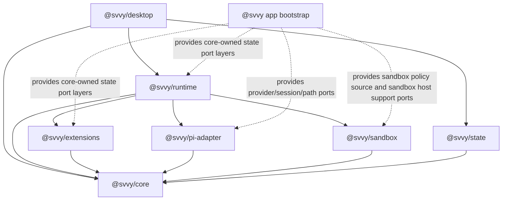

# Package Architecture Spec

## Status

- Date: 2026-06-11
- Status: active architecture spec; implementation progress is tracked in `docs/progress.md`
- Scope: package-oriented architecture for making `svvy` a reusable runtime plus desktop UI

This spec defines the target reusable package architecture for `svvy`. The PRD, feature inventory,
and domain specs must agree with these package boundaries.

## Goal

`svvy` is a vertically integrated desktop app built on a small set of reusable packages. Other app
consumers must be able to reuse the runtime, state model, sandbox, pi adapter, and extension system
with a different UI.

The package split must stay intuitive:

- public `@svvy/*` packages are for app developers building with `svvy`
- generated `@svvyx/*` packages are for Workflows source-library code and Smithers workflow source
- builtin capabilities that agents experience as tools, prompt guidance, or commands live under the
  extension system
- implementation areas that are not independently useful outside extensions remain source folders,
  not public packages
- prompt and instruction material lives as MDX/source contributors owned by `@svvy/extensions`
- the runtime API accepts new user-message inputs and emits typed events; consumers refetch durable
  read models instead of receiving renderer-shaped snapshots as the core API
- non-UI packages use Effect v4 services and layers for package-to-package composition; Promise,
  callback, and `AsyncIterable` APIs are edge facades over one scoped `ManagedRuntime`

## Cross-Cutting Specs

This package architecture is governed by these cross-cutting specs:

| Spec                | Purpose                                                                                                                    |
| ------------------- | -------------------------------------------------------------------------------------------------------------------------- |
| `effect-v4.spec.md` | Effect v4 usage rules, service/layer style, resource lifetimes, streams, schemas, subprocesses, bridge facades, and tests. |

Every package spec in this directory must follow the Effect v4 architecture spec when it describes
dependencies, public implementation APIs, resource lifetimes, event streams, errors, validation,
and tests.

## Public Package Set

The target public packages are exactly:

| Package            | Spec                 | Purpose                                                                                                                                             |
| ------------------ | -------------------- | --------------------------------------------------------------------------------------------------------------------------------------------------- |
| `@svvy/core`       | `core.spec.md`       | Shared stable `svvy` domain vocabulary, ids, schemas, event/read-model shapes, native-tool declaration shapes, typed errors, and tiny pure helpers. |
| `@svvy/state`      | `state.spec.md`      | Durable product state, projections, settings, logs, and persistence.                                                                                |
| `@svvy/sandbox`    | `sandbox.spec.md`    | Filesystem/network policy and sandbox helper integration.                                                                                           |
| `@svvy/pi-adapter` | `pi-adapter.spec.md` | Pi integration for scoped sessions, true system prompts, turns, model metadata, helper jobs, and pi event normalization.                            |
| `@svvy/extensions` | `extensions.spec.md` | Extension system plus builtin capability records.                                                                                                   |
| `@svvy/runtime`    | `runtime.spec.md`    | Shared orchestration kernel for sessions, surfaces, turns, queues, and extension routing.                                                           |
| `@svvy/desktop`    | `desktop.spec.md`    | Electrobun/Svelte desktop UI over runtime and state.                                                                                                |

The product package surface is the seven-package set above. Repository source folders outside
`packages/`, including app-entry folders such as `src/bun` and renderer folders such as
`src/mainview`, are implementation locations assigned to one of those package owners by this spec.
Physical source location is not a product architecture boundary.

Builtin capability domains remain extension records, state domains, or generated `@svvyx/*`
authoring artifacts unless a PRD/spec update creates a new public package boundary. Default actor
prompts, extension instructions, and reusable workflow prompts are MDX/source contributors owned,
validated, and built by `@svvy/extensions`. Generated `@svvyx/workflows` may emit `Prompts` exports
for Smithers authoring, but generated packages are read-only authoring outputs and are not prompt
source owners.

## Generated Package Set

The generated workflow/source-authoring packages are:

| Generated package   | Spec                         | Purpose                                                                   |
| ------------------- | ---------------------------- | ------------------------------------------------------------------------- |
| `@svvyx/workflows`  | `generated-packages.spec.md` | Generated reusable workflow assets for Smithers source.                   |
| `@svvyx/extensions` | `generated-packages.spec.md` | Generated extension references for workflow task-agent parameter records. |

`@svvyx/*` packages are local generated packages, not published reusable SDKs.

The public `@svvy/*` namespace is reserved for reusable developer packages. Generated packages use
the `@svvyx/*` namespace only.

## Dependency Graph

Arrows mean direct package import and service dependencies in the target architecture. Dashed arrows
mean app-bootstrap layer wiring that provides core-owned port implementations or package-owned host
support ports without creating package import edges.



`@svvy/core` is the only bottom public package. It must not import any implementation package.

Package import boundaries follow the graph above. A package may depend on another package only
through the other package's public contract modules, service classes, layer factories, facades, or
explicit port types. Importing a package's SQLite tables, renderer modules, pi-native internals,
generated build directories, source-checkout-relative helper files, or test fixtures is not an
allowed dependency even when TypeScript can resolve it.

`@svvy/runtime` has no direct `@svvy/state` package import edge. Runtime-facing orchestration code
consumes core-owned state port service tags and other package-owned Effect services only. App
bootstrap composes the concrete `@svvy/state` layers that satisfy those core-owned ports. Runtime
service code, package tests, and runtime Effect tests must not import state repositories, table
modules, SQLite clients, migration modules, store classes, state Promise facades, state command
facades, read-model facades, or private state implementation helpers. Any runtime test that needs a
state-backed implementation uses an app/bootstrap-level integration fixture named by
package-boundary tests rather than adding `@svvy/state` as a runtime package dependency.

App-entry modules under `src/bun/**` are bootstrap and host-adapter locations, not target ownership
surfaces. They may compose package-owned layers, create app-owned host adapters, register Electrobun
or process callbacks, and expose facades created from the app-owned `ManagedRuntime`. They must not
define product contracts, lifecycle policy, state ownership, queue claiming, prompt assembly,
accepted-tool execution policy, command lifecycle policy, request-input blocking lifecycle policy,
generated-package policy, recovery policy, or direct state mutation semantics. `@svvy/extensions`
owns metadata, prompts, schemas, and handler validation; `@svvy/runtime` owns accepted-tool
execution and lifecycle policy; `@svvy/state` owns durable facts behind core state ports; app
bootstrap wires concrete services and host adapters. Request-input timeout policy uses
runtime-owned Effect services, scoped wait registries, and committed timeout deadlines. Blocking
waits race the runtime-owned answer `Deferred` against the committed deadline using
`Effect.timeoutOrElse` or an equivalent scoped `Effect.sleep` timer fiber. Runtime computes
remaining time from Effect `DateTime.now` / `Clock`, records the deadline in state, and re-forks the
scoped timer only after committed pause/resume/version changes. App edges do not provide custom
timer policy and do not decide which request waits, expires, defaults, resolves, cancels, or writes
command/session-wait facts.

## Source Folder Map

The public package list is intentionally small. The following product domains are internal
source-folder boundaries, not public packages in this target design:

```text
@svvy/extensions/src/
  builtin/
    base-common/
    base-orchestrator/
    base-handler/
    base-workflow-task/
    shell/
    apply-patch/
    execute-typescript/
    extension-loading/
    extension-managing/
    request-user-input/
    thread-orchestration/
    thread-handling/
    artifacts/
    workflows/
    smithers/
    web/
    cx/
    git/
    github/
    external-instructions/
    facade-declarations/
    svvyx/

@svvy/runtime/src/
  workspaces/
  worktrees/
  sessions/
  surfaces/
  queues/
  commands/
  turns/
  handler-threads/
  requests/
  source-invalidation/
  events/
  prompt-refresh/
  recovery/
  title-jobs/
  generated-packages/

@svvy/state/src/
  settings/
  providers/
  sessions/
  workspaces/
  worktrees/
  commands/
  threads/
  artifacts/
  artifact-files/
  snippets/
  request-input/
  runtime-approvals/
  logs/
  generated-packages/
  read-models/
  migrations/
```

These folders remain source folders. Adding a concrete public package boundary for a non-extension
or non-runtime consumer requires agreement across the PRD, feature inventory, and package specs.
Splitting them by default would make the package surface less intuitive.

## File-Backed Vs Product-State-Backed Boundaries

Runtime architecture must not duplicate file-backed source truth into product state as a second
editable truth. `@svvy/state` persists product facts, indexes, fingerprints, and read-model
projections; source-owning packages write the source files; runtime listens for typed invalidations
and refreshes projections through package services.

| Domain                                                           | Editable file-backed source or generated file evidence                                                                                                                                                                                     | DB/product-state-backed facts                                                                                                     | Writer                                                                                                                                                                                                                                                                                                                                                      | Invalidation/read-model owner                                                                                                                                                                                                                                                                                         |
| ---------------------------------------------------------------- | ------------------------------------------------------------------------------------------------------------------------------------------------------------------------------------------------------------------------------------------ | --------------------------------------------------------------------------------------------------------------------------------- | ----------------------------------------------------------------------------------------------------------------------------------------------------------------------------------------------------------------------------------------------------------------------------------------------------------------------------------------------------------- | --------------------------------------------------------------------------------------------------------------------------------------------------------------------------------------------------------------------------------------------------------------------------------------------------------------------- |
| Orchestrator and handler agent profiles and extension usage      | none                                                                                                                                                                                                                                       | profile records, defaults, override rows, actor bindings, generated-context binding refs                                          | `@svvy/state` through state-backed command ports invoked by runtime/app command facades; desktop submits typed UI intent only                                                                                                                                                                                                                               | `@svvy/state` returns read-model after-commit descriptors; `@svvy/runtime` publishes notifications and refreshes affected surfaces                                                                                                                                                                                    |
| Workflow-agent records                                           | Workflows source-library `.agent.json` files                                                                                                                                                                                               | source fingerprints, source versions, diagnostics, generated agent metadata, Agents-pane links                                    | `@svvy/extensions` writes source files and returns file/fingerprint/diagnostic evidence; `@svvy/runtime` records source-version/fingerprint/diagnostic facts through core-owned `@svvy/state` ports                                                                                                                                                         | `@svvy/extensions` computes fingerprints; `@svvy/state` stores facts; `@svvy/runtime` schedules refresh                                                                                                                                                                                                               |
| Builtin extension prompts and instructions                       | packaged builtin templates under `@svvy/extensions`; live editable builtin sources scaffolded/reset under app config                                                                                                                       | prompt fingerprints, generated actor-context facts, dependency/readiness facts                                                    | `@svvy/extensions` scaffolds/resets/builds live sources                                                                                                                                                                                                                                                                                                     | `@svvy/extensions` computes fingerprints; `@svvy/runtime` schedules refresh                                                                                                                                                                                                                                           |
| User Extension source                                            | app-owned Extension source files/directories defined by Extension specs                                                                                                                                                                    | source fingerprints, package build facts, env/dependency readiness, actor usage projections                                       | `@svvy/extensions`                                                                                                                                                                                                                                                                                                                                          | `@svvy/runtime` watches/reconciles source changes; `@svvy/extensions` computes source/build facts; `@svvy/state` stores facts                                                                                                                                                                                         |
| Extension env declarations and secret values                     | extension source manifests and env declarations; secret values are never source files                                                                                                                                                      | encrypted secret values, non-secret overrides, readiness/status, coarse snapshot secret state                                     | `@svvy/extensions` declares and validates env requirements; `@svvy/state` persists user-owned values through app/runtime state commands                                                                                                                                                                                                                     | `@svvy/state` returns env/readiness after-commit descriptors; `@svvy/runtime` publishes notifications and refreshes affected actor readiness at safe boundaries                                                                                                                                                       |
| External instruction files                                       | discovered read-only files such as `AGENTS.md` and `CLAUDE.md`; `svvy` never writes these files                                                                                                                                            | external-instruction records, source fingerprints, diagnostics, generated-context participation                                   | external host/workspace writes files; `@svvy/extensions` discovers, validates, and renders contributions; `@svvy/state` stores rows, enablement, ordering, fingerprints, diagnostics, and read models                                                                                                                                                       | `@svvy/runtime` watches/reconciles; `@svvy/state` stores facts/read models                                                                                                                                                                                                                                            |
| Discovered read-only host snippets                               | host-owned Markdown snippet source files; `svvy` never writes these files                                                                                                                                                                  | discovered snippet records, enablement, provenance, fingerprints, diagnostics                                                     | external host writes files; `@svvy/state` owns managed snippet state                                                                                                                                                                                                                                                                                        | `@svvy/runtime` watches/reconciles; `@svvy/state` projects snippet read models                                                                                                                                                                                                                                        |
| Managed svvy snippets                                            | none                                                                                                                                                                                                                                       | managed snippet records, placeholders, enablement, provenance, source versions                                                    | `@svvy/state` through typed app/runtime commands                                                                                                                                                                                                                                                                                                            | `@svvy/state` returns read-model after-commit descriptors; runtime publishes notifications                                                                                                                                                                                                                            |
| App-global settings and preferences                              | none                                                                                                                                                                                                                                       | appearance, external editor, artifact directory, approval mode, network access, ambient resource category ledger                  | `@svvy/state` through typed app/runtime commands                                                                                                                                                                                                                                                                                                            | `@svvy/state` returns app preferences/settings descriptors; runtime publishes notifications                                                                                                                                                                                                                           |
| Generated `@svvyx/extensions`                                    | generated package files and generated manifest in the app-owned generated package area; generated evidence only, not editable source truth                                                                                                 | manifest build id, source/output fingerprints, build status, diagnostics, workspace link facts                                    | `@svvy/extensions` writes generated files and manifest evidence; when runtime asks for one workspace/package link repair, `@svvy/extensions` returns an immutable repair plan; `@svvy/runtime` schedules refresh/link repair and applies workspace links; `@svvy/state` writes generated-package and workspace-link facts through core-owned state ports implemented by `@svvy/state` | `@svvy/state` stores generated-package facts; `@svvy/runtime` schedules manifest reconciliation/generated-context refresh and publishes read-model invalidations only from committed `StateMutationResult.afterCommit` descriptors                                                                                    |
| Workflow source library prompts/components/workflows             | Workflows source-library prompt, component, and workflow source files                                                                                                                                                                      | source fingerprints, source versions, generated metadata, source diagnostics                                                      | `@svvy/extensions` Workflows source services write source files and return evidence only; `@svvy/runtime` records source facts through `@svvy/state` ports                                                                                                                                                                                                   | `@svvy/extensions` computes source facts; `@svvy/state` stores facts; `@svvy/runtime` schedules refresh and publishes notifications after committed descriptors                                                                                                                                                       |
| Generated `@svvyx/workflows`                                     | generated package files and generated manifest in the app-owned generated package area and linked workspace `.smithers/node_modules`; generated evidence only, not editable source truth                                                   | manifest build id, source/output fingerprints, build status, diagnostics, link status, generated export metadata                  | `@svvy/extensions` writes generated files and returns link repair plans; `@svvy/runtime` applies workspace links; `@svvy/state` writes generated-package and workspace-link facts                                                                                                                                                                           | `@svvy/state` stores facts; `@svvy/runtime` reconciles manifests/links and publishes notifications                                                                                                                                                                                                                    |
| Smithers workflow execution                                      | Smithers-owned `.smithers` project files and official Smithers CLI-observable execution artifacts/events; `svvy` does not read Smithers SQLite/event-log internals unless an official Smithers public API or CLI command exposes that data | observed Smithers run/task/node/iteration/attempt facts, bridge command links, task-attempt surfaces, summaries needed by svvy UI | Smithers writes Smithers state; `@svvy/runtime` records bridge/CLI-observed svvy facts                                                                                                                                                                                                                                                                      | `@svvy/runtime` observes bridge/CLI results; `@svvy/state` projects read models                                                                                                                                                                                                                                       |
| Bridge tokens and env injection                                  | command-scoped child-process environment only                                                                                                                                                                                              | source command binding, task-attempt linkage, and terminal accept/reject facts only                                               | `@svvy/runtime` creates, validates, expires, and revokes token values in runtime memory for the owning command scope                                                                                                                                                                                                                                        | token value, fingerprint, expiry, and revocation changes are runtime-local; visible facts are command/task-attempt invalidations                                                                                                                                                                                      |
| Surface queues, turns, commands, waits, request input, approvals | none                                                                                                                                                                                                                                       | authoritative product rows and read models                                                                                        | `@svvy/runtime` via `@svvy/state` ports                                                                                                                                                                                                                                                                                                                     | `@svvy/state` returns after-commit descriptors; runtime publishes notifications                                                                                                                                                                                                                                       |
| Command output artifacts                                         | artifact files under the app artifact store, with immutable files isolated under the session immutable child directory                                                                                                                     | artifact metadata, digests, command links, immutability state                                                                     | `@svvy/state` artifact command port                                                                                                                                                                                                                                                                                                                         | `@svvy/state` returns after-commit descriptors; runtime publishes artifact read-model notifications                                                                                                                                                                                                                   |
| Generated context cache material                                 | optional app-owned cache files written by `@svvy/extensions` only when needed for large rendered context blobs                                                                                                                             | binding rows, source fingerprints, rendered-context digest, cache-file refs, surface stale/current state                          | `@svvy/extensions` renders and writes optional cache files; `@svvy/state` persists facts, digests, and refs                                                                                                                                                                                                                                                 | `@svvy/runtime` refreshes stale bindings and publishes surface/read-model notifications from committed descriptors                                                                                                                                                                                                    |
| Source fingerprints and source versions                          | source files remain owned by their domain                                                                                                                                                                                                  | latest observed digest, compare-and-swap source version, build/reconcile status, diagnostics                                      | source-owning packages write source files and compute source evidence; `@svvy/state` alone writes source fingerprint/version rows through named state ports                                                                                                                                                                                                 | `@svvy/runtime` coordinates file-backed source watching/reconciliation; source-owning package saves return file-write receipts and decoded source evidence; runtime then calls named state-backed source-version/source-fact ports, and `@svvy/state` returns after-commit descriptors from the committed transaction |

Adding a new durable fact requires choosing exactly one owner row in this table or updating the table
first. A field that can be recomputed directly from a file-backed source must not be persisted as an
independent editable product value.

## Composition Model

Non-UI packages compose through Effect services and layers. The desktop app and other non-Effect
consumers use a facade created from one scoped `ManagedRuntime`; they do not directly assemble
hidden globals or ad hoc per-call runtimes.

Target bootstrap shape:

The bootstrap graph derives every state-backed port layer from one named `StateLayer` value. The
final app bootstrap exposes the runtime facade plus state read/command facades to desktop, browser tools, and headless
automation edges, and wires state-backed port layers into sandbox, pi-adapter, extensions, and
runtime package services. It does not expose a broad state store to package consumers.

The app bootstrap owns `ManagedRuntime` creation and root layer wiring. Every named layer, layer
factory, facade factory, or port factory in the example below must be one of:

- an exported package service/layer/facade named in that package spec
- a state-owned implementation layer for a core-owned port tag named in `state.spec.md`
- an app-owned host adapter for packaged paths, app config directories, platform services, or native
  process integration

Adding a new name to this bootstrap example requires adding the corresponding owner package/export
contract to the package spec in the same change. Example names are not allowed to become hidden
globals, source-checkout-relative helper imports, or package-private dependency shortcuts.
App bootstrap inputs in this sketch are either host facts, host-backed port layers, or facade bridge
adapters. Host facts such as `selectedEnv`, `appConfigDir`, `resourcesDir`, and `secretStore` are
decoded before package layer acquisition and are not reusable package services. Host-backed layer
helpers each produce the single service tag named by the consuming package spec. No bootstrap helper
may own product state, queue/runtime policy, prompt assembly, extension semantics, sandbox
decisions, command execution, or recovery. State-owned SQLite/file layers are provided with the
platform filesystem/path services they require; host adapter layers may depend on the same platform
services but must expose only the explicit port tags consumed by package layers. A host-backed layer
may resolve packaged paths, app-config roots, platform facts, or helper candidates only. The package
spec that consumes the port defines the port shape and test fixture before the bootstrap helper name
may appear here.

### App Bootstrap Host Adapter Contract

Every app/bootstrap host adapter used by the root layer graph is declared in this table and in the
owning package spec before it is used. An adapter that needs additional behavior gets a new row and a
new owner-package port; it does not grow hidden policy inside app-entry code.

| Adapter / layer name                           | Provides service tag                                        | Owning package spec                              | Allowed host reads                                                                                                                 | Forbidden product policy                                                                                                                          | Lifetime                                         | Readiness receipt                                                                                                                           | Shutdown behavior                                                                                                        | Fake/test layer requirement                                                                              | Boundary check                                                                                                          |
| ---------------------------------------------- | ----------------------------------------------------------- | ------------------------------------------------ | ---------------------------------------------------------------------------------------------------------------------------------- | ------------------------------------------------------------------------------------------------------------------------------------------------- | ------------------------------------------------ | ------------------------------------------------------------------------------------------------------------------------------------------- | ------------------------------------------------------------------------------------------------------------------------ | -------------------------------------------------------------------------------------------------------- | ----------------------------------------------------------------------------------------------------------------------- |
| `secretStore`                                  | `SecretStorePort`                                           | `state.spec.md`                                  | host secret-store handle and availability facts                                                                                    | profile policy, env readiness policy, prompt construction, command execution, raw secret projection                                               | app runtime layer                                | state startup proves the adapter can answer configured secret operations                                                                    | finalizer closes adapter when the host implementation has a lifecycle                                                    | fake secret store with redaction/no-raw-secret assertions                                                | no public package imports host secret-store implementation                                                              |
| `PackagedPiRuntimePathsLayer`                  | `PiRuntimePathsPort`                                        | `pi-adapter.spec.md`                             | packaged pi runtime path, helper bundle root, resource existence                                                                   | pi session creation, provider/model selection, turn dispatch, fallback to source-checkout paths                                                   | app runtime layer                                | pi-adapter startup validates packaged paths before opening a pi session                                                                     | no state mutation; closes only adapter-owned handles if any                                                              | fake packaged-path layer with missing/wrong-path diagnostics                                             | `@svvy/pi-adapter` does not import app-entry path helpers                                                               |
| `HostProcessReferenceLayer`                    | `HostProcessReferencePort`                                  | `sandbox.spec.md`                                | current process id, executable path, host platform facts for sandbox launch policy                                                 | sandbox profile decisions, approval policy, command lifecycle, output capture                                                                     | app runtime layer                                | sandbox startup/command launch validates the exact host facts it consumes                                                                   | no command cancellation; only host-fact handles are released                                                             | fake host-process layer for launch-policy tests                                                          | sandbox package imports only the port tag, not app process globals                                                      |
| `SandboxHelperCandidatesLayer`                 | `SandboxHelperCandidatesPort`                               | `sandbox.spec.md`                                | packaged helper candidate paths and existence/executable facts                                                                     | sandbox allow/deny decisions, source path discovery, command retry, broad `PATH` probing                                                          | app runtime layer                                | sandbox launch-policy tests prove missing helper candidates fail with typed errors                                                          | no state mutation; no command cleanup beyond helper-adapter handles                                                      | fake helper-candidate layer with exact candidate fixtures                                                | boundary tests reject source-checkout helper paths in product code                                                      |
| `createExtensionSourceRootsLayer(...)`         | `ExtensionSourceRootsPort`                                  | `extensions.spec.md`                             | app-owned extension roots under configured app-data locations                                                                      | extension registry semantics, generated context policy, dependency approval, runtime refresh scheduling                                           | app runtime layer                                | extensions startup validates root ownership before source reads or saves                                                                    | closes file-watch/root handles if acquired; does not delete source files                                                 | temp-root source layer for extension source tests                                                        | extensions package does not import app-entry config globals                                                             |
| `createPackagedExtensionTemplatesLayer(...)`   | `PackagedExtensionTemplatesPort`                            | `extensions.spec.md`                             | packaged builtin extension template roots and readonly resource existence                                                          | builtin extension enablement policy, prompt rendering, generated package facts                                                                    | app runtime layer                                | extensions startup verifies packaged template roots before builtin materialization                                                          | readonly handles only; no source cleanup                                                                                 | fake packaged-template layer with missing-template diagnostics                                           | no source-checkout template paths in shipped architecture                                                               |
| `createWorkspaceSourceLinkLayer(...)`          | `WorkspaceSourceLinkPort`                                   | `extensions.spec.md`                             | trusted workspace root/session facts needed to compute `<workspace>/.smithers/node_modules/@svvyx/<package>` link paths            | generated-package build policy, link application, status classification, runtime recovery policy, Smithers execution interpretation, state writes | app runtime layer / host link-path port boundary | `Extensions.generatedPackages.planWorkspaceLink(...)` receives only canonical link-path candidates; it does not mutate the filesystem       | no link handles; runtime-owned repair applies the plan through a primitive file host during command/recovery-scoped work | fake link-path layer for valid path, missing Smithers root, and rejected workspace inputs                | app/bootstrap provides path/file primitives; runtime owns scheduling, apply semantics, status classification, and facts |
| `RuntimeGeneratedPackageWorkspaceLinkFileHost` | runtime refresh boundary host, not an Effect service tag    | `runtime.spec.md` / `generated-packages.spec.md` | primitive filesystem operations for path existence, directory checks, symlink reads, parent creation, remove, and symlink creation | generated-package source validation, link-plan construction, status classification, recovery scheduling, state writes, product notifications      | runtime command/recovery file-host boundary      | runtime calls `applyGeneratedPackageWorkspaceLinkRepairPlan(...)` with this primitive host after receiving an immutable extension link plan | no lifecycle beyond the enclosing runtime command/recovery operation                                                     | fake file host tests for linked, unchanged, blocked non-symlink, missing Smithers root, and failed write | no app callback named or shaped like semantic `applyWorkspaceLinkRepairPlan`                                            |
| `createGeneratedPackageRootLayer(...)`         | `GeneratedPackageRootPort`                                  | `extensions.spec.md`                             | app-owned generated package root under configured app-data locations                                                               | generated manifest schema, source eligibility, workspace link scheduling, state fact writes                                                       | app runtime layer                                | extensions generated-package service validates root ownership before build output replacement                                               | does not delete durable generated roots except through explicit cleanup commands                                         | temp generated-root layer proving atomic replacement and recovery receipts                               | generated-package services never resolve source-checkout-relative generated roots                                       |
| `createFileWatchBackendLayer(...)`             | `FileSystem.WatchBackend`                                   | `effect-v4.spec.md` and consumers                | app host file-watch backend selection and packaged runtime capabilities                                                            | source invalidation policy, debouncing semantics, generated-package refresh decisions, state writes                                               | app runtime layer                                | runtime source-watch startup records watch backend readiness before watch-driven notifications                                              | finalizer closes watches through the Effect layer scope                                                                  | fake watch backend with deterministic watch events for runtime/source invalidation tests                 | packages consume `FileSystem` watch services, not app-entry watcher implementations                                     |
| `createNetworkPolicyHttpClientLayer(...)`      | guarded `HttpClient.HttpClient` from app-local policy input | app bootstrap / `effect-v4.spec.md`              | current app network preference and loopback policy facts through app state/settings                                                | HTTP request construction, provider probing, helper protocol behavior, command execution, DNS/socket/fetch effects                                | app runtime layer                                | guarded HTTP layer proves policy is available before any transport needing `HttpClient` starts                                              | no network teardown; only adapter subscriptions/read handles close                                                       | fake guarded HTTP layer for allowed, denied, loopback-only, and preference-change cases                  | domain packages do not import concrete Bun/Node/fetch HTTP layers or app-local policy objects                           |

The table is intentionally host-adapter-specific. Package-owned layers such as `@svvy/state.layer`,
`@svvy/extensions.layer`, `@svvy/pi-adapter.layer`, `@svvy/sandbox.layer`, and
`@svvy/runtime.layer` are not host adapters and must not appear here.

App network preference and loopback policy are app-bootstrap-local inputs to guarded HTTP client
construction. They are not reusable package service tags and are not `Runtime.layer` requirements.
If any package method directly requires network policy, the owning package spec must first promote a
named port contract, add it to the relevant layer requirements, and define its fake/test layer.

The following sketch is app-bootstrap-only. The `Effect.runPromise(...)` and
`ManagedRuntime.make(...)` calls shown here are process-edge calls and must not appear inside
non-edge package services, package layers, runtime logic, extension handlers, or ordinary service
tests.

```ts
import * as Layer from "effect/Layer";
import * as ManagedRuntime from "effect/ManagedRuntime";
import * as ConfigProvider from "effect/ConfigProvider";
import * as Effect from "effect/Effect";
import * as FileSystem from "effect/FileSystem";
import * as Crypto from "effect/Crypto";
import * as Path from "effect/Path";
import { ChildProcessSpawner } from "effect/unstable/process";
import * as HttpClient from "effect/unstable/http/HttpClient";
import type {
  ExtensionStatePort,
  PiRuntimePathsPort,
  ProviderAuthPort,
  PiSessionReferencePort,
  SandboxPolicySource,
} from "@svvy/core";
import { createDesktopApp } from "@svvy/desktop";
import {
  layer as ExtensionsLayerBase,
  type ExtensionSourceRootsPort,
  type GeneratedPackageRootPort,
  type PackagedExtensionTemplatesPort,
  type WorkspaceSourceLinkPort,
} from "@svvy/extensions";
import { layer as PiAdapterLayerBase } from "@svvy/pi-adapter";
import {
  createRuntimeFacade,
  layer as RuntimeLayerBase,
  type Runtime as SvvyRuntimeService,
} from "@svvy/runtime";
import {
  awaitRuntimeStartupReadiness,
  createRuntimeLayerConfigLayer,
  layerRuntimeBunPlatform,
  prepareRuntimeShutdown,
  RuntimeLayerConfigFromEnv,
} from "@svvy/runtime/bootstrap";
import {
  layer as SandboxLayerBase,
  type HostProcessReferencePort,
  type SandboxHelperCandidatesPort,
} from "@svvy/sandbox";
import {
  createStateCommandsFacade,
  createStateFacade,
  layerExtensionStatePort,
  layerPiSessionReferencePort,
  layerProviderAuthPort,
  layerRuntimeActorExtensionBindingStatePort,
  layerRuntimeApprovalStatePort,
  layerRuntimeArtifactStatePort,
  layerRuntimeCommandStatePort,
  layerRuntimeComposerDraftStatePort,
  layerRuntimeEpisodeStatePort,
  layerRuntimeExtensionStatePort,
  layerRuntimeExtensionContextImpactStatePort,
  layerRuntimeGeneratedPackageStatePort,
  layerRuntimeQueueStatePort,
  layerRuntimeReadModelStatePort,
  layerRuntimeRecoveryStatePort,
  layerRuntimeRequestStatePort,
  layerRuntimeSessionWaitStatePort,
  layerRuntimeSourceStatePort,
  layerRuntimeSurfaceLifecycleStatePort,
  layerRuntimeThreadStatePort,
  layerRuntimeTurnStatePort,
  layerRuntimeWorkspaceStatePort,
  layerSandboxPolicySource,
  layer as createStateLayer,
  type StateCommandInvalidationSink,
  StateLayerConfigFromEnv,
} from "@svvy/state";

// Provided by app host bootstrap, not by a public package API.
declare const secretStore: unknown;
declare const appConfigDir: string;
declare const resourcesDir: string;
declare const selectedEnv: Readonly<Record<string, string>>;
declare const SandboxHelperCandidatesLayer: Layer.Layer<SandboxHelperCandidatesPort>;
declare const HostProcessReferenceLayer: Layer.Layer<HostProcessReferencePort>;
declare const PackagedPiRuntimePathsLayer: Layer.Layer<PiRuntimePathsPort>;
declare const createBootstrapInvalidationSink: (
  managedRuntime: ManagedRuntime.ManagedRuntime<SvvyRuntimeService, unknown>,
) => StateCommandInvalidationSink;
declare const createDesktopNotificationsFacade: (
  managedRuntime: ManagedRuntime.ManagedRuntime<SvvyRuntimeService, unknown>,
) => unknown;
declare const omitRuntimeStreamSurface: (
  runtime: ReturnType<typeof createRuntimeFacade>,
) => unknown;
declare const createExtensionSourceRootsLayer: (input: {
  appConfigDir: string;
}) => Layer.Layer<ExtensionSourceRootsPort>;
declare const createPackagedExtensionTemplatesLayer: (input: {
  resourcesDir: string;
}) => Layer.Layer<PackagedExtensionTemplatesPort>;
declare const createWorkspaceSourceLinkLayer: (input: {
  appConfigDir: string;
}) => Layer.Layer<WorkspaceSourceLinkPort>;
declare const createGeneratedPackageRootLayer: (input: {
  appConfigDir: string;
}) => Layer.Layer<GeneratedPackageRootPort>;
declare const createFileWatchBackendLayer: (input: {
  appConfigDir: string;
  resourcesDir: string;
}) => Layer.Layer<FileSystem.WatchBackend>;
// App-bootstrap-local input to the guarded HTTP client layer. This is not a reusable package
// service tag and is not a `Runtime.layer` requirement.
type AppNetworkPolicy = {
  externalNetworkAllowed(): Effect.Effect<boolean, never>;
  loopbackAllowed(): Effect.Effect<boolean, never>;
};
declare const AppNetworkPolicyLayer: Layer.Layer<AppNetworkPolicy>;
declare const createNetworkPolicyHttpClientLayer: (input: {
  external: Layer.Layer<HttpClient.HttpClient>;
  networkPolicy: Layer.Layer<AppNetworkPolicy>;
}) => Layer.Layer<HttpClient.HttpClient>;
declare const HostChildProcessSpawnerLayer: Layer.Layer<ChildProcessSpawner.ChildProcessSpawner>;
declare const RawHostHttpClientLayer: Layer.Layer<HttpClient.HttpClient>;
const bootstrapConfigProvider = ConfigProvider.fromEnv({ env: selectedEnv });
const BootstrapConfigProviderLayer = ConfigProvider.layer(bootstrapConfigProvider);
const stateConfig = await Effect.runPromise(StateLayerConfigFromEnv.parse(bootstrapConfigProvider));
const runtimeConfig = await Effect.runPromise(
  RuntimeLayerConfigFromEnv.parse(bootstrapConfigProvider),
);
const StateLayer = createStateLayer({ config: stateConfig, secretStore });
const RuntimeLayerConfigLayer = createRuntimeLayerConfigLayer(runtimeConfig);
const ExtensionSourceRootsLayer = createExtensionSourceRootsLayer({ appConfigDir });
const PackagedExtensionTemplatesLayer = createPackagedExtensionTemplatesLayer({ resourcesDir });
const WorkspaceSourceLinkLayer = createWorkspaceSourceLinkLayer({ appConfigDir });
const GeneratedPackageRootLayer = createGeneratedPackageRootLayer({ appConfigDir });
const FileWatchBackendLayer = createFileWatchBackendLayer({ appConfigDir, resourcesDir });
const HostPlatformBaseLayer = Layer.mergeAll(
  layerRuntimeBunPlatform,
  FileWatchBackendLayer,
  HostChildProcessSpawnerLayer,
);

const StateWithPlatformLayer = StateLayer.pipe(Layer.provide(HostPlatformBaseLayer));

const SandboxPolicySourceLayer = layerSandboxPolicySource(StateWithPlatformLayer);
const AppHttpClientLayer = createNetworkPolicyHttpClientLayer({
  external: RawHostHttpClientLayer,
  networkPolicy: AppNetworkPolicyLayer,
});
const ProviderAuthLayer = layerProviderAuthPort(StateWithPlatformLayer);
const PiSessionReferenceLayer = layerPiSessionReferencePort(StateWithPlatformLayer);
const ExtensionStateLayer = layerExtensionStatePort(StateWithPlatformLayer);

const RuntimeStatePortsLayer = Layer.mergeAll(
  layerRuntimeWorkspaceStatePort(StateWithPlatformLayer),
  layerRuntimeSurfaceLifecycleStatePort(StateWithPlatformLayer),
  layerRuntimeComposerDraftStatePort(StateWithPlatformLayer),
  layerRuntimeQueueStatePort(StateWithPlatformLayer),
  layerRuntimeTurnStatePort(StateWithPlatformLayer),
  layerRuntimeThreadStatePort(StateWithPlatformLayer),
  layerRuntimeActorExtensionBindingStatePort(StateWithPlatformLayer),
  layerRuntimeApprovalStatePort(StateWithPlatformLayer),
  layerRuntimeEpisodeStatePort(StateWithPlatformLayer),
  layerRuntimeCommandStatePort(StateWithPlatformLayer),
  layerRuntimeRequestStatePort(StateWithPlatformLayer),
  layerRuntimeSessionWaitStatePort(StateWithPlatformLayer),
  layerRuntimeSourceStatePort(StateWithPlatformLayer),
  layerRuntimeExtensionContextImpactStatePort(StateWithPlatformLayer),
  layerRuntimeGeneratedPackageStatePort(StateWithPlatformLayer),
  layerRuntimeArtifactStatePort(StateWithPlatformLayer),
  layerRuntimeRecoveryStatePort(StateWithPlatformLayer),
  layerRuntimeReadModelStatePort(StateWithPlatformLayer),
);

// RuntimeArtifactStatePort is provided only by the imported @svvy/state layer factory.
// App bootstrap does not define a parallel artifact port implementation.

const SandboxHostSupportLayer = Layer.mergeAll(
  SandboxHelperCandidatesLayer,
  HostProcessReferenceLayer,
  layerRuntimeBunPlatform,
);

const SandboxLayer = SandboxLayerBase.pipe(
  Layer.provide(Layer.mergeAll(SandboxPolicySourceLayer, SandboxHostSupportLayer)),
);

const PiLayer = PiAdapterLayerBase.pipe(
  Layer.provide(Layer.mergeAll(ProviderAuthLayer, PiSessionReferenceLayer)),
  Layer.provide(PackagedPiRuntimePathsLayer),
);

const ExtensionsLayer = ExtensionsLayerBase.pipe(
  Layer.provide(
    Layer.mergeAll(
      ExtensionStateLayer,
      ExtensionSourceRootsLayer,
      PackagedExtensionTemplatesLayer,
      WorkspaceSourceLinkLayer,
      GeneratedPackageRootLayer,
      HostPlatformBaseLayer,
    ),
  ),
);

const SvvyRuntimeLayer = RuntimeLayerBase.pipe(
  Layer.provide(
    Layer.mergeAll(
      RuntimeStatePortsLayer,
      ExtensionStateLayer,
      PiSessionReferenceLayer,
      SandboxLayer,
      PiLayer,
      ExtensionsLayer,
      RuntimeLayerConfigLayer,
      HostPlatformBaseLayer,
    ),
  ),
);

const appLayer = Layer.mergeAll(StateWithPlatformLayer, SvvyRuntimeLayer);

const managedRuntime = ManagedRuntime.make(appLayer);
await managedRuntime.context();
await awaitRuntimeStartupReadiness(managedRuntime);
const invalidationSink = createBootstrapInvalidationSink(managedRuntime);
const runtime = createRuntimeFacade(managedRuntime);
const state = createStateFacade(managedRuntime);
const stateCommands = createStateCommandsFacade(managedRuntime, { invalidationSink });
const notifications = createDesktopNotificationsFacade(managedRuntime);

const commands = {
  runtime: runtime.commands,
  state: stateCommands,
};

const desktopHost = createElectrobunDesktopHostAdapter({
  bridge,
  windows,
  menus,
  browserTools,
});

const desktop = createDesktopApp({
  runtime: omitRuntimeStreamSurface(runtime),
  state,
  commands,
  notifications,
  host: desktopHost,
});
await desktop.start();

await runtime.messages.submit({
  target,
  message: { text: "Refactor the transcript projection and report risks." },
  delivery: "enqueue-and-run",
});

// Facade close methods release facade-owned subscriptions/callbacks only. They do not dispose the
// package layers, close the database, stop runtime workers, or tear down the app ManagedRuntime.
const shutdown = await prepareRuntimeShutdown(managedRuntime, {
  reason: "app-shutdown",
  drainTimeoutMs: 5000,
});
// {
//   status: "drained",
//   interruptedTurns: 0,
//   interruptedCommands: 0,
//   releasedQueueClaims: 0,
//   recoveryRowsScheduled: 0,
// }
await desktop.dispose();
await runtime.close();
await state.close();
await managedRuntime.dispose();
```

`RawHostHttpClientLayer` is private to app/bootstrap and network-policy wrapper tests. Base
`RuntimeLayerBase` does not receive `AppHttpClientLayer`; `runtime.spec.md` defines the exact
`RuntimeLayerRequirements`, and `HttpClient.HttpClient` is not one of them. Only separately named
transport layers whose public requirements explicitly include `HttpClient.HttpClient`, such as a
runtime-owned task-agent bridge transport layer, receive the guarded `AppHttpClientLayer`. Those
transport layers are composed alongside or under the runtime layer by app/bootstrap without changing
the base runtime service requirements. Packages that do not perform outbound HTTP do not receive a
generic HTTP service by default.
`networkAccess: false` fails with a typed policy error before any DNS lookup, socket open, fetch,
provider probe, or helper protocol request. Domain packages must not import or provide
`BunHttpClient.layer`, `NodeHttpClient.layer*`, or `FetchHttpClient.layer` directly.

`layerRuntimeBunPlatform` is the Bun/Electrobun platform bootstrap layer that provides abstract
`FileSystem.FileSystem`, `Path.Path`, and `Crypto.Crypto` from `@effect/platform-bun`
`BunFileSystem.layer`, `BunPath.layer`, and `BunCrypto.layer`. App/bootstrap composes it into
`HostPlatformBaseLayer`; package/domain services still consume only abstract Effect service tags.
`HostPlatformBaseLayer` also provides `FileSystem.WatchBackend` through the app-selected watch
backend and `ChildProcessSpawner.ChildProcessSpawner` through a svvy app-bootstrap adapter typed
against the installed abstract Effect service. Concrete platform modules are private app-bootstrap
implementation details only when this spec names them; package layers consume only the abstract
services.
`Crypto.Crypto` is part of the platform bundle because source fingerprints, generated-package
fingerprints, artifact digests, secure ids, tokens, and persisted checksum facts are host services,
not ad hoc `node:crypto`, Bun global, or package-local helpers. Packages that compute such values
declare `Crypto.Crypto` or a narrower explicit digest/id port in their layer requirements.

Runtime and extension services consume only the abstract `FileSystem.FileSystem` service and never
import Bun, Node, or Electron watcher APIs directly. When a file-watch backend is adopted for the
live filesystem service, app/bootstrap provides it at the same platform boundary before exposing the
filesystem service to package layers. Tests that need fake watcher behavior provide a fake
`FileSystem.WatchBackend` at that layer position and assert the fake backend receives watches before
the filesystem service is exposed.

`StateWithPlatformLayer` is one shared layer value for the app runtime graph. App/bootstrap must not
call `createStateLayer(...)` more than once for one `ManagedRuntime`, and state-backed port layer
factories must not open their own database handles. State exposes a single-acquisition receipt in
test layers; app-bootstrap integration tests assert one SQLite acquisition per app runtime graph
even when many state-backed port layers are composed.

`managedRuntime.context()` proves the app layer graph was acquired. App/bootstrap then awaits the
runtime-owned startup readiness effect before exposing facades. That readiness covers app-scoped
runtime workers, startup recovery scans, app-global source reconciliation, generated-package
startup reconciliation, and any other worker whose readiness is required before bridge calls can be
accepted. `context()` alone is not treated as proof that forked workers are semantically ready.

Target ownership is the package path plus the public service/schema contract. A package service owns
the behavior named in its contract, including validation, dependency wiring, lifecycle, and tests.
App entrypoints may adapt host callbacks into package facades, but they do not retain package-owned
queue policy, prompt assembly, pi delivery, extension semantics, sandbox decisions, state writes, or
runtime recovery behind a forwarding wrapper.

Desktop chrome and layout commands are renderer UI intents normalized by `@svvy/desktop` and
forwarded to bootstrap-provided command facades. The Effect command services that mutate app or
workspace state live in `@svvy/state` as explicit state-owned command ports, or in `@svvy/runtime`
when lifecycle work is required. `@svvy/desktop` exposes only renderer/window/bridge adapters over
those prebuilt facades through `createDesktopApp(input)`; it must not create a `ManagedRuntime`
facade that owns state mutation semantics.
`stateCommands` in the bootstrap example is the `StateCommandsFacade` produced by
`createStateCommandsFacade(managedRuntime, { invalidationSink })` exported by `@svvy/state`. Its
exact method groups are specified in the state package spec. It is separate from the read-only
`createStateFacade(...)` surface and contains only DB/product-state-backed UI-intent commands. It
hides committed `StateInvalidationDescriptor` arrays from callers and resolves public command calls
only after the app/bootstrap-owned invalidation sink has accepted the descriptors returned by the
committed state transaction. App/bootstrap wires the facade and sink; desktop and renderer callers
do not collect descriptors or publish runtime events.

Primary service exports are exact target names:

| Package            | Effect service export             | Primary layer export                               | Non-Effect facade export                                                                                                                                  |
| ------------------ | --------------------------------- | -------------------------------------------------- | --------------------------------------------------------------------------------------------------------------------------------------------------------- |
| `@svvy/state`      | no public umbrella service export | `layer(input)` plus named state-backed port layers | `createStateFacade(managedRuntime)` for read models; `createStateCommandsFacade(managedRuntime, { invalidationSink })` for state-owned UI-intent commands |
| `@svvy/sandbox`    | `Sandbox`                         | `layer`                                            | no non-Effect facade export; diagnostics remain Effect-native unless a named public subpath, exact methods, and boundary tests are added                  |
| `@svvy/pi-adapter` | `PiAdapter`                       | `layer`                                            | no general app facade; no Promise facade is exported unless `pi-adapter.spec.md` names exact diagnostics-only methods and boundary tests                  |
| `@svvy/extensions` | `Extensions`                      | `layer`                                            | no non-Effect facade export; package inspection remains Effect-native unless a named public subpath, exact methods, and boundary tests are added          |
| `@svvy/runtime`    | `Runtime`                         | `Runtime.layer` plus root `layer` alias            | `createRuntimeFacade(managedRuntime)`                                                                                                                     |
| `@svvy/desktop`    | no Effect service export          | no layer export                                    | `createDesktopApp(input)` for desktop/window/renderer lifecycle over injected runtime facade, state read/command facades, and host desktop adapters       |

`@svvy/core` exports schemas, branded ids, typed errors, read-model contracts, command contracts,
runtime event contracts, `RuntimeEffectRequest` contracts, `ExtensionExecutionPlan` contracts,
cross-package port `Context.Service` tags, and pure helpers. It has no service implementation,
layer, managed runtime, resource, or facade export.

`@svvy/desktop` receives facades and starts the app. It is not a dependency provider for non-UI
packages.

Dependency ownership:

- `@svvy/core` owns the shared port service tags and schema-backed records exchanged through those
  ports. `@svvy/state` exports state-backed implementations/layers for the core-owned runtime,
  extension, provider auth, pi session reference, sandbox policy source, runtime artifact, and
  secret-store port contracts consumed by runtime and other non-UI packages, plus the core-owned
  app-log write port for durable product observability. App/bootstrap provides the
  resulting `ProviderAuthPort`, `PiSessionReferencePort`, and `SandboxPolicySource` services to
  dependent layers. `@svvy/pi-adapter` and `@svvy/sandbox` consume the narrowed services they
  require and must not import state repositories, store objects, SQL clients, or migration
  internals.
- `@svvy/sandbox` consumes immutable sandbox policy snapshots plus sandbox-owned host support ports
  implemented by app/bootstrap, and returns launch constraints.
- `@svvy/pi-adapter` consumes provider auth, pi session references, and packaged runtime paths
  through Effect port services.
- `@svvy/extensions` consumes extension/product-state ports,
  app/bootstrap-provided source-root/template/link/generated-package path providers, and explicit
  filesystem/path services. It has no `@svvy/state` or `@svvy/sandbox` package dependency. It does
  not receive `RuntimeArtifactStatePort`, `ArtifactFileStorePort`, or any other artifact mutation
  port. Artifact command metadata, schemas, validation, and model-facing command descriptions live
  in `@svvy/extensions`; artifact state mutations and file writes are applied by `@svvy/runtime`
  through the state-backed `RuntimeArtifactStatePort`. Any operation that needs sandbox launch
  policy, durable queue ordering, command-session ownership, artifact mutation, or runtime scheduling
  returns an `ExtensionHandlerResult` containing one model-facing result plus ordered
  `ExtensionRuntimeOperation` items for `@svvy/runtime` to process.
- `@svvy/runtime` consumes runtime state ports, sandbox, pi-adapter, and extensions.
- `@svvy/desktop` consumes the runtime facade plus state read/command facades; it does not become a dependency of the
  runtime graph.

Dashed composition edges from `@svvy/state` to `@svvy/pi-adapter`, `@svvy/sandbox`, and
`@svvy/extensions` are allowed only as app/bootstrap-provided implementations of `@svvy/core` port
services. They are not package import edges and must not expose repositories, tables, SQL clients,
migrations, or `StateStore` internals.

Port ownership rule: `@svvy/core` owns port tags only when the tag is a cross-package contract or
when a state-backed implementation is shared with another package. A package may own a private host
support port, such as a sandbox native-helper launcher or packaged-path resolver, when the port is
consumed only by that package and its implementation is supplied by app/bootstrap. Private host
support ports must not carry product-state records, branded ids beyond their package input/output
schemas, repositories, runtime events, queue policy, or generated-context behavior. When a second
package needs the same port, the contract is promoted to `@svvy/core` in the same change that adds
the second consumer.

Packages compose through explicit Effect services, layers, and ports, not hidden globals, renderer
singletons, ambient pi state, source checkout paths, implicit global package resolution, or manual
runtime creation inside services.

Package-to-package code must depend on Effect-native services. Promise-returning, callback, and
`AsyncIterable` bridge/facade helpers are allowed only at non-Effect boundaries such as Electrobun
RPC, browser tools, and headless scripts.
Facade/RPC adapters use `managedRuntime.runPromiseExit(...)` when mapping success, typed failure,
defect, and interruption into stable bridge results. `managedRuntime.runPromise(...)` is allowed
only for calls whose rejection mapping is intentionally closed by the facade contract.

App shell bootstrap code owns only Electrobun process startup, platform-layer selection, packaged
path resolution, app-layer construction, RPC handler registration, and construction of package
facades for renderer/headless callers. It may adapt Promise/RPC calls into package-owned Effect
services at the edge, but it must not own product logic. Prompt submission, queue claiming, active
turn state, pi session lifecycle, structured state tables, generated-context cache storage,
extension handlers, generated-package builds, source invalidation, command tracking, request-input
delivery, timeout/wait coordination, and recovery belong to the public packages above.

## End-To-End Programmatic Flow

The programmatic runtime flow is target plus one new message, followed by events and read-model
refetches. The desktop UI uses the same flow as headless tests and alternate apps.

Input:

```ts
await runtime.messages.submit({
  target: {
    workspaceSessionId: "wsess_01" as WorkspaceSessionId,
    surface: "orchestrator",
    surfacePiSessionId: "pi_orch_01" as SurfacePiSessionId,
  },
  message: {
    text: "Inspect the failing queue delivery path and report the smallest fix.",
  },
  delivery: "enqueue-and-run",
  clientSubmission: {
    clientRequestId: "desktop-submit-218",
    source: "desktop",
  },
});
```

Execution sequence:

1. `@svvy/desktop` or another consumer decodes its UI/RPC payload with `@svvy/core` schemas and
   calls `runtime.messages.submit(...)` through the facade.
2. `@svvy/runtime` decodes `SubmitMessageInput`, reads the addressed surface, actor binding,
   generated-context binding, model settings, worktree context, and queue state through the named
   core-owned state ports for surface lookup, generated-context binding, model/settings reads,
   queue state, and queue insertion, and writes one durable `user_message` queue row through
   `@svvy/state`.
3. `@svvy/state` commits the queue row and returns after-commit invalidation descriptors. It does
   not dispatch pi work.
4. `@svvy/runtime` publishes typed queue/read-model notifications after the commit, then wakes the
   surface queue worker through an in-memory Effect `Queue`.
5. The surface queue worker claims the next eligible row transactionally through `@svvy/state`.
   Claiming and marking `dispatching` is a short uninterruptible transaction. The pi turn is not
   run inside that transaction.
6. Before prompt-bearing dispatch, `@svvy/runtime` refreshes the bound generated actor context when
   the surface is stale and opted in. It calls `@svvy/extensions` to build generated context and
   `@svvy/state` to persist the new binding facts.
7. `@svvy/runtime` builds `PromptExecutionContext` from state. The UI, tests, generated packages,
   and Smithers bridge callers never submit this context.
8. `@svvy/runtime` asks `@svvy/extensions` for actor-specific native tool declarations and metadata,
   then passes those pi-free declarations to `@svvy/pi-adapter`.
9. `@svvy/pi-adapter` opens or creates the scoped pi session, loads the bound generated context
   through pi's real `systemPrompt` channel, disables ambient pi resources that were not explicitly
   enabled, and sends the queue row's prompt text as one real pi user message.
10. `@svvy/runtime` consumes the returned `Stream<PiRuntimeEvent, PiAdapterError>`. Assistant text,
    thinking, and tool-call argument deltas become ordered live `surface.stream` patches and
    command argument snapshots.
11. When pi accepts a tool call, `@svvy/runtime` routes the accepted invocation to the matching
    `@svvy/extensions` handler. The handler validates arguments and returns one tool result plus
    zero or more ordered `ExtensionRuntimeOperation` items. It does not publish events, claim
    queues, or create desktop panes.
12. `@svvy/runtime` applies `runtime_effect` operation items through core-owned state ports,
    `@svvy/extensions`, `@svvy/pi-adapter`, or `@svvy/sandbox` as required by the request kind, and
    executes `execution_plan` operation items through runtime-owned command lanes.
    Before command facts, logs, artifacts, events, or transcript-derived text are persisted or
    emitted, runtime invokes extension redaction hooks and `@svvy/state` enforces the final
    persistence/read-model redaction boundary. Runtime records command lifecycle facts and publishes
    notifications only after commits.
13. When the pi turn ends, `@svvy/runtime` records delivered/failed/cancelled queue and turn facts
    through `@svvy/state`, releases the surface prompt lock, and drains the next eligible queued
    item for the same `surfacePiSessionId`.
14. Consumers handle runtime events as notifications. They refetch state-backed read models such as
    transcript, command inspector, request-input, app logs, generated packages, Agents, Extensions,
    Snippets, Settings, and session navigation from `@svvy/state`.

Output event example:

```json
{
  "type": "workspace_read_model.changed",
  "sequence": 839,
  "workspaceId": "workspace_01",
  "invalidation": {
    "model": "commandInspector",
    "ids": ["cmd_44"]
  }
}
```

Consumer reaction:

```ts
for await (const event of await runtime.events({ workspaceId })) {
  if (
    event.type === "workspace_read_model.changed" &&
    event.invalidation.model === "commandInspector"
  ) {
    const inspector = await state.readModels.fetch({
      kind: "commandInspector",
      commandId: event.invalidation.ids[0],
    });
    renderInspector(inspector);
  }
}
```

The event is not the command inspector data. It is a typed invalidation that tells consumers which
state-backed read model to refetch.

## Effect v4 Architecture

Effect v4 is part of the target package architecture.

Required rules:

- `@svvy/runtime`, `@svvy/state`, `@svvy/sandbox`, `@svvy/pi-adapter`, and `@svvy/extensions`
  expose Effect-native service/layer APIs for package-to-package use.
- `@svvy/core` exposes shared `Schema` shapes, branded ids, native-tool declaration shapes, typed
  errors, pure helpers, and data-only cross-package port `Context.Service` tags. It does not expose
  service implementations, layers, managed runtimes, fibers, queues, database handles, pi sessions,
  subprocesses, or UI bridges.
- Product app bootstrap creates the app `ManagedRuntime`; `@svvy/desktop` receives facades
  and exposes renderer-safe RPC, callback, and subscription calls.
- Runtime events are Effect `Stream`s internally and may be adapted to `AsyncIterable` by facades.
- Durable product queues, command facts, app logs, read models, recovery rows, and generated package
  facts remain SQLite/product-state facts in `@svvy/state`; Effect `Queue` and `PubSub` are only
  in-memory coordination and fanout.
- Long-lived resources are scoped: workspace runtimes, surface runtimes, pi sessions, source
  watchers, bridge subscriptions, subprocesses, title jobs, recovery workers, and queue workers all
  have explicit finalizers.
- Target Effect service/layer tests use `@effect/vitest`, `it.effect`, test layers, fake ports, and
  test clocks through the `test:effect` lane. Bun tests may cover pure contracts, package-boundary
  gates, and non-service behavior, but Effect service/layer behavior is accepted only in the Effect
  test lane.
- Effect v3 APIs and import paths are invalid in this architecture.

Allowed Effect v4 modules and disallowed architecture shortcuts are defined in
`effect-v4.spec.md`.

## Runtime Execution Responsibility Flow

This sequence describes execution ownership from the pi callback substrate toward product
consumers. It is not the package dependency graph; `@svvy/core` remains the bottom public package
and owns shared contracts. The package architecture preserves this responsibility chain:

1. pi runs the raw agent session: pi transcript/history, model turn, streamed assistant output,
   streamed tool-call arguments, and invocation of runtime-provided custom-tool callbacks. pi does
   not own native-tool declarations, handlers, command lifecycle, durable state, extension binding,
   queue delivery, request-input behavior, recovery, or UI read models.
2. `@svvy/pi-adapter` owns scoped pi session/turn handles and translates between pi-native
   callbacks/streams and pi-free `@svvy/core` contracts. It loads the true pi `systemPrompt` for
   each prompt-bearing turn, sends one real user message, forwards cancellation to pi/host APIs when
   supported, cleans up event/callback bridges in the owning scope, and emits
   `PiRuntimeEvent` streams to runtime. It does not expose pi-native objects or a public Promise
   facade.
3. `@svvy/core` supplies the stable shared language: ids, target shapes, submission inputs,
   runtime events, schemas, typed errors, read-model types, command fact envelopes,
   `RuntimeEffectRequest`, `ExtensionExecutionPlan`, `ExtensionRuntimeOperation`, and
   cross-package port service tags. Core has no service implementation, layer, managed runtime,
   resource, state, pi handle, extension registry, subprocess, or UI bridge.
4. `@svvy/state` persists durable product facts and projects read models. Every mutating
   state-backed port returns `StateMutationResult<T>` containing the committed domain value and
   post-commit invalidation descriptors. State does not execute work, dispatch pi turns, publish
   runtime events, watch source files, claim queue work outside transactional state changes, or own
   runtime policy.
5. `@svvy/sandbox` turns immutable policy snapshots into filesystem/network launch constraints and
   denial classification. It does not request approval, execute subprocesses, own command rows, or
   read mutable product state directly.
6. `@svvy/extensions` resolves actor capability bindings, composes extension-owned MDX/generated
   instruction source, builds generated context, declares actor-specific tools, validates accepted
   tool calls, runs extension-local semantics, redacts extension-provided output, writes
   extension-owned file-backed/generated package outputs, and returns one model-facing result plus
   ordered `ExtensionRuntimeOperation` items wrapping closed `runtime_effect` requests or immutable
   `execution_plan` values. It does not write product state directly, publish runtime events,
   execute runtime-owned subprocess/file/approval work, or mutate workspace package links.
7. `@svvy/runtime` owns the agentic program: message submission, durable queue insertion and
   claiming, in-memory wake hints, prompt locks, generated-context pre-dispatch refresh, turn record
   creation, pi stream consumption, accepted tool routing, ordered runtime-operation application,
   execution-plan lanes, handler-thread lifecycle, request-input waits and answers, generated-package
   refresh scheduling, workspace-link repair application, recovery, command tracking, event
   publication, and facade construction. Runtime publishes notifications only from committed
   state descriptors or live stream patches whose authoritative backing state can be rebaselined.
8. `@svvy/desktop` is one consumer. It receives app/bootstrap-created renderer-safe runtime and
   state facades, sends runtime requests, receives bootstrap fanout of renderer-safe runtime
   notifications, refetches read models from state, and renders the result. It owns renderer
   projection, DOM state, bridge/window lifecycle, and UI intent normalization only; it owns no
   queue, prompt, pi, extension, command, request-input, generated-package, recovery, subscription
   bus, or state mutation policy.

The Effect ownership for this chain is defined in `effect-v4.spec.md` under “Agentic Flow Effect
Contract”. That contract is normative for the package architecture: process-local Effect `Queue`, `PubSub`,
`Ref`, `Deferred`, `FiberMap`, `FiberSet`, `LayerMap`, `ScopedRef`, `Schedule`, and streams express
runtime coordination and scoped lifetimes only. SQLite/product state remains the durable truth for
queues, turns, commands, waits, approvals, generated-package facts, app logs, recovery, and read
models. File-backed sources remain the editable truth for extension/workflow/external-instruction
source domains. Runtime events tell consumers what to refetch; they are not replacement read
models, command facts, state snapshots, or renderer transcript state.

The desktop UI must not be required for programmatic runtime use. Headless tests and alternate apps
must be able to submit messages, subscribe to events, and fetch read models through the same lower
packages.

## Extension Principle

If agents experience a capability as a model-callable tool, prompt-only guidance, `svvyx` command
family, generated `execute_typescript` facade declaration, or loaded instruction block, it belongs in
`@svvy/extensions`.

That includes:

- Shell
- Apply Patch
- Execute TypeScript
- Extension Loading
- Extension Managing
- Request User Input
- Thread Orchestration
- Thread Handling
- Artifacts
- Workflows
- Smithers
- Web
- cx
- Git
- GitHub
- External Instructions
- Base actor prompts

The package architecture must not create separate public packages for those builtin extension
domains. A new public package requires a PRD/spec update that assigns it a concrete non-extension
consumer and package boundary.

## Prompt And Instruction Source Ownership

All packaged default agent-facing prompt templates and instruction generators live in
`@svvy/extensions` as builtin extension assets because prompt material is part of extension binding,
extension ordering, loaded / available / unavailable state (displayed as Off in UI), token
estimation, source invalidation, reset behavior, generated context preview, and actor capability
slicing. The shipped product does not
treat those package files as the mutable runtime source. Runtime-editable builtin sources and user
sources are scaffolded or reset into `~/.config/svvy/extensions/sources/...`; those app-config files
are the live prompt source used for source invalidation, generated context, and UI inspection.

This includes:

- base common prompt
- base orchestrator prompt
- base handler prompt
- base workflow-task prompt
- native tool guidance
- prompt-only CLI guidance such as Smithers, Git, GitHub, Web, and cx
- Extension Loading and Extension Managing guidance
- Workflows and Artifacts guidance

Default builtin instruction contributors are MDX template files declared by the extension record
unless a generator is required. Generated instruction outputs are checked-in
packaged templates only when they are derived from pinned tool/package artifacts. The preferred
packaged template shape is:

```text
@svvy/extensions/src/builtin/
  base-common/
    instructions/full/010-base-common.mdx
  base-orchestrator/
    instructions/full/010-base-orchestrator.mdx
  base-handler/
    instructions/full/010-base-handler.mdx
  base-workflow-task/
    instructions/full/010-base-workflow-task.mdx
  shell/
    instructions/full/010-shell.mdx
    native-tool.schema.ts
  apply-patch/
    instructions/full/010-apply-patch.mdx
    native-tool.schema.ts
  smithers/
    scripts/generate-instructions.ts
    instructions/full/010-smithers-core.generated.md
    instructions/full/040-smithers-memory.generated.md
  workflows/
    instructions/full/010-workflows.mdx
    svvyx/
      commands.ts
```

Editable/default prompt source is `.mdx`. MDX compiles to plain prompt text before it enters pi
`systemPrompt`; arbitrary runtime UI components are not prompt output. Generated prompt output, such
as Smithers-docs-derived guidance, is produced from an editable generator/source pair and may be
stored as read-only generated Markdown/plain text such as `*.generated.md`. Generated output is not
an independent top-level source type. Runtime prompt bindings store composed generated context in
product state; they do not make prompt source part of `@svvy/runtime`.

## Smithers And Workflows Boundary

Smithers and Workflows remain separate extensions.

The Smithers extension is a prompt-only generated instruction extension surface. Smithers
instruction content is governed by the Smithers extension spec and generation pipeline.

The Workflows extension is the reusable asset/source-library extension. It owns guidance and command
surface for saving, listing, building, and reusing app-global workflow assets. It is separate from
the Smithers extension and must not rely on Smithers guidance to teach Workflows-specific imports or
commands.

The Workflows extension remains a source-library capability. It does not run, resume, approve,
inspect, or debug active Smithers workflows.

Smithers guidance may include only the boundary pointer that reusable svvy workflow assets are
Workflows-extension material and that workspace `.smithers` TypeScript/TSX source imports those
assets from generated `@svvyx/workflows`. Detailed Workflows source-library imports,
`@svvyx/extensions` reference authoring, save/build/model-selection guidance, and Workflows
extension commands stay in Workflows guidance.

Smithers workflow execution remains official Smithers CLI usage through Shell in handler threads.
`svvy` must not expose Smithers as native tools, `svvyx smithers`, generated Smithers TypeScript
facades, Smithers runtime-control APIs or broad bridge tools, or product `workflow.*` APIs.

The generated Smithers task-agent `runTaskAgent` bridge operation is the only Smithers bridge
exception. Generated `@svvyx/workflows` task-agent code may call it with a command-scoped bridge
token so Smithers `<Task agent={...}>` can delegate one task attempt into `svvy`'s pi runtime. That
bridge is not an agent-facing workflow control API, does not inspect or mutate Smithers workflow
state, and does not replace Shell usage for official Smithers CLI operations.

Runtime schedules and reconciles generated-package work. Runtime never writes generated package
files directly, and extensions never mutate workspace package links directly. Runtime calls
`@svvy/extensions` generated-package services for app-global build/manifest output and separately
asks for typed workspace-link repair plans only when repairing one workspace/package link.
Runtime-owned workspace repair applies link changes from those plans; and `@svvy/state` records
build, diagnostic, manifest, and workspace-link facts through the generated package state port.
Authority is scoped. An app-global generated-package build result is authoritative for package
output only after atomic output replacement and generated-package state fact commit agree on the same
build id, output fingerprint, and package name. A workspace-link repair result is authoritative only
for that workspace/package after the link has been applied and the workspace-link state fact commit
agrees on the package name, link path, and target path. App-global build results must not claim that
workspace-link repair has completed.

## Generated Package Naming

Generated `@svvyx/*` packages are authoring imports, not product implementation dependencies.

Workspace Smithers TypeScript/TSX authoring source under `<workspace>/.smithers/workflows/**` and
`<workspace>/.smithers/components/**` may import generated assets from `@svvyx/*` packages:

```ts
import { Agents, Components, Prompts, Workflows } from "@svvyx/workflows";
import { Extensions } from "@svvyx/extensions";
```

Other `<workspace>/.smithers/**` files, including prompts, agents, config, executions, and generated
Smithers state, must not import generated `@svvyx/*` packages.

Workspace TypeScript source passed to `svvyx workflows save --from ...` may use the same imports
while it is parsed as external authoring input. Saved app-global Workflows source must satisfy the
persistent source import policy.

Persistent app-global Workflows source under `~/.config/svvy/workflows/components/**` and
`~/.config/svvy/workflows/workflows/**` may import `@svvyx/extensions` when it needs generated
extension reference values, but it must not import `@svvyx/workflows`. `@svvyx/workflows` is
generated from the Workflows source tree; allowing that source tree to import the generated package
by bare specifier would create a generated package self-import. App-global workflow-agent
`~/.config/svvy/workflows/agents/*.agent.json` records are structured data and have no TypeScript
imports; generated agent files may emit `@svvyx/extensions` imports for override-key values.

Public `@svvy/*` packages, `src/bun`, renderer/desktop source, and product implementation tests
must not import `@svvyx/workflows` or `@svvyx/extensions` except in explicit generated-package
fixtures or import-policy tests. Product code uses package services, state facts, generated-package
metadata, or source files instead.

Generated-output import graph:

- `@svvyx/extensions` is the lower generated package. It must not import `@svvyx/workflows`, itself
  by bare specifier, public `@svvy/extensions`, `@svvy/runtime`, `@svvy/desktop`,
  source-checkout-relative modules, workspace `.smithers/node_modules` links, or generated package
  build paths. It must not import or type-import `@svvy/core`; it emits self-contained plain
  reference data and product runtime validates those strings when they cross back into product
  state or runtime request boundaries.
- `@svvyx/workflows` may import `@svvyx/extensions`, Smithers workflow-authoring dependencies, and
  type-only `@svvy/core` contracts required for generated task-agent or bridge types. It must not
  import `@svvyx/workflows` by bare specifier or generated package path; generated code that needs
  another value from the same package uses relative internal imports. It must not import public
  `@svvy/extensions`, `@svvy/runtime`, `@svvy/desktop`, source-checkout-relative modules, workspace
  `.smithers/node_modules` links, or generated package build paths.

Inside `execute_typescript`, loaded extension facades remain an actor-scoped runtime object:

```ts
await extensions.artifacts.run("inspect", { options: { id: artifactId } });
await extensions.workflows.run("list", { options: { kind: "workflow" } });
```

That `extensions` object is not a package import and is not the same thing as generated
`@svvyx/extensions`. Agent-authored `execute_typescript` snippets use that injected object for
loaded callable TypeScript facades; they do not import `@svvyx/workflows` or `@svvyx/extensions` as
runtime facades.

The `Prompts` namespace inside `@svvyx/workflows` exposes generated authoring exports for reusable
Smithers prompt assets whose MDX/source files are owned by `@svvy/extensions`. It is not the prompt
source location and is not where default actor prompts or extension instructions live.

## Non-Goals

- Builtin capability domains remain extension records, state domains, or generated `@svvyx/*`
  authoring artifacts unless a PRD/spec update creates a new public package boundary.
- Do not introduce a standalone custom shell, readline loop, or alternate TUI stack outside pi.
- Do not use repo-root `workflows/` as shipped product runtime architecture.
- Do not emit generated package names outside the `@svvyx/*` namespace.
- Do not make pi the root of the package graph by putting shared `svvy` contracts inside
  `@svvy/pi-adapter`.

## Implementation Requirements

- Runtime-facing public contracts live in `@svvy/core` without pi, SQLite, desktop, Smithers, or
  Incur implementation leakage.
- A package directory, manifest entry, stub barrel, re-export, Promise facade, or forwarding adapter
  does not count as package extraction. A package behavior is promoted only when the owner package
  has the public Effect service or schema contract named by its spec, the public layer or app-owned
  host adapter named by its spec, typed error mapping, resource lifetime ownership, package-boundary
  tests, and focused service/facade tests for that behavior.
- App-entry modules under `src/bun/**` are implementation adapters assigned to package owners by
  this spec. They may compose the public runtime facade, state read/command facades, and app bootstrap services only; they do
  not define target contracts, lifecycle policy, pi-shaped message APIs, full surface snapshot APIs,
  catalog dispatch APIs, or alternate runtime behavior.
- Generated workflow source imports `@svvyx/workflows`.
- Generated workflow-agent extension references import `@svvyx/extensions`.
- Workflows extension guidance teaches `@svvyx/workflows` and `@svvyx/extensions` import usage for
  source-authoring contexts, never for `execute_typescript` runtime facades.
- Smithers extension guidance may include only a boundary pointer to Workflows-owned reusable
  assets and generated `@svvyx/workflows` imports in workspace `.smithers` source; detailed
  Workflows source-library command/import/model-selection guidance and `@svvyx/extensions`
  reference authoring stay in Workflows guidance.
- `execute_typescript` import policy rejects generated `@svvyx/*` packages as runtime facades.
  Loaded callable TypeScript facades are available through the injected actor-scoped `extensions`
  object only.
- Workspace `.smithers/node_modules` link creation and repair targets generated `@svvyx/*`
  packages.
- Generated package read models and Workflows pane labels use the `@svvyx/*` names.
- Docs, tests, and generated declaration fixtures describe only the target package names.
- Generated package names outside the `@svvyx/*` namespace are not emitted.

## Acceptance Criteria

- The public package set is limited to seven packages: `@svvy/core`, `@svvy/state`,
  `@svvy/sandbox`, `@svvy/pi-adapter`, `@svvy/extensions`, `@svvy/runtime`, and `@svvy/desktop`.
- A non-desktop app can use `@svvy/runtime` with its own UI.
- A UI can render authoritative read models and command facts without owning product lifecycle rules.
- Runtime prompt submission accepts only new user-message inputs and delivery intent, not full
  renderer/pi message arrays or system prompts.
- Runtime publishes typed app/workspace events and consumers refetch read models instead of treating
  runtime events as durable state snapshots.
- Non-UI packages expose Effect-native services and layers; Promise/callback/`AsyncIterable` APIs
  are edge facades over `ManagedRuntime`.
- All model-callable capabilities are extension records in `@svvy/extensions`.
- All default prompts and instructions are extension source assets in `@svvy/extensions`.
- `@svvy/extensions` hosts the builtin extension records without splitting builtin domains into
  premature public packages.
- Generated workflow/source-authoring packages use the `@svvyx/*` namespace.
- Smithers extension instruction content is governed by the Smithers extension specs.
- Workflows extension guidance is separate from Smithers guidance.
- Smithers workflow execution remains official CLI usage through Shell in handler threads.
- `execute_typescript` keeps actor-scoped loaded-extension facades only for loaded callable
  TypeScript-enabled extensions.
- Package boundaries avoid cycles and avoid hidden singleton coupling.

## Boundary Verification Requirements

Package-boundary tests cover:

- package manifest dependencies and devDependencies, not only source imports
- static imports, dynamic `import(...)`, CommonJS `require(...)`, and generated declaration imports
- source files, test files, generated fixtures, and public package entrypoints
- app `src/**` files, shared contracts, renderer code, bridge code, and package sources; app/shared
  contracts are pi-free and use `@svvy/core` schemas or generated declarations rather than
  pi-native types
- `@svvy/core` imports no implementation package. Implementation packages may import only public
  `@svvy/core` contracts and must not rely on core-private files or implementation backedges.
- `@svvy/runtime` production service code, package tests, and Effect tests do not import
  `@svvy/state`. Runtime-owned state changes go through core-owned Effect state ports implemented
  by `@svvy/state` and provided by app/bootstrap layer composition. App/bootstrap composition may
  import state layer factories and facade factories to wire the app runtime and desktop bridge.
  `@svvy/pi-adapter` does not import `@svvy/state`; it depends on `@svvy/core` port contracts and
  receives state-backed provider/session data from app/runtime composition. No package imports
  SQLite, `StateStore` internals, migrations, table internals, or app-log implementation modules as
  a shortcut.
- no `@svvy/pi-adapter` public type leakage of pi-native objects
- no `@mariozechner/*` imports outside `@svvy/pi-adapter`, and no
  `@svvy/pi-adapter/internal/*` imports outside package-private adapter implementation tests.
  App/bootstrap composes `@svvy/pi-adapter` through the public root entrypoint for the `PiAdapter`
  layer and core-owned port contracts, and through the public `@svvy/pi-adapter/messages` subpath
  for pi-message conversion. Generated declarations, generated packages, runtime, extensions,
  state, sandbox, desktop, renderer code, app bootstrap, and shared app contracts must not import
  adapter internals or receive pi-native handles.
- no non-UI package imports from `@svvy/desktop`, renderer modules, Svelte, Dockview, or Electrobun
- no generated `@svvyx/*` imports in `execute_typescript` runtime-facade declarations
- no generated package output imports from app/runtime package sources; generated `@svvyx/*`
  packages are actor context and workspace convenience outputs, not runtime SDKs
- no Effect v3 imports or v3 service APIs
- no manual `ManagedRuntime.make`, `Effect.run*`, inline schema compiler calls in hot/boundary
  functions, direct host-global reads, or wrapper-style `return Effect.gen(...)` in package code
  except where `effect-v4.spec.md` explicitly allows that edge
- facade tests cover caller-owned runtime usage, failure/defect mapping, cancellation, stream scope
  cleanup, disposal behavior, and absence of embedded queue/turn/state/tool/recovery policy
- app-bootstrap integration tests cover awaiting `managedRuntime.context()` before facades are
  exposed when layer startup effects matter
- docs/package-feature inventory agreement tests fail when `docs/features.ts`, package specs, and
  boundary manifests disagree about public packages or generated package names
- Generated package names outside the `@svvyx/*` namespace are not emitted.

## Package-Local Observability Contracts

Effect logs, spans, and metrics are operational observability. They are not product state. Product
logs, transcript rows, command facts, queue facts, request-input facts, generated-package facts, and
read models are DB-backed state owned by `@svvy/state` and written through owner ports/facades.
Every package spec that defines Effect services must include an observability contract before the
service is promoted into the root layer graph.

| Package            | Required spans                                                                                                                                                                                                   | Metrics allowed                                                                                                                                                   | Product app-log writes                                                                                    | Attribute and label restrictions                                                                                                                 | Required tests                                                                                             |
| ------------------ | ---------------------------------------------------------------------------------------------------------------------------------------------------------------------------------------------------------------- | ----------------------------------------------------------------------------------------------------------------------------------------------------------------- | --------------------------------------------------------------------------------------------------------- | ------------------------------------------------------------------------------------------------------------------------------------------------ | ---------------------------------------------------------------------------------------------------------- |
| `@svvy/state`      | `state.startup`, `state.transaction`, `state.migration`, `state.read_model.project`, `state.artifact.*`                                                                                                          | counters/timers for startup, transaction retry/rollback, migration, artifact materialization, projection refresh                                                  | only through app-log command/state ports; Effect logs do not become app-log rows automatically            | no raw SQL, file contents, prompt text, secret values, command output, or unbounded ids as metric labels                                         | startup observability test, no-secret/no-prompt-label test, app-log-vs-Effect-log separation test          |
| `@svvy/runtime`    | `runtime.startup`, `runtime.prompt.submit`, `runtime.queue.claim`, `runtime.turn.execute`, `runtime.tool.execute`, `runtime.command.spawn`, `runtime.command.wait`, `runtime.command.cancel`, `runtime.shutdown` | bounded counters/timers/gauges for queue claims, active turns, request-input waits, retries, recovery scans, generated-package refresh, command spawn/exit/cancel | runtime may write product app logs only through core-owned app-log ports backed by `@svvy/state` after a product event | no submitted prompt text, external instruction content, command output, raw provider responses, bridge tokens, or high-cardinality generated ids | startup/shutdown span test, runtime-event-not-product-log test, no-token/no-prompt metric-label test       |
| `@svvy/extensions` | `extensions.source.read`, `extensions.source.save`, `extensions.build`, `extensions.generated_package.build`, `extensions.dependency.probe`                                                                      | bounded counters/timers for source reads/saves, build attempts, dependency probes, generated-package replacement, manifest reconcile                              | extension build/readiness product facts are written through state ports coordinated by runtime, not logs  | no generated prompt bodies, external instruction content, dependency command stdout, secret env values, or source file contents as labels        | generated-package observability test, dependency-probe redaction test, manifest/state-fact separation test |
| `@svvy/pi-adapter` | `pi.session.acquire`, `pi.turn.start`, `pi.stream.consume`, `pi.tool_call.accept`, `pi.session.release`                                                                                                          | bounded counters/timers for session acquisition, stream events, accepted tool calls, turn completion/failure                                                      | no direct app-log writes unless routed through runtime/state command facts                                | no provider API keys, full prompt text, assistant reasoning text, tool arguments, or raw provider payloads as labels                             | pi-stream redaction test, provider-payload-not-labelled test, scoped session finalizer test                |
| `@svvy/sandbox`    | `sandbox.launch_policy.build`, `sandbox.path_access.resolve`, `sandbox.denial.classify`, `sandbox.helper.resolve`                                                                                                | bounded counters/timers for policy decisions, helper validation, profile generation, path canonicalization, and denial classification                             | command lifecycle facts are runtime/state-backed; sandbox does not publish product logs directly          | no command stdout/stderr, env values, raw user script text, secret paths, or unbounded cwd/file path labels                                      | sandbox-helper span test, launch-policy span test, immutable/generated-boundary metric-label test          |

Metric names, span names, and allowed attributes are maintained in the owner package spec beside
the service/method contract they describe. Any metric label with unbounded cardinality must be
bucketed, omitted, or replaced with a stable low-cardinality enum before the metric is added. Tests
prove product identifiers, prompt text, command output, source contents, bridge tokens, and secrets
do not appear in Effect log annotations, span attributes, metric labels, or thrown defects.

## Target-Ready Boundary Gates

Boundary tests enforce these gates. A package is target-ready only when every gate passes with no
staging allowlists, temporary baselines, or ledgered exceptions:

1. Public root exports match the target package API tables in this spec and the package-specific
   specs. Interim package ids, broad store classes, repositories, app-catalog adapters, generated
   package helper functions, and pi-adapter package-private internals are not root exports. Approved
   generated-package helper exports must be named in the owning package spec and covered by boundary
   tests proving they do not expose runtime facades, state stores, Effect runtimes, or generated
   `@svvyx/*` implementation internals.
2. `@svvy/runtime` exports `Runtime`, `layer`, `Runtime.layer`, and `createRuntimeFacade(...)`.
   App/bootstrap acquires runtime through that layer graph. Production app code must not synthesize a
   runtime service with `Layer.succeed(Runtime, catalogBackedService)`, catalog callback objects, or
   unsupported placeholder method groups.
3. Product bootstrap creates exactly one app `ManagedRuntime` from package layers and awaits
   readiness before exposing facades. App bootstrap may provide host adapters and app-owned config
   layers; it must not retain prompt dispatch, queue claiming, source invalidation, generated-package
   refresh, pi turn, command lifecycle, or recovery policy in forwarding wrappers.
4. Only `@svvy/pi-adapter` and explicitly named app-bootstrap provider/auth edge adapters may import
   pi-native packages. App session/catalog code, runtime, extensions, state, sandbox, desktop,
   renderer, generated packages, and shared contracts must use the public `PiAdapter` service and
   core-owned pi-free contracts.
5. Runtime services receive only core-owned state ports or `@svvy/state` public port layers.
   Desktop/app UI bridge handlers may receive read-model facades or `StateCommandsFacade` only for
   state-owned UI-intent commands. Extension handlers, runtime workers, app tool handlers,
   generated-package workers, and generated-package link repair workers do not receive
   `StateCommandsFacade`, `StateStore`, SQLite handles, repositories, state table helpers, app-log
   stores, state implementation subpaths, or broad state implementation objects.
6. `@svvy/extensions` root exposes the canonical `Extensions` service and `layer`. It does not
   expose a non-Effect facade. A diagnostics or inspection facade requires an explicit public
   subpath, exact method names and payloads in `extensions.spec.md`, and boundary tests proving the
   subpath does not expose runtime facades, state stores, Effect runtimes, or generated `@svvyx/*`
   implementation internals. Generated-package helpers, source edit helpers, registry helpers,
   builtin helpers, env helpers, dependency helpers, generated context builders, handler lookup
   helpers, and `svvyx` helpers are not root exports unless the owning package spec names an
   explicit public subpath with the same boundary guarantees.
   The target layer includes the service groups for registry, actor bindings, generated context,
   tool declarations/handlers, `svvyx`, generated `execute_typescript` facade declarations,
   generated packages, env, dependencies, source edits, builtin lifecycle, and external
   instructions. Missing groups mean the package is not target-ready.
7. Generated-package build, validation, manifest write, and content emission live in
   `@svvy/extensions`; generated-package scheduling, workspace fanout, link repair application,
   retries, and recovery live in `@svvy/runtime`; facts and read models live in `@svvy/state`.
   Runtime product refresh work may call only the runtime source-invalidation/generated-package
   refresh APIs. Runtime, state, desktop, and bootstrap code must not import package-private
   generated-package builders, link repair helpers, or generated package writers to bypass runtime
   scheduling, state facts, or recovery. App-owned non-Effect authoring/CLI bridge adapters return
   command facts, source-save facts, or `ExtensionRuntimeOperation` items wrapping closed
   `RuntimeEffectRequest` values and let runtime call public extension services. They must not
   import generated-package writers, link repair helpers,
   or host helpers other than the approved read-only `GeneratedExtensionExportDiscoveryHost`,
   `generatedExtensionExportIdsFromHost(...)`, and `generatedExtensionsPackageContentsFromHost(...)`
   adapter contracts named in `generated-packages.spec.md`; boundary tests must prove those helpers
   cannot write state, schedule runtime work, apply link repair, or expose runtime facades.
8. Desktop and shared renderer contracts never expose renderer transcript snapshots, pi message
   arrays, `systemPrompt` text, generated-context previews, or full tool declarations through
   runtime submission. They submit one normalized user message plus target, delivery intent, and
   client telemetry.

Each gate has a matching package-boundary or focused behavior test before the related package is
called complete. Ledgered exceptions are explicit incomplete work; they do not satisfy target-ready
acceptance for the package that owns the boundary.
