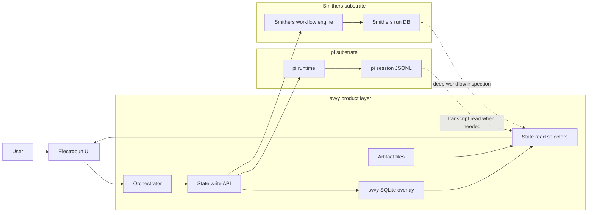
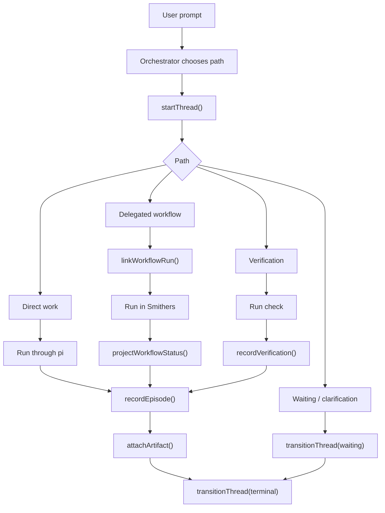

# Structured Session State Spec

## Status

- Date: 2026-04-13
- Status: proposed implementation direction for structured `svvy` session state
- Scope of this document:
  - define what `svvy` should persist as first-class product state
  - specify the storage, API, and synchronization architecture for that state
  - justify the design against current repo constraints and relevant external system patterns
  - make explicit what is adopted now versus what is intentionally deferred

## Purpose

`svvy` is not meant to be "pi with a prettier chat shell."

The PRD sets a higher bar:

- visible orchestration
- durable threads and episodes
- first-class verification
- inspectable delegated workflows
- safe resume after interruption
- one coherent product model across desktop and headless surfaces

The current product cannot reach that bar if it keeps inferring product state from raw transcript history.

This spec defines the recommended data-first architecture for fixing that.

In one sentence:

`svvy` should add a workspace-scoped structured state layer above `pi` and beside Smithers, so the product can query and resume real work state without reverse-engineering chat logs.

## Adopted Direction

The recommended `svvy` direction is:

- keep `pi` as the canonical transcript and runtime substrate
- keep Smithers as the canonical delegated workflow execution substrate
- add a `svvy`-owned structured state store as the canonical source for product state and UI query models
- implement that store as one workspace-scoped SQLite database owned by the Bun process
- store artifact metadata in SQLite and artifact bytes on disk
- use a hybrid write model:
  - normalized state tables for current product state
  - a small append-only domain event log for meaningful lifecycle transitions
  - explicit read selectors and DTOs for UI surfaces
- avoid treating transcript reconstruction as the primary implementation strategy once structured state exists
- avoid making `pi` custom entries or Smithers run tables the primary store for top-level `svvy` product state

Nothing below should be read as recommending:

- a second transcript engine
- a `svvy`-owned shell outside `pi`
- a giant per-session JSON blob as the main persistence format
- full event sourcing for every byte of app state

## Reading Rules

This document uses four labels:

- `Fact`: directly supported by a cited local or external source
- `Decision`: recommended `svvy` architecture choice derived from the facts
- `Not Adopted`: an alternative considered and explicitly rejected for the first implementation
- `Deferred`: important, but intentionally not part of the first implementation slice

## Product Fit

### Fact

The PRD defines:

- sessions as durable user-facing containers in addition to chat messages
- threads as bounded workstreams
- episodes as the main reusable output of meaningful work
- verification as first-class product state
- workflow runs as durable records of delegated Smithers-backed work
- desktop and headless paths sharing one product model

Sources:

- [PRD](../prd.md)
- [Execution Model](../execution-model.md)

### Decision

Structured session state is not an optional UI enhancement.

It is the missing data model required to implement the product already described in the PRD.

Without it, `svvy` can show messages, but it cannot reliably show:

- what work exists
- which workstream is active
- what finished
- what was verified
- what is blocked
- what should resume next

## Problem Statement

The current implementation is still transcript-first in the areas that matter most to the PRD.

### Fact

Current `svvy` session summaries are derived from message history in:

- `src/bun/session-projection.ts`

Current artifact state is reconstructed by replaying transcript tool calls in:

- `src/mainview/artifacts.ts`

Current frontend local storage in:

- `src/mainview/chat-storage.ts`

stores:

- provider keys
- custom providers
- workspace-scoped prompt history

It does not store durable structured session state.

### Decision

This is acceptable for bootstrap features like:

- session list projection
- prompt history
- transcript rendering
- transcript-derived artifact preview

It is not acceptable as the long-term basis for:

- thread and episode UI
- verification history
- resumable delegated workflows
- durable workflow inspection
- headless parity

Those features need explicit state, not inference.

## Why A Data-First Design Is The Best Fit

### Fact

The repo already points toward a layered architecture:

- `pi` owns the runtime seam and session substrate
- `svvy` owns product behavior above that seam
- Smithers owns delegated workflow execution and durable internal workflow runs

Sources:

- [PRD](../prd.md)
- [Smithers run/event model](../references/smithers/src/SmithersEvent.ts)
- [Smithers DB schema](../references/smithers/src/db/ensure.ts)
- [pi SessionManager](../references/pi-mono/packages/coding-agent/src/core/session-manager.ts)

### Fact

`pi` already supports extension-specific custom entries in session JSONL, and those entries are persisted but excluded from LLM context.

Source:

- [pi SessionManager custom entries](../references/pi-mono/packages/coding-agent/src/core/session-manager.ts)

### Fact

Smithers already uses a durable SQLite-backed model that separates:

- current run state
- node and attempt state
- event history
- read/query APIs

Sources:

- [Smithers DB schema](../references/smithers/src/db/ensure.ts)
- [Smithers DB adapter](../references/smithers/src/db/adapter.ts)

### Fact

Official CQRS and event-sourcing guidance recommends separating write and read models when systems need durable history plus specialized query projections.

Sources:

- [Azure CQRS pattern](https://learn.microsoft.com/en-us/azure/architecture/patterns/cqrs)
- [Azure Event Sourcing pattern](https://learn.microsoft.com/en-us/azure/architecture/patterns/event-sourcing)

### Decision

`svvy` should follow the same broad pattern, but in a lighter product-appropriate form:

- explicit writes for durable business state
- explicit read models for UI surfaces
- selective event logging for meaningful lifecycle transitions
- no ideological commitment to full event sourcing

This gives `svvy` the product benefits of durable state without paying unnecessary complexity costs.

## Ownership Boundaries

### Decision

The ownership boundary should be:

- `pi` is canonical for:
  - transcript history
  - session tree lineage
  - model/runtime conversation context
- Smithers is canonical for:
  - workflow internals
  - workflow nodes, attempts, retries, approvals, and event streams
- `svvy` is canonical for:
  - product-level threads
  - episodes
  - verification records
  - workflow links into the top-level session model
  - artifact references
  - worktree bindings for top-level work
  - UI query state such as inspector target and pane layout

### Decision

`svvy` should not flatten those boundaries into one store.

That would either:

- duplicate too much of `pi`
- duplicate too much of Smithers
- or force `svvy` UI code to understand low-level substrate formats directly

All three outcomes are worse than a clean layered model.

## Conceptual Architecture



## Storage Topology

## Primary Store Choice

### Decision

`svvy` structured state should live in one SQLite database per workspace.

Recommended path:

- `${getSvvySessionDir(cwd)}/svvy-state.db`

Recommended artifact directory:

- `${getSvvySessionDir(cwd)}/artifacts/`

This keeps the product state:

- colocated with the existing workspace-scoped session area
- independent from repo contents
- independent from renderer-local IndexedDB
- easy to back up, inspect, migrate, and test

## Why SQLite

### Fact

`bun:sqlite` supports:

- local embedded storage
- transactions
- prepared statements
- WAL mode

Sources:

- [Bun SQLite docs](https://bun.sh/docs/runtime/sqlite)
- [SQLite WAL](https://www.sqlite.org/wal.html)
- [SQLite UPSERT](https://www.sqlite.org/lang_upsert.html)
- [SQLite JSON](https://www.sqlite.org/json1.html)

### Fact

Smithers already uses `bun:sqlite` with:

- `journal_mode = WAL`
- `busy_timeout`
- `foreign_keys = ON`

Source:

- [Smithers create.ts](../references/smithers/src/create.ts)

### Decision

`svvy` should adopt the same baseline:

- `PRAGMA journal_mode = WAL`
- `PRAGMA busy_timeout = 5000`
- `PRAGMA foreign_keys = ON`

This is the right default for a Bun desktop app with:

- mostly local single-process writes
- occasional concurrent readers
- a need for crash-tolerant durability without running a separate service

## What `svvy` Should Persist

## Persistence Rule

### Decision

Persist a field in `svvy` if at least one of the following is true:

- the next orchestrator step depends on it
- the UI must display it without reconstructing transcripts
- it links top-level `svvy` product concepts across `pi` and Smithers
- it is required for safe resume after restart
- recomputing it would be lossy, ambiguous, or expensive

Do not persist a field as primary `svvy` state if it is:

- canonical in `pi`
- canonical in Smithers
- a cheap derived summary
- large binary payload better stored as a file

## Persisted Product Entities

### Decision

The first durable `svvy` model should include these entities:

- `workspace`
- `workspace_view_state`
- `session`
- `thread`
- `domain_event`
- `episode`
- `verification_run`
- `workflow_run_link`
- `artifact_ref`
- `artifact_link`
- `worktree`
- `worktree_binding`
- `sync_cursor`

### Decision

The intended meaning of each entity is:

- `workspace`: durable identity for the current repo/workspace
- `workspace_view_state`: persisted pane layout and inspector/navigation state
- `session`: top-level user-visible container linked to a `pi` session
- `thread`: bounded workstream inside a session
- `domain_event`: append-only lifecycle log for meaningful product transitions
- `episode`: durable reusable output from meaningful work
- `verification_run`: structured verification result
- `workflow_run_link`: top-level projection of a Smithers workflow into the session model
- `artifact_ref`: metadata pointer to artifact bytes on disk
- `artifact_link`: flexible many-to-many owner linking between artifacts and other records
- `worktree`: known worktree identity used by durable work bindings
- `worktree_binding`: historical or active binding between work and a worktree
- `sync_cursor`: incremental import cursor for Smithers and other substrate sync paths

## Persist Vs Derive

| Data | Recommended treatment | Why |
| --- | --- | --- |
| Transcript messages | Keep in `pi` | `pi` is already canonical and append-only |
| Session title | Mirror into `svvy.session` | Hot query field for sidebar and selectors |
| Session parent lineage | Keep from `pi`, mirror into `svvy.session` | Needed for fast UI and branching projections |
| Thread objective/status/executor | Persist in `svvy.thread` | Core product state |
| Episode conclusions and changed files | Persist in `svvy.episode` | Durable reusable output |
| Verification summary and status | Persist in `svvy.verification_run` | First-class routing input and UI state |
| Smithers internal nodes/attempts | Leave in Smithers | Too low-level for top-level canonical `svvy` state |
| Workflow run link and projected status | Persist in `svvy.workflow_run_link` | Bridges top-level product model to Smithers |
| Artifact bytes | Store as files | Keep DB small and previews simple |
| Artifact metadata and links | Persist in SQLite | Needed for queries and durability |
| Current repo branch/worktree inventory | Read live, optionally cache | Environment state is dynamic and filesystem-derived |
| Worktree binding of a thread or workflow | Persist | Product meaning depends on it |
| Pane layout and inspector selection | Persist in `workspace_view_state` | Needed for safe UI resume |
| Badge counts or other cheap summaries | Derive on read | Avoid redundant mutable state |

## What Is Not Adopted

### Not Adopted: pi custom entries as the primary `svvy` store

`pi` custom entries are useful as an escape hatch or breadcrumb mechanism.

They are not the right primary storage model for `svvy` product state because:

- they are append-only JSONL entries
- they are not indexed for UI queries
- they make multi-surface projections awkward
- they encourage reparsing the whole session file to answer product questions

### Not Adopted: one giant session overlay JSON document

A single blob per session is attractive as a POC, but it is the wrong long-term storage shape because:

- incremental updates become awkward
- queryability is poor
- migrations become blob surgery
- linking sessions, threads, episodes, artifacts, and workflows becomes clumsy

### Not Adopted: full event sourcing for all product state

Full event sourcing is not required for v1.

It would add:

- projection rebuild complexity
- snapshot complexity
- higher implementation cost

without enough day-one product benefit.

The chosen hybrid design keeps event history where it helps and mutable state tables where they are simpler.

## Recommended Schema Shape

### Decision

The first schema should be normalized around product concepts, with hot query fields as columns and colder structured payloads in JSON text columns.

Recommended initial tables:

- `workspace`
- `workspace_view_state`
- `session`
- `thread`
- `domain_event`
- `episode`
- `verification_run`
- `workflow_run_link`
- `artifact_ref`
- `artifact_link`
- `worktree`
- `worktree_binding`
- `sync_cursor`

### Decision

Recommended hot columns:

- ids
- foreign keys
- kind
- status
- title or objective
- created/updated/finished timestamps
- latest referenced run ids
- primary display summary fields used by selectors

Recommended JSON payload fields:

- episode conclusions
- unresolved issues
- follow-up suggestions
- provenance
- changed-file lists
- workflow projected metadata
- view layout payloads

### Decision

Do not hide the whole state model inside JSON columns.

SQLite JSON support is useful for flexible payloads, not as a substitute for a real relational query model.

## Initial Table Responsibilities

### `workspace`

Stores:

- stable workspace id
- repo root
- display label
- created and updated timestamps

Does not need to be canonical for:

- current branch
- working tree dirtiness
- live filesystem inventory

Those are environment reads, not product-state writes.

### `workspace_view_state`

Stores:

- selected session id
- selected thread id
- selected inspector target
- focused pane id
- pane layout JSON
- flat folder labels and membership

This table is mutable UI state, not domain history.

### `session`

Stores:

- `svvy` session id
- linked `pi` session id or session file
- workspace id
- mirrored title
- parent session id
- runtime profile overrides
- compatibility mode flag for pre-overlay sessions if needed
- created and updated timestamps

### `thread`

Stores:

- thread id
- session id
- kind: `direct`, `workflow`, `verification`, `waiting`
- objective
- status
- executor kind
- executor ref
- blocked reason
- started, updated, finished timestamps

### `domain_event`

Stores append-only business transitions such as:

- `thread.started`
- `thread.status_changed`
- `episode.recorded`
- `verification.recorded`
- `workflow.linked`
- `workflow.status_projected`
- `waiting.set`
- `waiting.cleared`
- `artifact.linked`
- `worktree.bound`

This table should not record:

- every stream delta
- every token
- every low-level tool call
- transient UI interactions

### `episode`

Stores:

- episode id
- thread id
- source
- status
- optional objective override
- conclusions JSON
- changed files JSON
- unresolved issues JSON
- follow-up suggestions JSON
- provenance JSON
- created and updated timestamps

### `verification_run`

Stores:

- verification id
- thread id
- optional linked episode id
- type: `build`, `test`, `lint`, `integration`, `manual`
- status
- summary
- exit code when relevant
- command or metadata JSON when relevant
- started and finished timestamps

### `workflow_run_link`

Stores:

- workflow link id
- thread id
- Smithers run id
- workflow name
- workflow path when known
- projected status
- projected summary payload
- started, updated, finished timestamps

This is the `svvy` bridge into Smithers, not a replacement for Smithers internal run tables.

### `artifact_ref`

Stores:

- artifact id
- kind
- MIME type
- preview kind
- storage path
- content hash
- size in bytes
- created and updated timestamps
- optional metadata JSON

### `artifact_link`

Stores:

- artifact id
- owner type
- owner id
- link role

This avoids hard-coding artifacts as children of only one record type.

### `worktree` and `worktree_binding`

Store:

- known worktree identities
- historical or active bindings between a worktree and a thread or workflow

This is the durable product view of worktree ownership.

### `sync_cursor`

Stores:

- source name
- aggregate id when needed
- last processed sequence or timestamp
- updated timestamp

This is how `svvy` should do incremental Smithers sync without replaying everything.

## API Design

## Write Side

### Decision

The Bun process should own the only write API for structured state.

The renderer should never write raw rows directly.

Recommended writer shape:

```ts
interface SvvyStateWriter {
  ensureWorkspace(input: EnsureWorkspaceInput): Promise<WorkspaceRecord>;
  ensureSession(input: EnsureSessionInput): Promise<SessionRecord>;
  startThread(input: StartThreadInput): Promise<ThreadRecord>;
  transitionThread(input: TransitionThreadInput): Promise<void>;
  recordEpisode(input: RecordEpisodeInput): Promise<EpisodeRecord>;
  recordVerification(input: RecordVerificationInput): Promise<VerificationRunRecord>;
  linkWorkflowRun(input: LinkWorkflowRunInput): Promise<WorkflowRunLinkRecord>;
  projectWorkflowStatus(input: ProjectWorkflowStatusInput): Promise<void>;
  attachArtifact(input: AttachArtifactInput): Promise<ArtifactRefRecord>;
  bindWorktree(input: BindWorktreeInput): Promise<void>;
  saveWorkspaceView(input: SaveWorkspaceViewInput): Promise<void>;
  saveSyncCursor(input: SaveSyncCursorInput): Promise<void>;
}
```

### Decision

Writer operations should be:

- transactional
- idempotent where replay or reconnect can happen
- explicit about ownership and lifecycle meaning

The caller should not need to know table layout details.

## Read Side

### Decision

The renderer should consume selector-oriented DTOs, not raw relational rows.

Recommended reader shape:

```ts
interface SvvyStateReader {
  getWorkspaceView(workspaceId: string): Promise<WorkspaceViewDTO>;
  listSessionSummaries(workspaceId: string): Promise<SessionSummaryDTO[]>;
  getSessionView(sessionId: string): Promise<SessionViewDTO>;
  listThreads(sessionId: string): Promise<ThreadListItemDTO[]>;
  getThreadDetail(threadId: string): Promise<ThreadDetailDTO>;
  getInspectorTarget(input: InspectorTargetInput): Promise<InspectorDTO | null>;
}
```

### Decision

Selectors should be organized around surfaces:

- sidebar
- session main view
- inspector
- status strip

not around tables.

## Selector Strategy

### Decision

Selectors should:

- join normalized tables
- derive cheap summaries
- return stable DTOs shaped for UI rendering
- avoid returning large blobs that the surface does not need

Examples:

- `listSessionSummaries()` should not return every episode body
- `getThreadDetail()` may return verification and artifact summaries for that thread
- deep workflow node inspection should query Smithers on demand using the linked run id

## Domain Event Model

### Decision

`svvy` should keep an append-only domain event log for meaningful product transitions.

The event log is for:

- auditability
- debugging
- future projection rebuilds if needed
- sync and reconciliation reasoning

It is not the exclusive source of truth for every UI state field.

### Decision

The first event set should include:

- `thread.started`
- `thread.status_changed`
- `episode.recorded`
- `verification.recorded`
- `workflow.linked`
- `workflow.status_projected`
- `waiting.set`
- `waiting.cleared`
- `artifact.linked`
- `worktree.bound`

### Decision

`workspace_view_state` changes do not need to go through domain events in v1.

They may be stored as direct mutable writes because they are UI preference state, not durable work-history facts.

## Synchronization With `pi`

### Fact

`pi` session files remain the durable transcript substrate and already support:

- session identity
- parent session linkage
- durable transcript history
- extension custom entries

Source:

- [pi SessionManager](../references/pi-mono/packages/coding-agent/src/core/session-manager.ts)

### Decision

`svvy` should sync with `pi` like this:

1. a workspace opens
2. `svvy` opens or creates the workspace SQLite DB
3. `svvy` enumerates `pi` sessions
4. `svvy` ensures a lightweight `session` row for each visible `pi` session
5. `svvy` mirrors session title and lineage fields needed for hot queries
6. transcript messages remain in `pi`

### Decision

Day-one compatibility for pre-overlay sessions should be:

- create `session` rows lazily from `pi`
- do not try to fully backfill threads, episodes, or verification from historical transcripts
- continue transcript rendering and transcript-derived artifacts for legacy sessions
- create structured rows only for new work once the overlay is active

This keeps migration complexity bounded while still letting the product move forward.

### Deferred

Optional future use of `pi` custom entries:

- breadcrumb pointers into `svvy` record ids
- migration markers
- lightweight resume hints

This may help tooling or export later, but it is not required for the first implementation.

## Synchronization With Smithers

### Fact

Smithers exposes:

- durable run ids
- events
- node and attempt state
- resumable runs

Sources:

- [Smithers event types](../references/smithers/src/SmithersEvent.ts)
- [Smithers server and DB adapter](../references/smithers/src/server/serve.ts)
- [Smithers DB adapter](../references/smithers/src/db/adapter.ts)

### Decision

`svvy` should not copy Smithers internals wholesale into its own DB.

Instead it should:

- create `workflow_run_link` when delegated work starts
- store the Smithers run id
- project only the top-level workflow status and summary into `svvy`
- query Smithers directly for deep workflow inspection when the user opens that surface

### Decision

Smithers sync should be incremental.

`svvy` should use `sync_cursor` to remember the last imported event sequence or timestamp for a linked run and only project new state transitions.

## Artifact Storage

### Decision

Artifact bytes should live on disk, not inside SQLite BLOB fields, unless a very small special case emerges later.

Recommended artifact layout:

- artifact file path under `${sessionDir}/artifacts/`
- SQLite row in `artifact_ref`
- links in `artifact_link`

### Decision

Artifact storage should be content-addressed or artifact-id-addressed.

Both are acceptable in v1.

The requirement is:

- stable durable path
- easy garbage collection later
- no dependence on transcript replay to find the file again

## UI Projection Model

### Decision

The UI should project from structured state in this order:

- workspace view
- session summary
- thread list
- selected thread detail
- selected inspector target

Transcript rendering remains available, but it is no longer the source of truth for work state.

### Decision

The day-one workflow inspector should use:

- `svvy.workflow_run_link` for top-level placement in the session model
- Smithers run data for graph and node drill-down

This is the cleanest split between product semantics and workflow internals.

## State Transitions



## Performance And Operational Requirements

### Decision

The first implementation should optimize for:

- fast startup without full event replay
- fast session list queries
- fast thread detail loading
- cheap incremental writes during active work
- clean crash recovery

### Decision

To support that, the implementation should:

- store current product state directly in normalized tables
- write domain events in the same transaction as state transitions
- index hot read paths
- keep artifact bytes out of the DB
- use integer millisecond timestamps
- use prepared statements or a typed query layer

### Decision

Recommended initial indexes include:

- `session(workspace_id, updated_at_ms desc)`
- `thread(session_id, updated_at_ms desc)`
- `episode(thread_id, created_at_ms asc)`
- `verification_run(thread_id, started_at_ms desc)`
- `workflow_run_link(thread_id, updated_at_ms desc)`
- `artifact_link(owner_type, owner_id)`
- `sync_cursor(source, aggregate_id)`

### Decision

The implementation should prefer ordinary rowid tables by default.

`WITHOUT ROWID` is not required up front and should only be introduced after measurement if a specific composite-key table benefits from it.

## Failure And Recovery Semantics

### Decision

Every writer command should be transactionally atomic.

If a command fails halfway through, neither the durable state row nor the matching domain event should be partially committed.

### Decision

On startup or reopen:

- the Bun process should run schema migrations
- ensure workspace/session rows exist
- reload view state
- reload active non-terminal threads
- reconcile linked workflow runs using Smithers cursors when applicable

### Decision

If `svvy` state is missing but `pi` transcript exists:

- recover the session shell from `pi`
- mark the session as compatible legacy state if needed
- do not treat missing overlay state as fatal data corruption

## Why This Design Is Better Than The Main Alternatives

| Option | Upside | Downside | Decision |
| --- | --- | --- | --- |
| `pi` transcript only | Lowest implementation cost | Too brittle for threads, verification, workflows, and resume | Rejected |
| `pi` custom entries only | Reuses existing persistence seam | Poor queryability and indexing | Rejected as primary store |
| One giant overlay JSON per session | Fast POC | Bad incremental updates and poor queries | Rejected |
| Full event sourcing | Strong replay story | Too complex for day one | Rejected |
| Workspace-scoped SQLite hybrid model | Clear ownership, fast queries, resumable, evolvable | More initial schema work | Adopted |

## Rollout Plan

### Decision

The implementation should land in phases.

### Phase 1: Minimal Structured Root

Ship:

- workspace DB creation and migrations
- `workspace`
- `workspace_view_state`
- `session`
- `thread`
- `domain_event`
- reader and writer interfaces
- minimal session and thread selectors

Goal:

- replace transcript-only guesswork for "what work exists right now"

### Phase 2: Direct Work Normalization

Ship:

- `episode`
- `artifact_ref`
- `artifact_link`
- direct-path episode recording

Goal:

- normalize direct work into reusable durable outputs

### Phase 3: Verification

Ship:

- `verification_run`
- verification selectors
- inline verification projection

Goal:

- make verification first-class product state

### Phase 4: Workflow Links

Ship:

- `workflow_run_link`
- Smithers sync cursors
- projected workflow status in thread and session views

Goal:

- bridge top-level product state to delegated workflow execution

### Phase 5: Workflow Inspector Integration

Ship:

- workflow inspector opening from linked workflow state
- deep node inspection backed by Smithers queries

Goal:

- durable top-level session model plus read-only deep workflow inspection

## Deferred

The following are intentionally deferred from the first structured-state slice:

- full historical backfill from old transcripts into episodes and verification records
- mirroring Smithers node and attempt internals into `svvy`
- generalized event replay rebuild tooling
- sync to cloud or cross-device backends
- machine-global shared state across unrelated workspaces
- artifact deduplication and garbage collection policy beyond basic durable storage
- advanced multi-window conflict resolution beyond SQLite safety and last-write-wins for view state

## Sources

## Local Sources

- [PRD](../prd.md)
- [Execution Model](../execution-model.md)
- [Session projection](../../src/bun/session-projection.ts)
- [Artifacts reconstruction](../../src/mainview/artifacts.ts)
- [Frontend chat storage](../../src/mainview/chat-storage.ts)
- [pi SessionManager](../references/pi-mono/packages/coding-agent/src/core/session-manager.ts)
- [Smithers events](../references/smithers/src/SmithersEvent.ts)
- [Smithers DB schema](../references/smithers/src/db/ensure.ts)
- [Smithers DB adapter](../references/smithers/src/db/adapter.ts)
- [Smithers SQLite setup](../references/smithers/src/create.ts)
- [opencode session schema](../references/opencode/packages/opencode/src/session/session.sql.ts)

## External Sources

- [Azure CQRS pattern](https://learn.microsoft.com/en-us/azure/architecture/patterns/cqrs)
- [Azure Event Sourcing pattern](https://learn.microsoft.com/en-us/azure/architecture/patterns/event-sourcing)
- [Bun SQLite docs](https://bun.sh/docs/runtime/sqlite)
- [SQLite WAL](https://www.sqlite.org/wal.html)
- [SQLite JSON](https://www.sqlite.org/json1.html)
- [SQLite UPSERT](https://www.sqlite.org/lang_upsert.html)

